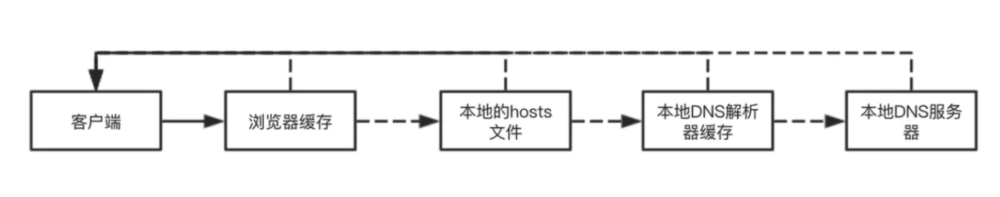
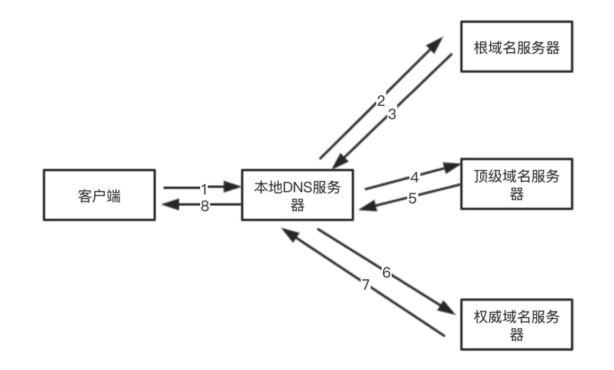
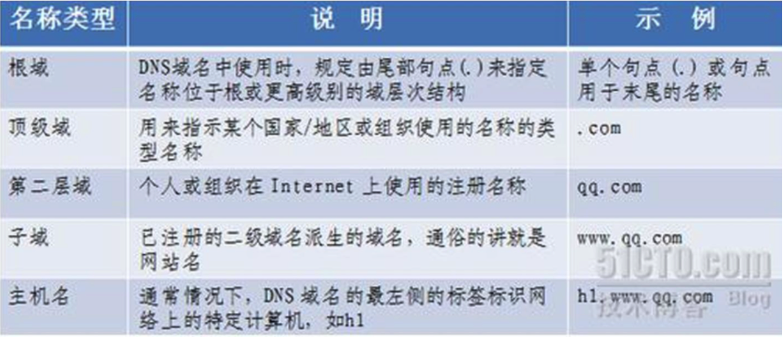
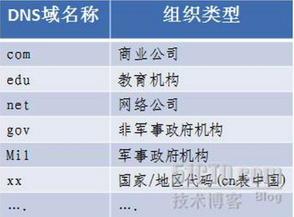

# DNS

来自维基百科的解释

> **域名系统**（英语：**D**omain **N**ame **S**ystem，缩写：**DNS**）是互联网的一项服务。它作为将域名和IP地址相互映射的一个分布式数据库，能够使人更方便地访问互联网。DNS使用TCP和UDP，端口是53。当前，对于每一级域名长度的限制是63个字符，域名总长度则不能超过253个字符。


### DNS具体是怎么体现的？

举🌰

​	比如我们现在访问 `www.baidu.com`,这种叫域名，具有可读性，容易让用户记住。

但是互联网定位我们真正访问的服务器只认识ip地址。我们 `ping www.baidu.com`，看到的是

64 bytes from **14.215.177.39**: icmp_seq=0 ttl=56 time=9.448 ms，那么14.215.177.39才是

我们最终访问的服务器。当我们访问 `www.baidu.com`的时候，DNS会帮我们找到对应的IP地址，

然后我们去访问ip地址，才能把资源请求回来。


### DNS的解析过程？

1. 查看DNS是否有缓存，如果有则直接返回。

   查找缓存的过程如下，是一个递归查询的过程。

   1.1 在浏览器中查找缓存，如果没有，继续找。

   1.2 查找本地的hosts文件，我们的测试环境一般都是配在host上面，如果没有，继续找。

   1.3 本地DNS解析器缓存，如果没有，继续找。

   1.4 本地DNS服务器，如果没有，继续找，到第2步。

   

   

2. 如果缓存没有找到，那就需要本地DNS服务器去其他域名服务器上面找称为迭代查询。

   2.1 如果没有设置转发模式

   ​	2.1.1 本地DNS服务器请求根域名服务器，如果不能解析则根域名服务器返回处理这个顶级域名的服务器ip。

   ​	2.1.2 本地DNS服务器请求顶级域名服务器，顶级域名服务器不能解析则返回权威域名服务器ip。

   ​	2.1.3 本地DNS服务器请求权威域名服务器，权威域名服务器不能解析则继续返回下一级能处理的服务器，知道找到能处理的位置。

   2.2 如果设置转发模式

   ​	2.2.1 本地DNS服务器会请求转发的IP地址，如果不能解析则请求其上级。

   ​	2.2.2  上级如果不能解析则继续请求上上级，知道找到为止。	




### DNS应该怎么优化？

> 每一次 DNS 解析时间预计在 20~120 毫秒
>
> - 减少 DNS 请求次数
>  - 尽量是采用少量的不同的域名，太多，可能影响网络速度。
> - DNS 预获取（DNS Prefetch）
> 


#### **X-DNS-Prefetch-Control**

**`X-DNS-Prefetch-Control`** 头控制着浏览器的 DNS 预读取功能。 DNS 预读取是一项使浏览器主动去执行域名解析的功能，其范围包括文档的所有链接，无论是图片的，CSS 的，还是 JavaScript 等其他用户能够点击的 URL。

因为预读取会在后台执行，所以 DNS 很可能在链接对应的东西出现之前就已经解析完毕。这能够减少用户点击链接时的延迟。

```html
<meta http-equiv="x-dns-prefetch-control" content="on"> 
on：打开
off：关闭
```

#### 强制查询特定主机名

```html
<link rel="dns-prefetch" href="http://www.spreadfirefox.com">
通过设置rel="dns-prefetch"，属性对href设置的链接预读取
```


**相关名词的解释**






参考：https://blog.51cto.com/369369/812889