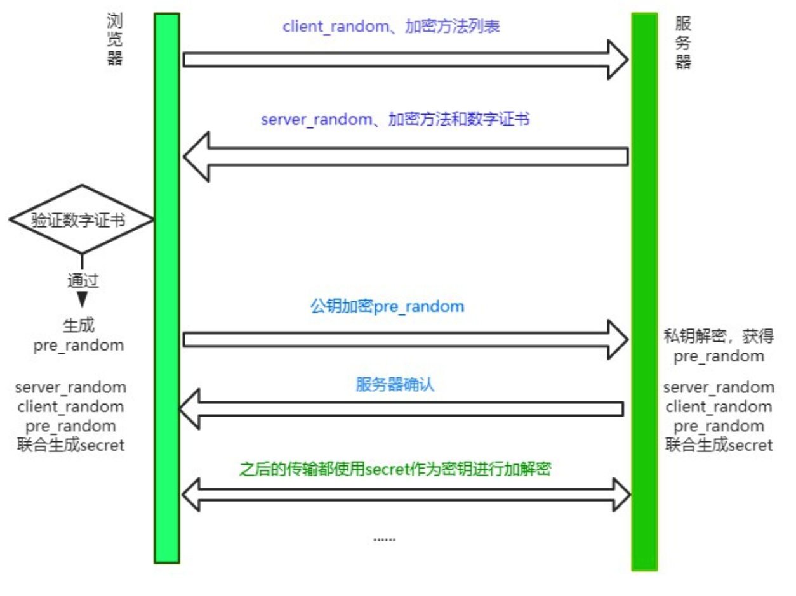

# HTTP

> 本篇将详细讲解http相关知识点

HTTP协议是Hyper Text Transfer Protocol（超文本传输协议）的缩写,是用于从万维网服务器传输超文本到本地浏览器的传送协议。HTTP 是基于 TCP/IP 协议通信协议来传递数据（HTML 文件, 图片文件, 查询结果等）。它不涉及数据包（packet）传输，主要规定了客户端和服务器之间的通信格式，默认使用80端口。


## Http的特点

1.**简单快速**：客户向服务器请求服务时，只需传送请求方法和路径。请求方法常用的有GET、HEAD、PUT、DELETE、POST。每种方法规定了客户与服务器联系的类型不同。由于HTTP协议简单，使得HTTP服务器的程序规模小，因而通信速度很快。

2.**灵活**：HTTP允许传输任意类型的数据对象。

3.**无连接**：无连接的含义是限制每次连接只处理一个请求。服务器处理完客户的请求，并收到客户的应答后，即断开连接。采用这种方式可以节省传输时间。

4.**无状态**：**HTTP协议是无状态的，HTTP 协议自身不对请求和响应之间的通信状态进行保存。任何两次请求之间都没有依赖关系。**直观地说，就是每个请求都是独立的，与前面的请求和后面的请求都是没有直接联系的。协议本身并不保留之前一切的请求或 响应报文的信息。**这是为了更快地处理大量事务，确保协议的可伸缩性，而特意把 HTTP 协议设计成如此简单的。**


## HTTP/0.9

​     HTTP协议的最初版本，功能简陋，仅支持请求方式GET，并且仅能请求访问HTML格式的资源。


## **HTTP/1.0** 

- 增加了请求方式POST和HEAD
- 引入的请求头和响应头，根据Content-Type可以支持多种数据格式，不再局限于0.9版本的HTML格式
- 支持浏览器缓存
- 引入了状态码


## **HTTP/1.1**

### 新增的功能

- 增加了持久连接

- 引入Cookie，为解决http无状态问题。

- 提供虚拟主机的支持

  - 在 HTTP/1.0 中，每个域名绑定了一个唯一的 IP 地址，因此一个服务器只能支持一个域名。但是随着虚拟主机技术的发展，需要实现在一台物理主机上绑定多个虚拟主机，每个虚拟主机都有自己的单独的域名，这些单独的域名都公用同一个 IP 地址。因此，HTTP/1.1 的请求头中增加了 Host 字段，用来表示当前的域名地址，这样服务器就可以根据不同的 Host 值做不同的处理。

- 对动态生成的内容，浏览器可以及时知道文件是否接收完

  - 在设计 HTTP/1.0 时，需要在响应头中设置完整的数据大小，如Content-Length: 901，这样浏览器就可以根据设置的数据大小来接收数据。不过随着服务器端的技术发展，很多页面的内容都是动态生成的，因此在传输数据之前并不知道最终的数据大小，这就导致了浏览器不知道何时会接收完所有的文件数据。

    HTTP/1.1 通过引入 Chunk transfer 机制来解决这个问题，服务器会将数据分割成若干个任意大小的数据块，每个数据块发送时会附上上个数据块的长度，最后使用一个零长度的块作为发送数据完成的标志。这样就提供了对动态内容的支持。

### 优点：

**增加了持久连接的方法，keep-alive**

​	它的特点是在一个 TCP 连接上可以传输多个 HTTP 请求，只要浏览器或者服务器没有明确断开连接，那么该 TCP 连接会一直保持。http1.1默认开启，关闭连接Connection: close。

### 缺点：

**网络利用率不高**

​	**1.TCP慢启动策略**，它会慢慢将请求启动起来，然后判断当前的网络环境是否稳定，但是这个过程太慢了，导致网络利用率不高。

​	**2.TCP连接出现竞争资源**，当我们带宽不足的时候，这时候关键资源不能得到服务器快速回复，浏览器则会一直等待，甚至卡顿。

​	**3.引起了队头堵塞问题**，http1.1传输是基于tcp/ip的，tcp同时只能处理一个请求并且需要等待当前请求处理完才能处理下一个请求，那么当tcp出现丢包，等待，重传，或者其他原因。这个过程就会队头堵塞问题。使后面的请求一直处于等待。这样也会导致网络利用率不高。

### 如何优化http1.1连接？

TCP慢启动和 TCP连接出现竞争资源带宽是由于 TCP 本身的机制导致的，而队头阻塞是由于 HTTP/1.1 的机制导致的，所以我们优化的方式只能对队头堵塞的问题进行优化，剩下的只能交给下一代http2.0协议来优化了。

**浏览器为每个域名最多同时维护 6 个 TCP 持久连接**，我们可以利用这个优点使用合理CDN资源，比如使用了2个不同的CDN域名，那么最多可以同时发送 3 * 6 个tcp连接，这个技术称为域名分片。


## **HTTP/2.0**

> 上面提到TCP慢启动，TCP资源竞争，是TCP的本身机制导致的，其实还有http1.1做的不够好。那么http2.0中可以完美解决这个问题，还是长连接，只维护一个TCP连接，这样TCP慢启动就只有一次，TCP连接之前也不会出现竞争。
>
> 至于队头堵塞处理起来确实麻烦，http2.0也只是缓解了队头堵塞的问题。那问题就留在了http3.0啦。

### 新增功能

- 多路复用
- 设置请求的优先级
- 服务器推送
- 头部压缩


### 多路复用

多路复用是http2.0中最重要的功能，可以做到并发请求的数量比HTTP1.1大了好几个数量级，使得http传输效率提升20%-60%。

大概流程是客户端可以并发请求，然后服务器可以并发接收，按照优先级去处理，并且返回回来给客户端。

**多路复用的实现流程**

http2.0增加了二进制分帧处理。

1. 浏览器将请求信息准备好。
2. 二进制分帧层将数据进行分帧，数据会转换为一个个带有请求 ID 编号的帧，通过协议栈将这些帧发送给服务器。
3. 服务器接收到帧数据后，会根据ID将帧转换为数据，交给服务器处理。
4. 服务器处理完后，将响应的数据传递到二进制分帧层。
5. 同样，二进制分帧层将数据转换为一个个带ID编号的帧，通过协议栈将这些帧发送给浏览器。
6. 浏览器接收到帧数据后，将帧转换为数据，并将数据交给相应的请求。

以上就是多路复用的详细流程，就是因为这些帧它可以并发，随意发，就是多路复用的意思。

### 请求的优先级

把http消息分为很多帧之后，就可以通过优化这些帧的交错和传输顺序进一步优化性能。每个流都可以带有一个31比特的优先值：0 表示最高优先级；2的31次方-1 表示最低优先级。

服务器可以根据流的优先级，控制资源分配（CPU、内存、带宽），而在响应数据准备好之后，优先将最高优先级的帧发送给客户端。高优先级的流都应该优先发送，但又不会绝对的。可能又会引入首队阻塞的问题：高优先级的请求慢导致阻塞其他资源交付。

客户端会指定哪个流是最重要的，有一些依赖参数，这样一个流可以依赖另外一个流。优先级别可以在运行时动态改变，当用户滚动页面时，可以告诉浏览器哪个图像是最重要的，你也可以在一组流中进行优先筛选，能够突然抓住重点流。

●优先级最高：主要的html

●优先级高：CSS文件

●优先级中：js文件

●优先级低：图片

### 服务器推送

服务器推送的功能，即不经请求服务端主动向客户端发送数据。

当用户请求一个 HTML 页面之后，服务器知道该 HTML 页面会引用几个重要的 JavaScript 文件和 CSS 文件，那么在接收到 HTML 请求之后，附带将要使用的 CSS 文件和 JavaScript 文件一并发送给浏览器，这样当浏览器解析完 HTML 文件之后，就能直接拿到需要的 CSS 文件和 JavaScript 文件，服务器可以缓存客户端的文件，可以提升首次打开页面的速度。

### 头部压缩

HTTP请求和响应中，状态行和请求/响应头都是些信息字段，并没有真正的数据，因此http2.0中将所有的信息字段建立一张表，为表中的每个字段建立索引，客户端和服务端共同使用这个表，他们之间就以索引号来表示信息字段，这样就避免了http2.0以前的重复繁琐的字段，并以压缩的方式传输，提高利用率。


## HTTP/3.0

问题:当http:2.0出现丢包的时候,效率还不如1.1.会触发重传问题

 Google 在推SPDY的时候就已经意识到了这些问题，于是就另起炉灶搞了一个基于 UDP 协议的“QUIC”协议，让HTTP跑在QUIC上而不是TCP上。

而这个“HTTP over QUIC”就是HTTP协议的下一个大版本，HTTP/3。它在HTTP/2的基础上又实现了质的飞跃，真正“完美”地解决了“队头阻塞”问题。

  

### 二、Http报文(以1.0为例)

Http报文包括请求报文和响应报文两大部分，其中请求报文由请求行（request line）、请求头（header）、空行和请求体四个部分组成。而响应报文由状态行、响应头部、空行和响应体四个部分组成。接下来我们详细介绍下请求报文的各个部分及其作用。

#### 1.请求行，用来说明请求类型,要访问的资源以及所使用的HTTP版本。

```
POST  /chapter17/user.html HTTP/1.1
```

以上代码中“POST ”代表请求方法，“/chapter17/user.html”表示URI，“HTTP/1.1”代表协议和协议的版本。现在比较流行的是Http1.1版本

#### 2.请求头由关键字/值对组成，每行一对，关键字和值用英文冒号“:”分隔。

请求头部通知服务器有关于客户端请求的信息。它包含许多有关的客户端环境和请求正文的有用信息。其中比如：
**Host，表示主机名，虚拟主机；Connection,HTTP/1.1增加的，使用keepalive，即持久连接，一个连接可以发多个请求；User-Agent，请求发出者，兼容性以及定制化需求。**

#### 3.最后一个请求头之后是一个空行，这个行非常重要，它表示请求头已经结束，接下来的是请求正文。

#### 4.请求体，可以承载多个请求参数的数据

```
name=tom&password=1234&realName=tomson
```

上面代码，承载着name、password、realName三个请求参数。


### 三、持久连接

#### 1.为什么需要持久连接

**HTTP协议的初始版本中，每进行一次HTTP通信就要断开一次TCP连接**。以当年的通信情况来说，因为都是些容量很小的文本传输，所以即使这样也没有多大问题。可随着 HTTP 的 普及，文档中包含大量图片的情况多了起来。比如，使用浏览器浏览一个包含多张图片的 HTML 页面时，在发送请求访问 HTML 页面资源的同时，也会请 求该 HTML 页面里包含的其他资源。因此，**每次的请求都会造成无谓的 TCP 连接建立和断开，增加通信量的 开销。**

#### 2.持久连接的特点

为解决上述 TCP 连接的问题，HTTP/1.1 和一部分的 HTTP/1.0 想出了持久连接（HTTP Persistent Connections，也称为 HTTP keep-alive 或 HTTP connection reuse）的方法。持久连接的特点是，**只要任意一端没有明确提出断开连接，则保持TCP连接状态。**

**持久连接的好处在于减少了 TCP 连接的重复建立和断开所造成的额外开销，减轻了服务器端的负载。另外， 减少开销的那部分时间，使 HTTP 请求和响应能够更早地结束，这样 Web 页面的显示速度也就相应提高了。**
在 HTTP/1.1 中，所有的连接默认都是持久连接，但在 HTTP/1.0 内并未标准化。虽然有一部分服务器通过非 标准的手段实现了持久连接，但服务器端不一定能够支持持久连接。毫无疑问，除了服务器端，客户端也需 要支持持久连接。

### 四、管线化

持久连接使得多数请求以管线化（pipelining）方式发送成为可能。从前发送请求后需等待并收到响应，才能 发送下一个请求。管线化技术出现后，不用等待响应亦可直接发送下一个请求。
**这样就能够做到同时并行发送多个请求，而不需要一个接一个地等待响应了。通俗地讲，请求打包一次传输过去，响应打包一次传递回来。管线化的前提是在持久连接下。**

假如当请求一个包含 10 张图片的 HTML Web 页面，**与挨个连接相比，用持久连接可以让请求更快结束。 而管线化技术则比持久连接还要快**。请求数越多，时间差就越明显。客户端需要请求这十个资源。以前的做法是，在同一个TCP连接里面，先发送A请求，然后等待服务器做出回应，收到后再发出B请求，以此类推，而管道机制则是允许浏览器同时发出这十个请求，但是服务器还是按照顺序，先回应A请求，完成后再回应B请求。
于是在使用持久连接的情况下，某个连接上消息的传递类似于

## 五、什么是HTTPS

HTTPS是在HTTP上建立SSL加密层，并对传输数据进行加密，是HTTP协议的安全版。现在它被广泛用于万维网上安全敏感的通讯，例如交易支付方面。

HTTPS主要作用是：

（1）对数据进行加密，并建立一个信息安全通道，来保证传输过程中的数据安全;

（2）对网站服务器进行真实身份认证。

我们经常会在Web的登录页面和购物结算界面等使用HTTPS通信。使用HTTPS通信时，不再用`http://`，而是改用`https://`。另外，当浏览器访问HTTPS通信有效的Web网站时，浏览器的地址栏内会出现一个带锁的标记。对HTTPS的显示方式会因浏览器的不同而有所改变。

HTTPS 协议的主要功能基本都依赖于 TLS/SSL 协议，TLS/SSL 的功能实现主要依赖于三类基本算法：散列函数 、对称加密和非对称加密，**其利用非对称加密实现身份认证和密钥协商，对称加密算法采用协商的密钥对数据加密，基于散列函数验证信息的完整性**。(具体流程自己百度)


#### **第四步：TCP 三次握手**

接下来就是利用 IP 地址和服务器建立 TCP 连接。连接建立之后，浏览器端会构建请求行、请求头等信息，并把和该域名相关的 Cookie 等数据附加到请求头中，然后向服务器发送构建的请求信息。

> UDP 是即时通信。
>
> - seq 序号，用来标识从 TCP 源端向目的端发送的字节流，发起方发送数据时对此进行标记
> - ack 确认序号： 表示期望下一次应该接受到的报文的第一个字节的序号，若 ack = N 则表示，到序号 N-1 为止的所有的数据都已经正确的收到了。只有 ACK 标志位为 1 时，确认序号字段才有效，ack=seq+1。建立连接后，所有传送的报文段都必须把 ACK 置为 1。
>
> - 标志位
>   - ACK：确认序号有效 ACK 是一个对数据包的确认，当正确收到数据包后，接收端会发送一个 ACk 给发送端，里面会说明对那个数据包进行确认，每个数据包里都会有一个序列号，如果收到的数据包有误，或错序，还会申请重发，NAK 是一个否定的回答，ACK 是确定回答，这样保证数据的正确传输，这是 TCP 协议的传输机制，被称为面向连接的。
>   - RST：重置连接
>   - SYN：发起一个新连接，当两台计算机在 TCP 连接上进行会话时，连接一定会首先被初始化。完成这项任务的包叫作 SYN。
>   - FIN：释放一个连接 带有该标志置位的数据包用来结束一个 TCP 回话，但对应端口仍处于开放状态，准备接收后续数据

**三次握手流程**

```
第一次握手客户端发送请求「新链接SYN，序号seq」链接给服务器。
	过程是SYN包初始化完成，准备好连接了SYN=1，并且发送了发送数据包的第一个字节的序号，seq=x。
第二次握手服务器处理完处理返回「新链接SYN=1，确认序号有效ACK=1，返回新的序号seq=y，确认序号ack=x+1」
	接受到合法的连接请求然后也进行初始化SYN=1，并且确认ACK=1，还有ack = x+1，期望下次握手能拿到x+1的序号
	seq发送包的第一个字节的序号
第三次握手客户端「确认序号有效ACK=1， 返回新的序号seq=x+1，确认序号ack=y+1」
	这时候SYN是0就忽略了，不用再初始化了，确认ACK=1 然后期望下次收到的是 ack=y+1，并且seq = x+1，发送给服务器，完成它的期望。

然后就可以传输数据，http1.1是长链接，断开链接后才需要重新建立连接通道。
TCP作为一种可靠传输控制协议，其核心思想：既要保证数据可靠传输，又要提高传输的效率！

如果是两次握手？
	服务端无法确认客户端是否收到了信息，从而无法进行下一步建立通道的操作。
如果是四次握手？
	服务端如果是第四次握手的话，就会存在没有什么需要确认的信息回去了，因为需要确认的序号都已经确认好了，无需多余的操作。
```


#### **第五步：数据传输**

```
- HTTP报文
  - 请求报文
  - 响应报文
- 响应状态码
  - 200 OK
  - 202 Accepted ：服务器已接受请求，但尚未处理（异步）
  - 204 No Content：服务器成功处理了请求，但不需要返回任何实体内容
  - 206 Partial Content：服务器已经成功处理了部分 GET 请求（断点续传 Range/If-Range/Content-Range/Content-Type:”multipart/byteranges”/Content-Length….）
  - 301 Moved Permanently
  - 302 Move Temporarily
  - 304 Not Modified
  - 305 Use Proxy
  - 400 Bad Request : 请求参数有误
  - 401 Unauthorized：权限（Authorization）
  - 404 Not Found
  - 405 Method Not Allowed
  - 408 Request Timeout
  - 500 Internal Server Error
  - 503 Service Unavailable
  - 505 HTTP Version Not Supported
  - ……
```

#### **第六步：TCP 四次挥手**

> - 服务器端收到客户端的 SYN 连接请求报文后，可以直接发送 SYN+ACK 报文
> - 但关闭连接时，当服务器端收到 FIN 报文时，很可能并不会立即关闭链接，所以只能先回复一个 ACK 报文，告诉客户端：”你发的 FIN 报文我收到了”，只有等到服务器端所有的报文都发送完了，我才能发送 FIN 报文，因此不能一起发送，故需要四步握手。
>
> Connection: keep-alive http1.0 需要设置，http1.1 默认就是长链接，一般页面关闭后就会关闭链接。

**为什么 TCP 需要四次挥手而不是 2 次挥手呢**

```
因为当客户端发送断开请求的时候，服务端需要马上回复客户端，但是服务端此时需要做一些比较费时的事情，所以先马上返回客户端‘好的，我正在处理后续的断开操作’，等处理完了，再去返回给客户端，接着客户端接收到了，回复一下服务端，就可以断开了

```

**四次挥手流程**

```
说明：当通信完成后，A和B都可以主动断开连接，例如，客户端A不主动断开连接，也不发送数据，B还等着接受，会占用服务器B的资源，B也可以主动断开连接。

  （1）A，B都处于ESTAB-LISHED建立连接状态。当A发送完数据后，想要断开连接，向B发送FIN=1（1代表请求断开连接），seq=u（这次发送的包，在我这所排的序号），发送后，A进入FIN-WAIT-1 终止等待1状态。

（2）当B收到A的请求后，回复ACK=1（确认收到），seq=v（这个包在我这，即在服务器B这排序为v，因为之前传输数据传输了很多包，这个排序不确定），ack=u+1（请求下一个发送的包为u+1，代表上一个包u已收到），当B发送后，进入CLOSE-WAIT关闭等待状态

（3）A收到B的回复后，进入FIN-WAIT-2终止等待2状态,因为B仅仅是回复了，我收到你的断开请求了，但是B没说是否同意断开，所以A继续等待。

（4）服务器B再次发送FIN=1（发送中断请求，即同意中断），ACK=1（确认收到），seq=w（这个包在我这，即在服务器B这排序为w，在请求关闭的同时，可能之前传送的包因网络问题，还在传输过程中，这中间服务器还会收到包，所以包排序不确定，有可能不是v+1，所以命名为w），ack=u+1（请求下一个发送的包为u+1，因为A已经进入终止等待状态，不会主动再发送包了，所以上次请求的包u+1,A没有发送，B这次继续发请求还是这个包），当B发送后进入LIST-ACK最后确认状态。

（5）当A收到B的中断请求后，发送回复，ACK=1（确认收到），seq=u+1（发送包u+1,这个包在我这排序为u+1，即上次B的回复中，请求下次发的包），ack=w+1（A会算出这个包在B那边的排序。上一个包为w，所以这个包为w+1）,发送完后A进入TIME-WAIT时间等待状态，因为网络中可能还有数据在传输，所以A要等待一段时间，确认这些数据发送成功。

（6）当B收到A的确认后，进入CLOSED关闭状态，断开与A连接，然后会迅速进入LISTEN收听状态，继续接受下一个客户端的请求连接。当A等待2MSL（TCP报文段在网络中的最大生存时间,RFC 1122标准的建议值是2min），进入CLOSED关闭状态，断开与服务器B连接。
```


# (传统RSA版本)HTTPS为什么让数据传输更安全？


谈到`HTTPS`, 就不得不谈到与之相对的`HTTP`。`HTTP`的特性是明文传输，因此在传输的每一个环节，数据都有可能被第三方窃取或者篡改，具体来说，HTTP 数据经过 TCP 层，然后经过`WIFI路由器`、`运营商`和`目标服务器`，这些环节中都可能被中间人拿到数据并进行篡改，也就是我们常说的**中间人攻击**。

为了防范这样一类攻击，我们不得已要引入新的加密方案，即 HTTPS。

`HTTPS`并不是一个新的协议, 而是一个加强版的`HTTP`。其原理是在`HTTP`和`TCP`之间建立了一个中间层，当`HTTP`和`TCP`通信时并不是像以前那样直接通信，直接经过了一个中间层进行加密，将加密后的数据包传给`TCP`, 响应的，`TCP`必须将数据包解密，才能传给上面的`HTTP`。这个中间层也叫`安全层`。`安全层`的核心就是对数据`加解密`。

接下来我们就来剖析一下`HTTPS`的加解密是如何实现的。

## 对称加密和非对称加密

### 概念

首先需要理解`对称加密`和`非对称加密`的概念，然后讨论两者应用后的效果如何。

`对称加密`是最简单的方式，指的是`加密`和`解密`用的是**同样的密钥**。

而对于`非对称加密`，如果有 A、 B 两把密钥，如果用 A 加密过的数据包只能用 B 解密，反之，如果用 B 加密过的数据包只能用 A 解密。

### 加解密过程

接着我们来谈谈`浏览器`和`服务器`进行协商加解密的过程。

首先，浏览器会给服务器发送一个随机数`client_random` 和一个加密的方法列表。

服务器接收后给浏览器返回另一个随机数`server_random`和加密方法。

现在，两者拥有三样相同的凭证: `client_random`、`server_random`和加密方法。

接着用这个加密方法将两个随机数混合起来生成密钥，这个密钥就是浏览器和服务端通信的`暗号`。

### 各自应用的效果

如果用`对称加密`的方式，那么第三方可以在中间获取到`client_random`、`server_random`和加密方法，由于这个加密方法同时可以解密，所以中间人可以成功对暗号进行解密，拿到数据，很容易就将这种加密方式破解了。

那能不能只用`非对称加密`呢？理论上是可以的，但实际上非对称加密需要的计算量非常大，对于稍微大一点的数据即使用最快的处理器也非常耗时。后面有机会给大家分享一下 RSA 非对称加密算法的原理，大家就会有更加直观的认识，这里我们先不深究。

## 对称加密和非对称加密的结合

可以发现，对称加密和非对称加密，只用前者会有安全隐患，只用后者性能消耗又太大。那我们能不能把两者结合，保证性能的同时又能保证安全呢？

其实是可以的，演示一下整个流程：

1. 浏览器向服务器发送`client_random`和加密方法列表。
2. 服务器接收到，返回`server_random`、加密方法以及公钥。
3. 浏览器接收，接着生成另一个随机数`pre_random`, 并且用公钥加密，传给服务器。(敲黑板！重点操作！)
4. 服务器用私钥解密这个被加密后的`pre_random`。

现在浏览器和服务器有三样相同的凭证:`client_random`、`server_random`和`pre_random`。然后两者用相同的加密方法混合这三个随机数，生成最终的`密钥`。

然后浏览器和服务器尽管用一样的密钥进行通信，即使用`对称加密`。

这个最终的密钥是很难被中间人拿到的，为什么呢? 因为中间人没有私钥，从而**拿不到pre_random**，也就无法生成最终的密钥了。

回头比较一下和单纯的使用**非对称加密**, 这种方式做了什么改进呢？本质上是**防止了私钥加密的数据外传**。单独使用**非对称加密**，最大的漏洞在于服务器传数据给浏览器只能用`私钥`加密，这是危险产生的根源。利用`对称和非对称`加密结合的方式，就防止了这一点，从而保证了安全。

## 添加数字证书

尽管通过两者加密方式的结合，能够很好地实现加密传输，但实际上还是存在一些问题。黑客如果采用 DNS 劫持，将目标地址替换成黑客服务器的地址，然后黑客自己造一份公钥和私钥，照样能进行数据传输。而对于浏览器用户而言，他是不知道自己正在访问一个危险的服务器的。

事实上`HTTPS`在上述`结合对称和非对称加密`的基础上，又添加了`数字证书认证`的步骤。其目的就是让服务器证明自己的身份。

### 传输过程

为了获取这个证书，服务器运营者需要向第三方认证机构获取授权，这个第三方机构也叫`CA`(`Certificate Authority`), 认证通过后 CA 会给服务器颁发**数字证书**。

这个数字证书有两个作用:

1. 服务器向浏览器证明自己的身份。
2. 把公钥传给浏览器。

这个验证的过程发生在什么时候呢？

当服务器传送`server_random`、加密方法的时候，顺便会带上`数字证书`(包含了`公钥`), 接着浏览器接收之后就会开始验证数字证书。如果验证通过，那么后面的过程照常进行，否则拒绝执行。

现在我们来梳理一下`HTTPS`最终的加解密过程:



### 认证过程

浏览器拿到数字证书后，如何来对证书进行认证呢？

首先，会读取证书中的明文内容。CA 进行数字证书的签名时会保存一个 Hash 函数，来这个函数来计算明文内容得到`信息A`，然后用公钥解密明文内容得到`信息B`，两份信息做比对，一致则表示认证合法。

当然有时候对于浏览器而言，它不知道哪些 CA 是值得信任的，因此会继续查找 CA 的上级 CA，以同样的信息比对方式验证上级 CA 的合法性。一般根级的 CA 会内置在操作系统当中，当然如果向上找没有找到根级的 CA，那么将被视为不合法。


只会的另外一个回答


```
CA 签发证书的过程，如上图左边部分：首先 CA 会把持有者的公钥、用途、颁发者、有效时间等信息打成一个包，然后对这些信息进行 Hash 计算，得到一个 Hash 值；然后 CA 会使用自己的私钥将该 Hash 值加密，生成 Certificate Signature，也就是 CA 对证书做了签名；最后将 Certificate Signature 添加在文件证书上，形成数字证书；客户端校验服务端的数字证书的过程，如上图右边部分：首先客户端会使用同样的 Hash 算法获取该证书的 Hash 值 H1；通常浏览器和操作系统中集成了 CA 的公钥信息，浏览器收到证书后可以使用 CA 的公钥解密 Certificate Signature 内容，得到一个 Hash 值 H2 ；最后比较 H1 和 H2，如果值相同，则为可信赖的证书，否则则认为证书不可信。
```


## 总结

HTTPS并不是一个新的协议, 它在`HTTP`和`TCP`的传输中建立了一个安全层，利用`对称加密`和`非对称机密`结合数字证书认证的方式，让传输过程的安全性大大提高。

参考 http://47.98.159.95/my_blog/blogs/browser/browser-security/003.html#%E6%80%BB%E7%BB%93

参考 https://www.zhihu.com/question/37370216/answer/1914075935