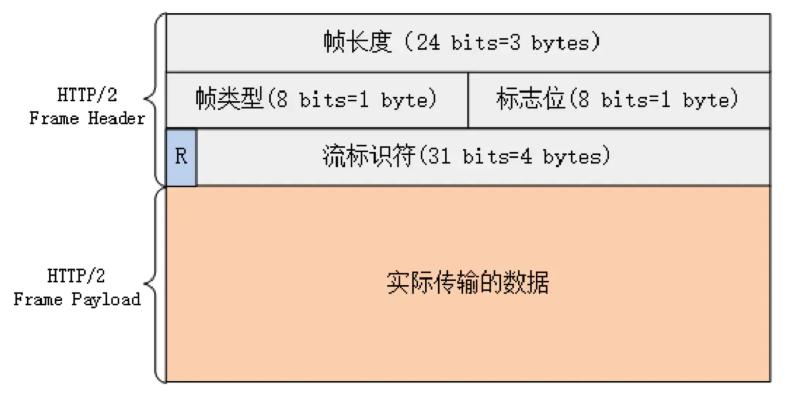
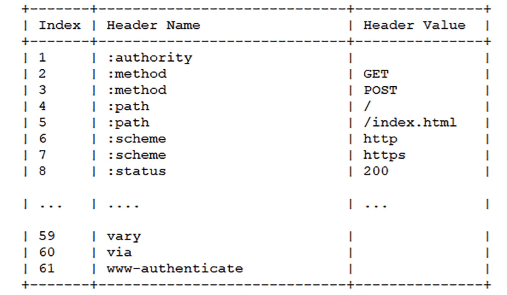
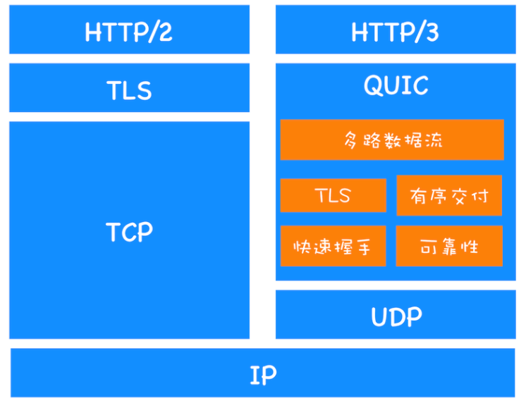
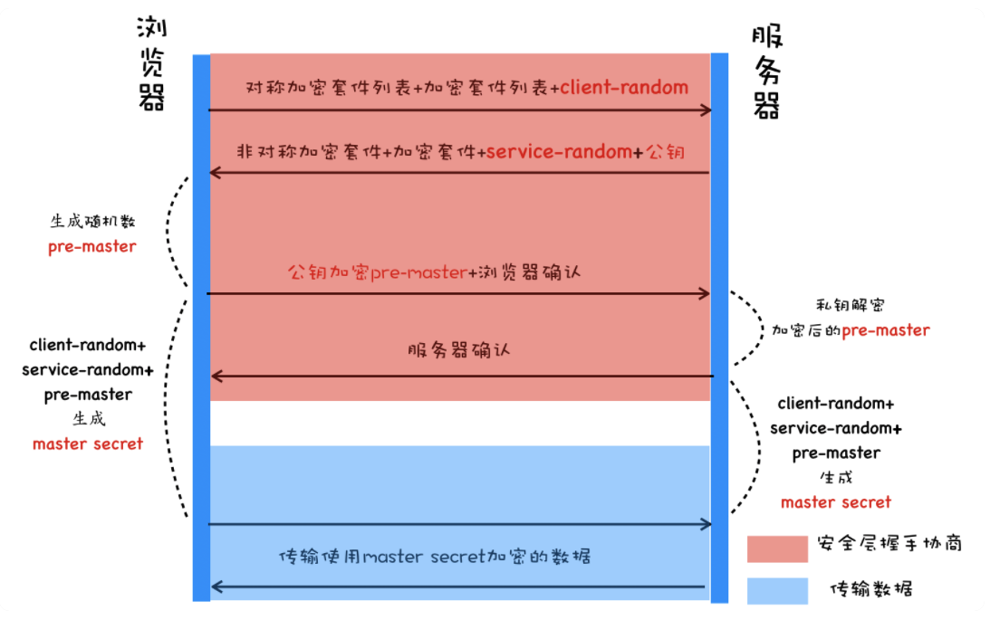
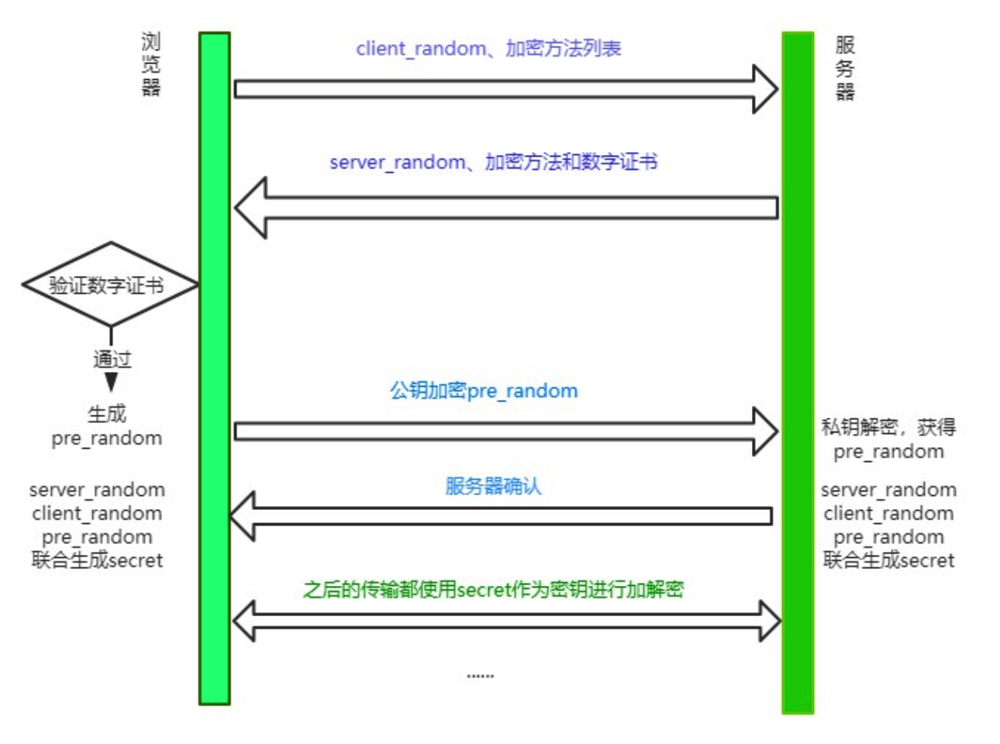
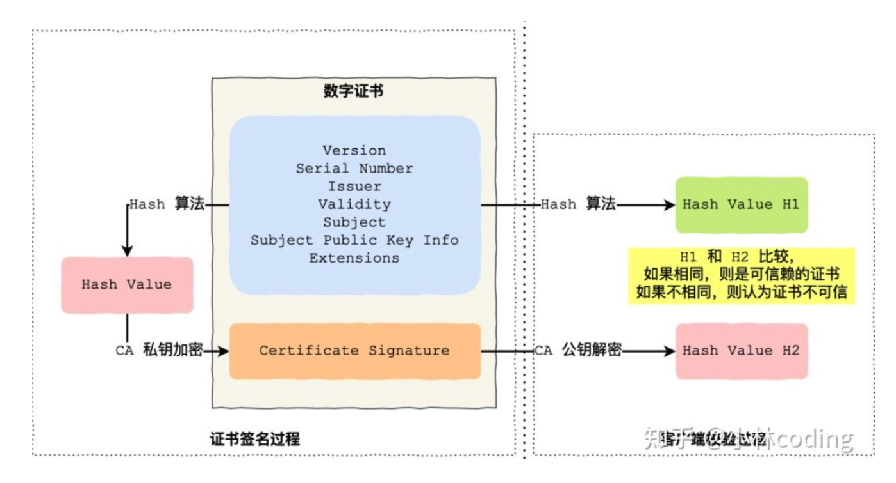
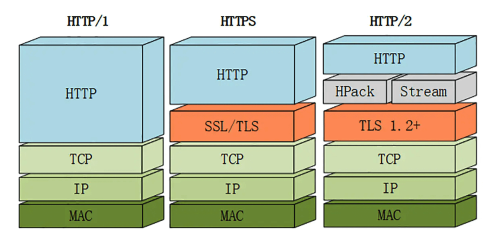

# HTTP

> 本篇将详细讲解http相关知识点

HTTP协议是Hyper Text Transfer Protocol（超文本传输协议）的缩写,是用于从万维网服务器传输超文本到本地浏览器的传送协议。HTTP 是基于 TCP/IP 协议通信协议来传递数据（HTML 文件, 图片文件, 查询结果等）。它不涉及数据包（packet）传输，主要规定了客户端和服务器之间的通信格式，默认使用80端口。


## Http的特点

1.**简单快速**：客户向服务器请求服务时，只需传送请求方法和路径。请求方法常用的有GET、HEAD、PUT、DELETE、POST。每种方法规定了客户与服务器联系的类型不同。由于HTTP协议简单，使得HTTP服务器的程序规模小，因而通信速度很快。

2.**灵活**：HTTP允许传输任意类型的数据对象。

3.**无连接**：无连接的含义是限制每次连接只处理一个请求。服务器处理完客户的请求，并收到客户的应答后，即断开连接。采用这种方式可以节省传输时间。

4.**无状态**：**HTTP协议是无状态的，HTTP 协议自身不对请求和响应之间的通信状态进行保存。任何两次请求之间都没有依赖关系。**直观地说，就是每个请求都是独立的，与前面的请求和后面的请求都是没有直接联系的。协议本身并不保留之前一切的请求或 响应报文的信息。**这是为了更快地处理大量事务，确保协议的可伸缩性，而特意把 HTTP 协议设计成如此简单的。**


## HTTP/0.9

​     HTTP协议的最初版本，功能简陋，仅支持请求方式GET，并且仅能请求访问HTML格式的资源。


## **HTTP/1.0** 

- 增加了请求方式POST和HEAD
- 引入的请求头和响应头，根据Content-Type可以支持多种数据格式，不再局限于0.9版本的HTML格式
- 支持浏览器缓存
- 引入了状态码


## **HTTP/1.1**

### 新增的功能

- 增加了持久连接

- 引入Cookie，为解决http无状态问题。

- 提供虚拟主机的支持

  - 在 HTTP/1.0 中，每个域名绑定了一个唯一的 IP 地址，因此一个服务器只能支持一个域名。但是随着虚拟主机技术的发展，需要实现在一台物理主机上绑定多个虚拟主机，每个虚拟主机都有自己的单独的域名，这些单独的域名都公用同一个 IP 地址。因此，HTTP/1.1 的请求头中增加了 Host 字段，用来表示当前的域名地址，这样服务器就可以根据不同的 Host 值做不同的处理。

- 对动态生成的内容，浏览器可以及时知道文件是否接收完

  - 在设计 HTTP/1.0 时，需要在响应头中设置完整的数据大小，如Content-Length: 901，这样浏览器就可以根据设置的数据大小来接收数据。不过随着服务器端的技术发展，很多页面的内容都是动态生成的，因此在传输数据之前并不知道最终的数据大小，这就导致了浏览器不知道何时会接收完所有的文件数据。

    HTTP/1.1 通过引入 Chunk transfer 机制来解决这个问题，服务器会将数据分割成若干个任意大小的数据块，每个数据块发送时会附上上个数据块的长度，最后使用一个零长度的块作为发送数据完成的标志。这样就提供了对动态内容的支持。

### 优点

**增加了持久连接的方法，keep-alive**

​	它的特点是在一个 TCP 连接上可以传输多个 HTTP 请求，只要浏览器或者服务器没有明确断开连接，那么该 TCP 连接会一直保持。http1.1默认开启，关闭连接Connection: close。

### 缺点

**网络利用率不高**

​	**1.TCP慢启动策略**，它会慢慢将请求启动起来，然后判断当前的网络环境是否稳定，但是这个过程太慢了，导致网络利用率不高。

​	**2.TCP连接出现竞争资源**，当我们带宽不足的时候，这时候关键资源不能得到服务器快速回复，浏览器则会一直等待，甚至卡顿。

​	**3.引起了队头堵塞问题**，http1.1传输是基于tcp/ip的，tcp同时只能处理一个请求并且需要等待当前请求处理完才能处理下一个请求，那么当tcp出现丢包，等待，重传，或者其他原因。这个过程就会队头堵塞问题。使后面的请求一直处于等待。这样也会导致网络利用率不高。

### 如何优化http1.1连接？

TCP慢启动和 TCP连接出现竞争资源带宽是由于 TCP 本身的机制导致的，而队头阻塞是由于 HTTP/1.1 的机制导致的，所以我们优化的方式只能对队头堵塞的问题进行优化，剩下的只能交给下一代http2.0协议来优化了。

**浏览器为每个域名最多同时维护 6 个 TCP 持久连接**，我们可以利用这个优点使用合理CDN资源，比如使用了2个不同的CDN域名，那么最多可以同时发送 3 * 6 个tcp连接，这个技术称为域名分片。


## **HTTP/2.0**

> 上面提到TCP慢启动，TCP资源竞争，是TCP的本身机制导致的，其实还有http1.1做的不够好。那么http2.0中可以完美解决这个问题，还是长连接，只维护一个TCP连接，这样TCP慢启动就只有一次，TCP连接之前也不会出现竞争。
>
> 至于队头堵塞处理起来确实麻烦，http2.0也只是缓解了队头堵塞的问题。那问题就留在了http3.0啦。

### 新增功能

- 多路复用
- 设置请求的优先级
- 服务器推送
- 头部压缩

### 优点

#### 多路复用

多路复用是http2.0中最重要的功能，可以做到并发请求的数量比HTTP1.1大了好几个数量级，使得http传输效率提升20%-60%。

大概流程是客户端可以并发请求，然后服务器可以并发接收，按照优先级去处理，并且返回回来给客户端。

**多路复用的实现流程**

http2.0增加了二进制分帧层处理。

1. 浏览器将请求信息准备好。
2. 二进制分帧层将数据进行分帧，数据会转换为一个个带有请求 ID 编号的帧，通过协议栈将这些帧「称为流，Stream」发送给服务器。
3. 服务器接收到帧数据后，会根据ID将帧转换为数据，交给服务器处理。
4. 服务器处理完后，将响应的数据传递到二进制分帧层。
5. 同样，二进制分帧层将数据转换为一个个带ID编号的帧，通过协议栈将这些帧发送给浏览器。
6. 浏览器接收到帧数据后，将帧转换为数据，并将数据交给相应的请求。

以上就是多路复用的详细流程，就是因为这些帧它可以并发，随意发，就是多路复用的意思，并且二进制分帧层将数据转换为二进制具有更好的兼容性，计算器能够更好的识别提高效率。

**二进制分层详解**




帧结构如上。分别包含帧长度，帧类型，标志位，流标识符，实际传输的数据组成，总共 9 个字节。

**帧长度**

帧长度记录了这一帧实际传输数据（帧负载）的长度。它由 24 个比特位来表示，意味着一个帧最多可传输的数据可以达到 16 M。

**帧类型**

帧类型由 8 个比特位来表示，最多可以表示 256 种类型。HTTP/2 一共定义了 10 种类型。大概可以分为**数据帧**和**控制帧**两种。数据帧用来存放 HTTP 报文，控制帧用来管理`流`的传输。

**标志位**

标志位由 8 个比特位来表示，可以保存 8 个标志位，携带控制信息。

**流标识符**

流标识符由 32 个比特位表示，但最高位是保留位，所以最多可以使用 31 位。其上限为 2^31，大约是 21 亿。有了流标识符，接收方就可以从乱序的帧里识别是相同流标识符的帧，并按序组合起来。


#### 请求的优先级

浏览器根据`type/context`来给资源设置优先级，二进制分帧层将数据分为很多帧之后，就可以通过优化这些帧的交错和传输顺序进一步优化性能。每个流都可以带有一个请求优先级，服务器可以根据流的优先级，控制资源分配（CPU、内存、带宽），而在响应数据准备好之后，优先将最高优先级的帧发送给客户端。高优先级的流都应该优先发送，但又不会绝对的。可能又会引入首队阻塞的问题，高优先级的请求慢导致阻塞其他资源交付。

●优先级最高：主要的html--- Highest

●优先级高：CSS文件 ---High

●优先级中：js文件 ----High / Low

●优先级低：图片 --- Low

#### 服务器推送

服务器推送的功能，即不经请求服务端主动向客户端发送数据。

当用户请求一个 HTML 页面之后，服务器知道该 HTML 页面会引用几个重要的 JavaScript 文件和 CSS 文件，那么在接收到 HTML 请求之后，附带将要使用的 CSS 文件和 JavaScript 文件一并发送给浏览器，这样当浏览器解析完 HTML 文件之后，就能直接拿到需要的 CSS 文件和 JavaScript 文件，服务器可以缓存客户端的文件，可以提升首次打开页面的速度。

#### 头部压缩

HTTP请求和响应中，状态行和请求/响应头都是些信息字段，并没有真正的数据，因此http2.0中将所有的信息字段建立一张表，为表中的每个字段建立索引，客户端和服务端共同使用这个表，他们之间就以索引号来表示信息字段，这样就避免了http2.0以前的重复繁琐的字段，并以压缩的方式传输，提高利用率，利用的是HPACK算法。

**HPACK算法**

首先是在服务器和客户端之间建立哈希表，将用到的字段存放在这张表中，那么在传输的时候对于之前出现过的值，只需要把**索引**(比如 0，1，2，...)传给对方即可，对方拿到索引查表就行了。这种**传索引**的方式，可以说让请求头字段得到极大程度的精简和复用。

**哈夫曼编码**，哈夫曼编码的原理就是先将所有出现的字符建立一张索引表，然后让出现次数多的字符对应的索引尽可能短，传输的时候也是传输这样的**索引序列**，可以达到非常高的压缩率。



### 缺点

还是队头堵塞问题，因为http2.0是基于tcp/ip的，那么传输的时候只能一个接着一个传输，所以队头堵塞的问题，一定会存在，无法解决，只能尽量减缓。

只要传输过程中出现丢包，那么就会堵塞后面的传输，等待重传，据统计，当丢包率达到2%，http2.0的传输效率还没有http1.1中高效。


## HTTP/3.0

> http3.0是一个跨时代的产品，从根源上解决了tcp的缺点，并把tcp的优点整合到http3.0上面。尽管截止到现在2021年6月还在草案状态，相信未来一定值得我们的期待。

#### TCP缺点

##### 队头堵塞

队头堵塞问题一直在解决，却无法根治，原因在于TCP的底层是一条通道传输的原因，http1.1 多个tcp连接，但是其中一个连接堵塞了，其余5个连接还可以继续，而http2.0只有一个tcp连接，如果出现堵塞，它的传输效率可能还比http1.1还低。

##### TCP建立连接延时

网络延迟又称为 RTT（Round Trip Time），是客户端发送一个数据包到服务器，服务器再返回这个过程所需时间。

在建立 TCP 连接的时候，需要和服务器进行三次握手来确认连接成功，也就是说需要在消耗完 1.5 个 RTT 之后才能进行数据传输。

如果配置了https，还需要TLS连接，TLS 有两个版本——TLS1.2 和 TLS1.3，每个版本建立连接所花的时间不同，大致是需要 1～2 个 RTT。

大概耗费3-4个RTT「一个RTT大概10ms～100ms」，其实这样的耗费时间有时候用户是感觉得到卡顿的。

#### TCP优点

##### 可靠传输

出现丢包重传。

##### 请求-应答（稳定）

客户端传输/接受数据，服务端都会做出应答。

#### QUIC 协议

由于网路链路经过很多层，Wi-Fi，路由器，交换机等等，但是它们都是使用TCP或者UDP进行传输，所以留给http3.0的创新空间不大，它只能选择弃用TCP，选择UDP。



QUIC 协议是基于UDP，然后再上面发明一层QUIC协议，把UDP的不稳定，不可靠，把TCP可靠的稳定的学习过来，并实现快速握手功能、集成TLS1.3、多路复用。

**快速握手**：实现了快速握手功能。由于 QUIC 是基于 UDP 的，所以 QUIC 可以实现使用 0-RTT 或者 1-RTT 来建立连接，这意味着 QUIC 可以用最快的速度来发送和接收数据，这样可以大大提升首次打开页面的速度。

**集成TLS1.3**：目前TLS1.3是最先进的安全协议也是最快的。

**多路复用**：在一个连接中进行多条路径传输数据。

#### http3.0缺点

1.丢包率太高，由于udp优化不及tcp优化好，还需要有一段路需要走。

2.目前的浏览器厂商支持度不高。


## **TCP 三次握手**

目前http除了3.0版本外其他都是基于TCP连接。


**seq 同步序列序号(Synchronize Sequence Numbers)**：用来标识从 TCP 源端向目的端发送的字节流，发起方发送数据时对此进行标记，为第一个字节的序号，它是用来解决包在网络中乱序的问题。

**ack 确认序号**： 表示期望下一次应该接受到的报文的第一个字节的序号，若 ack = N 则表示，到序号 N-1 为止的所有的数据都已经正确的收到了。只有 ACK 标志位为 1 时，确认序号字段才有效，ack=seq+1。建立连接后，所有传送的报文段都必须把 ACK 置为 1，是用于向发送方确认已经收到了哪些包，用来解决不丢包的问题。

- 标志位
  - ACK：确认序号有效 ACK 是一个对数据包的确认，当正确收到数据包后，接收端会发送一个 ACk 给发送端，里面会说明对那个数据包进行确认，每个数据包里都会有一个序列号，如果收到的数据包有误，或错序，还会申请重发，NAK 是一个否定的回答，ACK 是确定回答，这样保证数据的正确传输，这是 TCP 协议的传输机制，被称为面向连接的。
  - RST：重置连接
  - SYN：发起一个新连接，当两台计算机在 TCP 连接上进行会话时，连接一定会首先被初始化。完成这项任务的包叫作 SYN。
  - FIN：释放一个连接 带有该标志置位的数据包用来结束一个 TCP 回话，但对应端口仍处于开放状态，准备接收后续数据


### 三次握手流程

**第一次握手客户端发送请求到服务器**

SYN包初始化完成，SYN=1标志着准备好连接了，并且发送数据包的第一个字节的序号，seq=x。

**第二次握手服务器处理完后返回客户端**

接受到合法的连接请求后服务器也进行初始化SYN=1，并且确认ACK=1，还有ack=x+1，期望下次握手能拿到x+1的序号，发送包的第一个字节的序号seq=y。

**第三次握手客户端发送数据包给服务器**

这时候SYN是0就忽略了，不用再初始化了，确认ACK=1，然后期望下次收到的是 ack=y+1，并且seq = x+1，发送给服务器，发送完毕后，客户端和服务器进入[ESTABLISHED](https://baike.baidu.com/item/ESTABLISHED)（TCP连接成功）状态，完成三次握手，然后就可以传递数据了。

**如果是两次握手？**

服务端无法确认客户端是否收到了信息，从而无法进行下一步建立通道的操作。

**如果是四次握手？**

服务端如果是第四次握手的话，就会存在没有什么需要确认的信息回去了，因为需要确认的序号都已经确认好了，无需多余的操作。	


## **TCP 四次挥手**

> Connection: keep-alive http1.0 需要设置，http1.1 默认就是长链接，一般页面关闭后就会关闭链接。
>
> 我们还可以通过keep-alive:timeout=15或者设置Connection:close。


- 但关闭连接时，当服务器端收到 FIN 报文时，很可能并不会立即关闭链接，所以只能先回复一个 ACK 报文，告诉客户端：”你发的 FIN 报文我收到了”，只有等到服务器端所有的报文都发送完了，我才能发送 FIN 报文，因此不能一起发送，故需要四步握手。

### **四次挥手流程**

说明：当通信完成后，客户端和服务器都可以主动断开连接，例如，客户端不主动断开连接，也不发送数据，服务端还等着接收，会占用服务器的资源，服务器也可以主动断开连接。

**第一次挥手 客户端向服务端发起断开连接**

这时候客户端和服务端都处在ESTABLISHED连接状态，当客户端想发起断开连接时 FIN=1(1代表请求断开连接),seq=u,发送后，客户端进入FIN-WAIT 终止等待状态。

**第二次挥手 服务器回复浏览器**

当服务端收到客户端的请求后，回复ACK=1（确认收到），seq=v，ack=u+1，当B发送后，进入CLOSE-WAIT关闭等待状态

客户端收到服务端的回复后，进入FIN-WAIT-2终止等待状态,因为服务端仅仅是回复了，他在处理断开相关工作，和等待数据是否已经传递完毕，所以服务端没有同意断开，客户端还需要继续等待。

**第三次挥手 服务器同意断开通知客户端**

服务端处理好信息后并且信息已经发送完毕了，服务端会发送FIN=1(发送中断请求，即同意中断),ACK=1（确认收到）,seq=w,ack=u+1,服务端发送完后进入LIST-ACK最后确认状态。

**第四次挥手 客户端确认 并通知服务端**

客户端收到服务端中断请求后，发送回复，ACK=1（确认收到），seq=u+1，ack=w+1，发送完后A进入TIME-WAIT时间等待状态，因为网络中可能还有数据在传输，所以A要等待一段时间，确认这些数据发送成功。

服务端收到客户端的确认后，进入CLOSED关闭状态，断开与A连接，然后会迅速进入LISTEN收听状态，继续接受下一个客户端的请求连接。当客户端等待2ms（TCP报文段在网络中的最大生存时间,RFC 1122标准的建议值是2min），进入CLOSED关闭状态，断开与服务器B连接。


**为什么 TCP 需要四次挥手而不是 2 次挥手呢？**

因为当客户端发送断开请求的时候，服务端需要马上回复客户端，但是服务端此时需要做一些比较费时的事情，所以先马上返回客户端‘好的，我正在处理后续的断开操作’，等处理完了，再去返回给客户端，接着客户端接收到了，回复一下服务端，就可以断开了。


## 什么是HTTPS

HTTPS是在HTTP上建立SSL/TLS加密层，并对传输数据进行加密，是HTTP协议的安全版。现在它被广泛用于万维网上安全敏感的通讯，例如交易支付方面。

HTTPS主要作用是：

（1）对数据进行加密，并建立一个信息安全通道，来保证传输过程中的数据安全;

（2）对网站服务器进行真实身份认证。

我们经常会在Web的登录页面和购物结算界面等使用HTTPS通信。使用HTTPS通信时，不再用`http://`，而是改用`https://`。另外，当浏览器访问HTTPS通信有效的Web网站时，浏览器的地址栏内会出现一个带锁的标记。对HTTPS的显示方式会因浏览器的不同而有所改变。

SSL 出过三个大版本，当它发展到第三个大版本的时候才被标准化，成为 TLS（传输层安全，Transport Layer Security），并被当做 TLS1.0 的版本，准确地说，**TLS1.0 = SSL3.1**。

### 为什么会有HTTPS？

我们知道http2.0以前，http传输数据都是明文传输的，http2.0/http3.0 采用二进制帧数据，因此在传输的每一个环节，数据都有可能被第三方窃取或者篡改，具体来说，HTTP 数据经过 TCP 层，然后经过`WIFI路由器`、`运营商`和`目标服务器`，这些环节中都可能被中间人拿到数据并进行篡改，也就是我们常说的**中间人攻击**。

那https是服务端/客户端将数据进行加密，然后客户端/服务器进行解密，这样就可以对数据能够保护起来，虽然也被攻击过，但是也起到了一定的防护作用，并且安全性越来越高。


##### 对称加密

对称加密：指的是**加密**和**解密**用的是**同样的密钥**。如果用来加密数据，抓包直接可以抓到密钥，所以不安全。

##### 非对称加密

非对称加密：如果有 A、 B 两把密钥，如果用 A 加密过的数据包只能用 B 解密，反之，如果用 B 加密过的数据包只能用 A 解密。

加解密计算量太大，增加服务端和客户端的负担，并且当服务器返回数据给客户端，抓包是可以抓到公钥的，同时返回的数据就会被破解出来，虽然上传数据公钥加密，黑客无法解密，所以效率不高也不安全。


### 对称加密和非对称加密的结合

综上所述，单独使用对称加密，非对称加密都是不安全的，那么将它们结合在一起确实一个不错的解决方案。



具体流程：

1. 首先浏览器向服务器发送对称加密套件列表、非对称加密套件列表和随机数 client-random；
2. 服务器保存随机数 client-random，选择对称加密和非对称加密的套件，然后生成随机数 service-random，向浏览器发送选择的加密套件、service-random 和公钥；
3. 浏览器保存公钥，并生成随机数 pre-master，然后利用公钥对 pre-master 加密，并向服务器发送加密后的数据；最后服务器拿出自己的私钥，解密出 pre-master 数据，并返回确认消息。

现在浏览器和服务器有三样相同的凭证:**client_random**、**server_random**和**pre-master**。然后两者用相同的对称加密方法和这三个随机数，生成最终的`密钥`。

然后浏览器和服务器尽管用一样的密钥进行通信，即使用`对称加密`。

**pre-master**是很安全的，因为需要私钥解密才能把pre-master算出来，据统计可以通过穷举解密，但是这种方式解密是不是难度太大了。

然而技术是不断的进步的，上面的加密仍然不够安全，下面的来看一下**TLS1.2**


### TLS1.2


ECDHE 即 “短暂-椭圆曲线-迪菲-赫尔曼（ephemeral Elliptic Curve Diffie -Hellman）”

## 添加数字证书

尽管通过两者加密方式的结合，能够很好地实现加密传输，但实际上还是存在一些问题。黑客如果采用 DNS 劫持，将目标地址替换成黑客服务器的地址，然后黑客自己造一份公钥和私钥，照样能进行数据传输。而对于浏览器用户而言，他是不知道自己正在访问一个危险的服务器的。

事实上`HTTPS`在上述`结合对称和非对称加密`的基础上，又添加了`数字证书认证`的步骤。其目的就是让服务器证明自己的身份。

### 传输过程

为了获取这个证书，服务器运营者需要向第三方认证机构获取授权，这个第三方机构也叫`CA`(`Certificate Authority`), 认证通过后 CA 会给服务器颁发**数字证书**。

这个数字证书有两个作用:

1. 服务器向浏览器证明自己的身份。
2. 把公钥传给浏览器。

这个验证的过程发生在什么时候呢？

当服务器传送`server_random`、加密方法的时候，顺便会带上`数字证书`(包含了`公钥`), 接着浏览器接收之后就会开始验证数字证书。如果验证通过，那么后面的过程照常进行，否则拒绝执行。

现在我们来梳理一下`HTTPS`最终的加解密过程:



### 认证过程

浏览器拿到数字证书后，如何来对证书进行认证呢？

首先，会读取证书中的明文内容。CA 进行数字证书的签名时会保存一个 Hash 函数，来这个函数来计算明文内容得到`信息A`，然后用公钥解密明文内容得到`信息B`，两份信息做比对，一致则表示认证合法。

当然有时候对于浏览器而言，它不知道哪些 CA 是值得信任的，因此会继续查找 CA 的上级 CA，以同样的信息比对方式验证上级 CA 的合法性。一般根级的 CA 会内置在操作系统当中，当然如果向上找没有找到根级的 CA，那么将被视为不合法。


只会的另外一个回答



```
CA 签发证书的过程，如上图左边部分：首先 CA 会把持有者的公钥、用途、颁发者、有效时间等信息打成一个包，然后对这些信息进行 Hash 计算，得到一个 Hash 值；然后 CA 会使用自己的私钥将该 Hash 值加密，生成 Certificate Signature，也就是 CA 对证书做了签名；最后将 Certificate Signature 添加在文件证书上，形成数字证书；客户端校验服务端的数字证书的过程，如上图右边部分：首先客户端会使用同样的 Hash 算法获取该证书的 Hash 值 H1；通常浏览器和操作系统中集成了 CA 的公钥信息，浏览器收到证书后可以使用 CA 的公钥解密 Certificate Signature 内容，得到一个 Hash 值 H2 ；最后比较 H1 和 H2，如果值相同，则为可信赖的证书，否则则认为证书不可信。
```



```
- HTTP报文
  - 请求报文
  - 响应报文
- 响应状态码
  - 200 OK
  - 202 Accepted ：服务器已接受请求，但尚未处理（异步）
  - 204 No Content：服务器成功处理了请求，但不需要返回任何实体内容
  - 206 Partial Content：服务器已经成功处理了部分 GET 请求（断点续传 Range/If-Range/Content-Range/Content-Type:”multipart/byteranges”/Content-Length….）
  - 301 Moved Permanently
  - 302 Move Temporarily
  - 304 Not Modified
  - 305 Use Proxy
  - 400 Bad Request : 请求参数有误
  - 401 Unauthorized：权限（Authorization）
  - 404 Not Found
  - 405 Method Not Allowed
  - 408 Request Timeout
  - 500 Internal Server Error
  - 503 Service Unavailable
  - 505 HTTP Version Not Supported
  - ……
```


## 总结

HTTPS并不是一个新的协议, 它在`HTTP`和`TCP`的传输中建立了一个安全层，利用`对称加密`和`非对称机密`结合数字证书认证的方式，让传输过程的安全性大大提高。

参考

[《浏览器工作原理与实践》](https://time.geekbang.org/column/intro/100033601)

[《web协议详解与抓包实战——陶辉》](https://link.juejin.cn/?target=https%3A%2F%2Ftime.geekbang.org%2Fcourse%2Fintro%2F175)

[《透视 HTTP 协议》——chrono](https://link.juejin.cn/?target=https%3A%2F%2Ftime.geekbang.org%2Fcolumn%2Fintro%2F100029001)

