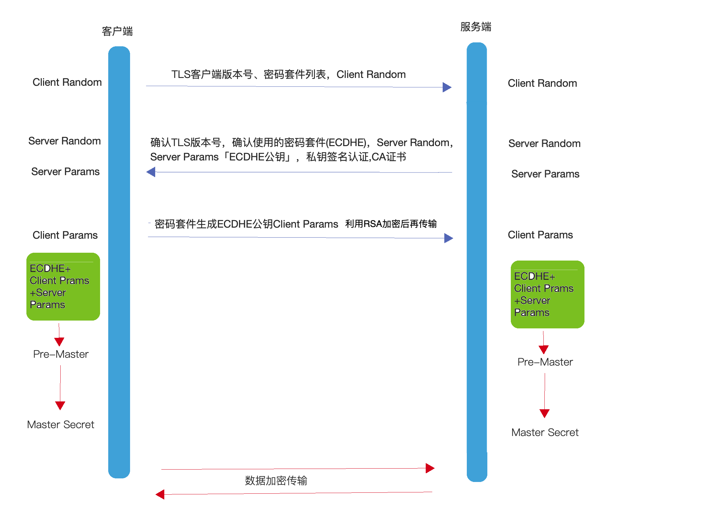
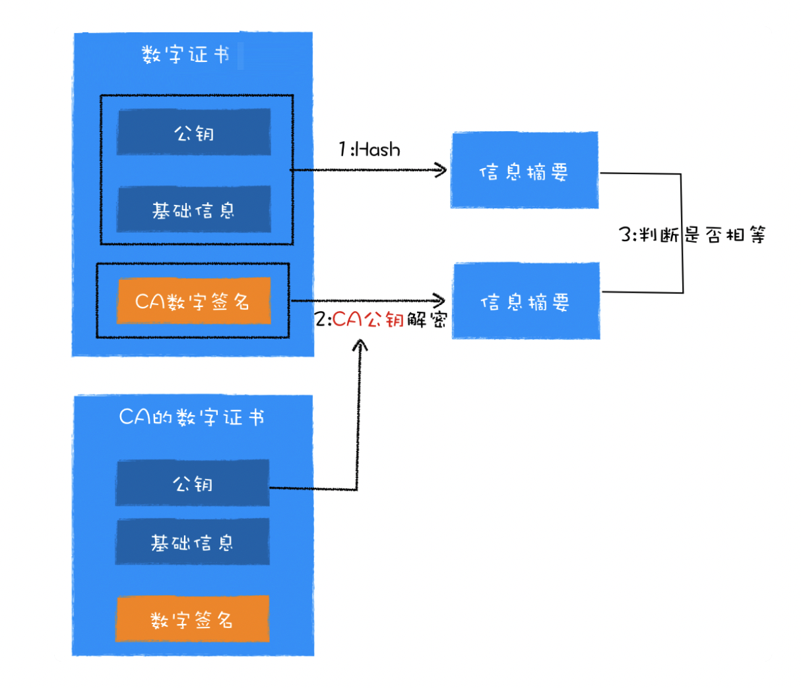

# HTTP

> 本篇将详细讲解http相关知识点

HTTP协议是Hyper Text Transfer Protocol（超文本传输协议）的缩写,是用于从万维网服务器传输超文本到本地浏览器的传送协议。HTTP 是基于 TCP/IP 协议通信协议来传递数据（HTML 文件, 图片文件, 查询结果等）。它不涉及数据包（packet）传输，主要规定了客户端和服务器之间的通信格式，默认使用80端口。


## Http的特点

1.**简单快速**：客户向服务器请求服务时，只需传送请求方法和路径。请求方法常用的有GET、HEAD、PUT、DELETE、POST。每种方法规定了客户与服务器联系的类型不同。由于HTTP协议简单，使得HTTP服务器的程序规模小，因而通信速度很快。

2.**灵活**：HTTP允许传输任意类型的数据对象。

3.**无连接**：无连接的含义是限制每次连接只处理一个请求。服务器处理完客户的请求，并收到客户的应答后，即断开连接。采用这种方式可以节省传输时间。

4.**无状态**：**HTTP协议是无状态的，HTTP 协议自身不对请求和响应之间的通信状态进行保存。任何两次请求之间都没有依赖关系。**直观地说，就是每个请求都是独立的，与前面的请求和后面的请求都是没有直接联系的。协议本身并不保留之前一切的请求或 响应报文的信息。**这是为了更快地处理大量事务，确保协议的可伸缩性，而特意把 HTTP 协议设计成如此简单的。**


## HTTP/0.9

1991年创建了**HTTP/0.9**

​     HTTP协议的最初版本，功能简陋，仅支持请求方式GET，并且仅能请求访问HTML格式的资源。


## **HTTP/1.0** 

1996年创建了**HTTP/1.0** 

- 增加了请求方式POST和HEAD
- 引入的请求头和响应头，根据Content-Type可以支持多种数据格式，不再局限于0.9版本的HTML格式
- 支持浏览器缓存
- 引入了状态码


## **HTTP/1.1**

1999年创建了**HTTP/1.1**

### 新增的功能

- 增加了持久连接

- 引入Cookie，为解决http无状态问题。

- 提供虚拟主机的支持

  - 在 HTTP/1.0 中，每个域名绑定了一个唯一的 IP 地址，因此一个服务器只能支持一个域名。但是随着虚拟主机技术的发展，需要实现在一台物理主机上绑定多个虚拟主机，每个虚拟主机都有自己的单独的域名，这些单独的域名都公用同一个 IP 地址。因此，HTTP/1.1 的请求头中增加了 Host 字段，用来表示当前的域名地址，这样服务器就可以根据不同的 Host 值做不同的处理。

- 对动态生成的内容，浏览器可以及时知道文件是否接收完

  - 在设计 HTTP/1.0 时，需要在响应头中设置完整的数据大小，如Content-Length: 901，这样浏览器就可以根据设置的数据大小来接收数据。不过随着服务器端的技术发展，很多页面的内容都是动态生成的，因此在传输数据之前并不知道最终的数据大小，这就导致了浏览器不知道何时会接收完所有的文件数据。

    HTTP/1.1 通过引入 Chunk transfer 机制来解决这个问题，服务器会将数据分割成若干个任意大小的数据块，每个数据块发送时会附上上个数据块的长度，最后使用一个零长度的块作为发送数据完成的标志。这样就提供了对动态内容的支持。

### 优点

**增加了持久连接的方法，keep-alive**

​	它的特点是在一个 TCP 连接上可以传输多个 HTTP 请求，只要浏览器或者服务器没有明确断开连接，那么该 TCP 连接会一直保持。http1.1默认开启，关闭连接Connection: close。

### 缺点

**网络利用率不高**

​	**1.TCP慢启动策略**，它会慢慢将请求启动起来，然后判断当前的网络环境是否稳定，但是这个过程太慢了，导致网络利用率不高。

​	**2.TCP连接出现竞争资源**，当我们带宽不足的时候，这时候关键资源不能得到服务器快速回复，浏览器则会一直等待，甚至卡顿。

​	**3.引起了队头堵塞问题**，http1.1传输是基于tcp/ip的，tcp同时只能处理一个请求并且需要等待当前请求处理完才能处理下一个请求，那么当tcp出现丢包，等待，重传，或者其他原因。这个过程就会队头堵塞问题。使后面的请求一直处于等待。这样也会导致网络利用率不高。

### 如何优化http1.1连接？

TCP慢启动和 TCP连接出现竞争资源带宽是由于 TCP 本身的机制导致的，而队头阻塞是由于 HTTP/1.1 的机制导致的，所以我们优化的方式只能对队头堵塞的问题进行优化，剩下的只能交给下一代http2.0协议来优化了。

**浏览器为每个域名最多同时维护 6 个 TCP 持久连接**，我们可以利用这个优点使用合理CDN资源，比如使用了2个不同的CDN域名，那么最多可以同时发送 3 * 6 个tcp连接，这个技术称为域名分片。


## **HTTP/2.0**

2015年创建了**HTTP/2.0**

> 上面提到TCP慢启动，TCP资源竞争，是TCP的本身机制导致的，其实还有http1.1做的不够好。那么http2.0中可以完美解决这个问题，还是长连接，只维护一个TCP连接，这样TCP慢启动就只有一次，TCP连接之前也不会出现竞争。
>
> 至于队头堵塞处理起来确实麻烦，http2.0也只是缓解了队头堵塞的问题。那问题就留在了http3.0啦。

### 新增功能

- 多路复用
- 设置请求的优先级
- 服务器推送
- 头部压缩

### 优点

#### 多路复用

多路复用是http2.0中最重要的功能，可以做到并发请求的数量比HTTP1.1大了好几个数量级，使得http传输效率提升20%-60%。

大概流程是客户端可以并发请求，然后服务器可以并发接收，按照优先级去处理，并且返回回来给客户端。

**多路复用的实现流程**

http2.0增加了二进制分帧层处理。

1. 浏览器将请求信息准备好。
2. 二进制分帧层将数据进行分帧，数据会转换为一个个带有请求 ID 编号的帧，通过协议栈将这些帧「称为流，Stream」发送给服务器。
3. 服务器接收到帧数据后，会根据ID将帧转换为数据，交给服务器处理。
4. 服务器处理完后，将响应的数据传递到二进制分帧层。
5. 同样，二进制分帧层将数据转换为一个个带ID编号的帧，通过协议栈将这些帧发送给浏览器。
6. 浏览器接收到帧数据后，将帧转换为数据，并将数据交给相应的请求。

以上就是多路复用的详细流程，就是因为这些帧它可以并发，随意发，就是多路复用的意思，并且二进制分帧层将数据转换为二进制具有更好的兼容性，计算器能够更好的识别提高效率。

**二进制分层详解**


帧结构如上。分别包含帧长度，帧类型，标志位，流标识符，实际传输的数据组成，总共 9 个字节。

**帧长度**

帧长度记录了这一帧实际传输数据（帧负载）的长度。它由 24 个比特位来表示，意味着一个帧最多可传输的数据可以达到 16 M。

**帧类型**

帧类型由 8 个比特位来表示，最多可以表示 256 种类型。HTTP/2 一共定义了 10 种类型。大概可以分为**数据帧**和**控制帧**两种。数据帧用来存放 HTTP 报文，控制帧用来管理`流`的传输。

**标志位**

标志位由 8 个比特位来表示，可以保存 8 个标志位，携带控制信息。

**流标识符**

流标识符由 32 个比特位表示，但最高位是保留位，所以最多可以使用 31 位。其上限为 2^31，大约是 21 亿。有了流标识符，接收方就可以从乱序的帧里识别是相同流标识符的帧，并按序组合起来。


#### 请求的优先级

浏览器根据`type/context`来给资源设置优先级，二进制分帧层将数据分为很多帧之后，就可以通过优化这些帧的交错和传输顺序进一步优化性能。每个流都可以带有一个请求优先级，服务器可以根据流的优先级，控制资源分配（CPU、内存、带宽），而在响应数据准备好之后，优先将最高优先级的帧发送给客户端。高优先级的流都应该优先发送，但又不会绝对的。可能又会引入队首阻塞的问题，高优先级的请求慢导致阻塞其他资源交付。

●优先级最高：主要的html--- Highest

●优先级高：CSS文件 ---High

●优先级中：js文件 ----High / Low

●优先级低：图片 --- Low / Lowest

#### 服务器推送

服务器推送的功能，即不经请求服务端主动向客户端发送数据。

当用户请求一个 HTML 页面之后，服务器知道该 HTML 页面会引用几个重要的 JavaScript 文件和 CSS 文件，那么在接收到 HTML 请求之后，附带将要使用的 CSS 文件和 JavaScript 文件一并发送给浏览器，这样当浏览器解析完 HTML 文件之后，就能直接拿到需要的 CSS 文件和 JavaScript 文件，服务器可以缓存客户端的文件，可以提升首次打开页面的速度。

#### 头部压缩

HTTP请求和响应中，状态行和请求/响应头都是些信息字段，并没有真正的数据，因此http2.0中将所有的信息字段建立一张表，为表中的每个字段建立索引，客户端和服务端共同使用这个表，他们之间就以索引号来表示信息字段，这样就避免了http2.0以前的重复繁琐的字段，并以压缩的方式传输，提高利用率，利用的是HPACK算法。

**HPACK算法**

首先是在服务器和客户端之间建立哈希表，将用到的字段存放在这张表中，那么在传输的时候对于之前出现过的值，只需要把**索引**(比如 0，1，2，...)传给对方即可，对方拿到索引查表就行了。这种**传索引**的方式，可以说让请求头字段得到极大程度的精简和复用。

**哈夫曼编码**，哈夫曼编码的原理就是先将所有出现的字符建立一张索引表，然后让出现次数多的字符对应的索引尽可能短，传输的时候也是传输这样的**索引序列**，可以达到非常高的压缩率。


### 缺点

还是队头堵塞问题，因为http2.0是基于tcp/ip的，那么传输的时候只能一个接着一个传输，所以队头堵塞的问题，一定会存在，无法解决，只能尽量减缓。

只要传输过程中出现丢包，那么就会堵塞后面的传输，等待重传，据统计，当丢包率达到2%，http2.0的传输效率还没有http1.1中高效。


## HTTP/3.0

> http3.0是一个跨时代的产品，从根源上解决了tcp的缺点，并把tcp的优点整合到http3.0上面。尽管截止到现在2021年6月还在草案状态，相信未来一定值得我们的期待。

#### TCP缺点

##### 队头堵塞

队头堵塞问题一直在解决，却无法根治，原因在于TCP的底层是一条通道传输的原因，http1.1 多个tcp连接，但是其中一个连接堵塞了，其余5个连接还可以继续，而http2.0只有一个tcp连接，如果出现堵塞，它的传输效率可能比http1.1还低。

##### TCP建立连接延时

网络延迟又称为 RTT（Round Trip Time），是客户端发送一个数据包到服务器，服务器再返回这个过程所需时间。

在建立 TCP 连接的时候，需要和服务器进行三次握手来确认连接成功，也就是说需要在消耗完 1.5 个 RTT 之后才能进行数据传输。

如果配置了https，还需要TLS连接，TLS 有两个版本——TLS1.2 和 TLS1.3，每个版本建立连接所花的时间不同，大致是需要 1～2 个 RTT。

大概耗费2.5-3.5个RTT「一个RTT大概10ms～100ms」，其实这样的耗费时间有时候用户是感觉得到卡顿的。

#### TCP优点

##### 可靠传输

出现丢包重传。

##### 请求-应答（稳定）

客户端传输/接受数据，服务端都会做出应答。

#### QUIC 协议

由于网路链路经过很多层，Wi-Fi，路由器，交换机等等，但是它们都是使用TCP或者UDP进行传输，所以留给http3.0的创新空间不大，它只能选择弃用TCP，选择UDP。


QUIC 协议是基于UDP，然后再上面发明一层QUIC协议，把UDP的不稳定，不可靠，把TCP可靠的稳定的学习过来，并实现快速握手功能、集成TLS1.3、多路复用。

**快速握手**：实现了快速握手功能。由于 QUIC 是基于 UDP 的，所以 QUIC 可以实现使用 0-RTT 或者 1-RTT 来建立连接，这意味着 QUIC 可以用最快的速度来发送和接收数据，这样可以大大提升首次打开页面的速度。

**集成TLS1.3**：目前TLS1.3是最先进的安全协议也是最快的。

**多路复用**：在一个连接中进行多条路径传输数据。

#### http3.0缺点

1.丢包率太高，由于udp优化不及tcp优化好，还需要有一段路需要走。

2.目前的浏览器厂商支持度不高。


上面讲了那么多，这张图可以解析的比较多。


# **TCP 三次握手**

目前http除了3.0版本外其他都是基于TCP连接。


**seq 同步序列序号(Synchronize Sequence Numbers)**：用来标识从 TCP 源端向目的端发送的字节流，发起方发送数据时对此进行标记，为第一个字节的序号，它是用来解决包在网络中乱序的问题。

**ack 确认序号**： 表示期望下一次应该接受到的报文的第一个字节的序号，若 ack = N 则表示，到序号 N-1 为止的所有的数据都已经正确的收到了。只有 ACK 标志位为 1 时，确认序号字段才有效，ack=seq+1。建立连接后，所有传送的报文段都必须把 ACK 置为 1，是用于向发送方确认已经收到了哪些包，用来解决不丢包的问题。

- 标志位
  - ACK：确认序号有效 ACK 是一个对数据包的确认，当正确收到数据包后，接收端会发送一个 ACK 给发送端，里面会说明对那个数据包进行确认，每个数据包里都会有一个序列号，如果收到的数据包有误，或错序，还会申请重发，NAK 是一个否定的回答，ACK 是确定回答，这样保证数据的正确传输，这是 TCP 协议的传输机制，被称为面向连接的。
  - NAK：则和ACK相反，当服务端没有收到包的时候就会发送回去给客户端，客户端就会重传数据，所以它意味着丢包重传。
  - RST：重置连接
  - SYN：发起一个新连接，当两台计算机在 TCP 连接上进行会话时，连接一定会首先被初始化。完成这项任务的包叫作 SYN。
  - FIN：释放一个连接 带有该标志置位的数据包用来结束一个 TCP 回话，但对应端口仍处于开放状态，准备接收后续数据


### 三次握手流程

**第一次握手客户端发送请求到服务器**

SYN包初始化完成，SYN=1标志着准备好连接了，并且发送数据包的第一个字节的序号，seq=x。

**第二次握手服务器处理完后返回客户端**

接受到合法的连接请求后服务器也进行初始化SYN=1，并且确认ACK=1，还有ack=x+1，期望下次握手能拿到x+1的序号，发送包的第一个字节的序号seq=y。

**第三次握手客户端发送数据包给服务器**

这时候SYN是0就忽略了，不用再初始化了，确认ACK=1，然后期望下次收到的是 ack=y+1，并且seq = x+1，发送给服务器，发送完毕后，客户端和服务器进入[ESTABLISHED](https://baike.baidu.com/item/ESTABLISHED)（TCP连接成功）状态，完成三次握手，然后就可以传递数据了。

**如果是两次握手？**

服务端无法确认客户端是否收到了信息，从而无法进行下一步建立通道的操作。

**如果是四次握手？**

服务端如果是第四次握手的话，就会存在没有什么需要确认的信息回去了，因为需要确认的序号都已经确认好了，无需多余的操作。	


# **TCP 四次挥手**

> Connection: keep-alive http1.0 需要设置，http1.1 默认就是长链接，一般页面关闭后就会关闭链接。
>
> 我们还可以通过keep-alive:timeout=15或者设置Connection:close。


- 但关闭连接时，当服务器端收到 FIN 报文时，很可能并不会立即关闭链接，所以只能先回复一个 ACK 报文，告诉客户端：”你发的 FIN 报文我收到了”，只有等到服务器端所有的报文都发送完了，我才能发送 FIN 报文，因此不能一起发送，故需要四步握手。

### **四次挥手流程**

说明：当通信完成后，客户端和服务器都可以主动断开连接，例如，客户端不主动断开连接，也不发送数据，服务端还等着接收，会占用服务器的资源，服务器也可以主动断开连接。

**第一次挥手 客户端向服务端发起断开连接**

这时候客户端和服务端都处在ESTABLISHED连接状态，当客户端想发起断开连接时 FIN=1(1代表请求断开连接),seq=u,发送后，客户端进入FIN-WAIT 终止等待状态。

**第二次挥手 服务器回复客户端**

当服务端收到客户端的请求后，回复ACK=1（确认收到），seq=v，ack=u+1，当B发送后，进入CLOSE-WAIT关闭等待状态

客户端收到服务端的回复后，进入FIN-WAIT-2终止等待状态,因为服务端仅仅是回复了，他在处理断开相关工作，和等待数据是否已经传递完毕，所以服务端没有同意断开，客户端还需要继续等待。

**第三次挥手 服务器同意断开通知客户端**

服务端处理好信息后并且信息已经发送完毕了，服务端会发送FIN=1(发送中断请求，即同意中断),ACK=1（确认收到）,seq=w,ack=u+1,服务端发送完后进入LIST-ACK最后确认状态。

**第四次挥手 客户端确认 并通知服务端**

客户端收到服务端中断请求后，发送回复，ACK=1（确认收到），seq=u+1，ack=w+1，发送完后A进入TIME-WAIT时间等待状态，因为网络中可能还有数据在传输，所以A要等待一段时间，确认这些数据发送成功。

服务端收到客户端的确认后，进入CLOSED关闭状态，断开与A连接，然后会迅速进入LISTEN收听状态，继续接受下一个客户端的请求连接。当客户端等待2ms（TCP报文段在网络中的最大生存时间,RFC 1122标准的建议值是2min），进入CLOSED关闭状态，断开与服务器B连接。


**为什么 TCP 需要四次挥手而不是 2 次挥手呢？**

因为当客户端发送断开请求的时候，服务端需要马上回复客户端，但是服务端此时需要做一些比较费时的事情，所以先马上返回客户端‘好的，我正在处理后续的断开操作’，等处理完了，再去返回给客户端，接着客户端接收到了，回复一下服务端，就可以断开了。


# 什么是HTTPS

HTTPS是在HTTP上建立SSL/TLS加密层，并对传输数据进行加密，是HTTP协议的安全版。现在它被广泛用于万维网上安全敏感的通讯，例如交易支付方面。

HTTPS主要作用是：

（1）对数据进行加密，并建立一个信息安全通道，来保证传输过程中的数据安全;

（2）对网站服务器进行真实身份认证。

我们经常会在Web的登录页面和购物结算界面等使用HTTPS通信。使用HTTPS通信时，不再用`http://`，而是改用`https://`。另外，当浏览器访问HTTPS通信有效的Web网站时，浏览器的地址栏内会出现一个带锁的标记。对HTTPS的显示方式会因浏览器的不同而有所改变。

SSL 出过三个大版本，当它发展到第三个大版本的时候才被标准化，成为 TLS（传输层安全，Transport Layer Security），并被当做 TLS1.0 的版本，准确地说，**TLS1.0 = SSL3.1**。

## 为什么会有HTTPS？

我们知道http2.0以前，http传输数据都是明文传输的，http2.0/http3.0 采用二进制帧数据，因此在传输的每一个环节，数据都有可能被第三方窃取或者篡改，具体来说，HTTP 数据经过 TCP 层，然后经过`WIFI路由器`、`运营商`和`目标服务器`，这些环节中都可能被中间人拿到数据并进行篡改，也就是我们常说的**中间人攻击**。

那https是服务端/客户端将数据进行加密，然后客户端/服务器进行解密，这样就可以对数据能够保护起来，虽然也可能被攻击，但是也起到了一定的防护作用，并且安全性越来越高。


## TLS1.2

> TLS1.2其实是非常复杂的过程。

### 使用RSA连接的TLS1.2

#### 对称加密

对称加密：指的是**加密**和**解密**用的是**同样的密钥**。如果用来加密数据，抓包直接可以抓到密钥，所以不安全。

#### 非对称加密

非对称加密：如果有 A、 B 两把密钥，如果用 A 加密过的数据包只能用 B 解密，反之，如果用 B 加密过的数据包只能用 A 解密。

加解密计算量太大，增加服务端和客户端的负担，并且当服务器返回数据给客户端，抓包是可以抓到公钥的，同时返回的数据就会被破解出来，虽然上传数据公钥加密，黑客无法解密，所以效率不高也不安全。

#### 对称加密和非对称加密的结合

综上所述，单独使用对称加密，非对称加密都是不安全的，那么将它们结合在一起确实一个不错的解决方案。


当 TCP 建立连接之后。

**第一步**

​	首先浏览器向服务器发送对称加密套件列表、非对称加密套件列表和随机数 client-random；

**第二步**

​	服务器保存随机数 client-random，选择对称加密和非对称加密的套件，然后生成随机数 service-random，向浏览器发送选择的加密套件、service-random 和公钥；

**第三步**

​	浏览器保存公钥，并生成随机数 pre-master，然后利用公钥对 pre-master 加密，并向服务器发送加密后的数据；最后服务器拿出自己的私钥，解密出 pre-master 数据，并返回确认消息。

**第四步**

​	现在浏览器和服务器有三样相同的凭证:**client_random**、**server_random**和**pre-master**。然后两者用相同的对称加密方法和这三个随机数，生成最终的`密钥`。

**第五步**

​	然后浏览器和服务器尽管用一样的密钥进行通信，即使用`对称加密`。

**小结**

​	**pre-master**是很安全的，因为需要私钥解密才能把pre-master算出来，据统计可以通过穷举解密，但是这种方式解密是不是难度太大了。

但是这种方式一旦被破解了，历史信息都是可以被查看到的，因为私钥是不变的，那么要解决这个问题，使用了ECDHE算法。

### 使用ECDHE的TLS1.2



当 TCP 建立连接之后。

**第一步**

​	客户端发送客户端的TLS版本号，加密密码套件列表，还有客户端随机生成的Client Random，我们可以在开发者工具上面的Security中查看TLS版本，密码套件。

**第二步**

​	服务端收到客户端信息后，确认TLS版本号，选择出此次连接的加密方法，也是ECDHE，把Client Random保存起来，方便以后使用，接着服务端也生成了一个Server Random，和 Serve Prams「也就是ECDHE公钥」，还有私钥签名认证，CA证书，用来证明服务端身份。

**第三步**

​	客户端收到这么多信息后，把Server Random， Serve Prams，保存起来，方便以后使用，接着使用CA证书，验证服务器身份，并且通过刚刚确认的加密方法生成Client Params，接着使用CA证书的公钥进行加密，把Client Params传递到服务端，这时候服务端和客户端拥有了 **Client Random、Server Random、Client Params、Serve Prams**。

**第四步**

​	服务端和客户端同步进行，利用ECDHE算法，以Client Params、Server Params为参数，还有服务端使用自己的私钥，客户端使用自己的私钥，各自生成Pre-Master，这里的Pre-Master是安全的关键，利用ECDHE算法保证黑客无法算法真正的Pre-Master。这里其实是利用了椭圆曲线离散对数，比较复杂。

**第五步**

​	生成完Pre-Master后，它只是一个随机数，为安全再做一层保障。接着客户端和服务端利用三个随机数：**Client Random、Server Random 和 Pre-Master**。用这三个作为原始材料，使用PRF算法，然后再经过想这样SHA384的摘要算法再进行签名， 就可以生成用于加密会话的主密钥，叫“Master Secret”。而黑客因为拿不到“Pre-Master”，所以也就得不到主密钥。三个随机数，又增加的随机性，每次建立https连接都不一样，所以黑客破解的成本太高了。

**第六步**

​	主密钥还会衍生出会话密钥，等等，都是基于这个主密钥的。

​	就和上面一样，使用AES对称加密算法加密会话密钥进行传输数据，因为会话密钥是用来传递HTTPS的数据使用的。


**加密方法都有什么？**

比如：TLS_ECDHE_RSA_WITH_AES_128_GCM_SHA256

**ECDHE**：使用进行密钥交换

**RSA**：非对称加密

**AES_128_GCM**：使用128位GCM分组工作模式的AES进行消息和会话密钥的对称加密

**SHA256**：摘要算法， 使用摘要算法，再用私钥对摘要签名的原因是因为非对称加密算法效率不高，摘要数据量小又能代表完整数据，对摘要签名即可以达到对完整数据签名的效果。

**小结**

ECDHE 即 “短暂-椭圆曲线-迪菲-赫尔曼（ephemeral Elliptic Curve Diffie -Hellman）

1.使用ECDHE算法的话可以提高安全性，因为可以做到前向加密，每一个https连接都是随机的密钥。

2.效率高，因为使用了 ECDHE，客户端可以不用等到服务器发回“Finished”确认握手完毕，立即就发出 HTTP 报文，省去了一个消息往返的时间浪费。这个叫“TLS False Start”，意思就是“抢跑”，不等连接完全建立就提前发应用数据，提高传输的效率。


## TLS1.3

> 由于TLS1.2是2008年的协议，所以在2018年TLS1.3出世，TLS1.2其实安全性，性能方面都是存在多多少少的问题，如RSA握手不安全、连接时需要2个RTT。
>
> TLS1.3也是受了很多的限制，想HTTP3.0一样，需要考虑的历史遗留的问题。
>
> 所以TLS1.3是向后兼容TLS1.2的。


### TLS1.3相比TLS1.2有什么不同？

#### **兼容性**

因为设备硬化的问题，导致新的算法不一定能够使用，就会导致HTTPS握手失败，TLS1.3为了更好的兼容性，所以增加了可以自动降级TLS1.2的辨别方式，扩展协议（Extension Protocol）,如果TLS无法判断该字段，则认为是TLS1.2。

```js
Handshake Protocol: Client Hello
    Version: TLS 1.2 (0x0303)
    Extension: supported_versions (len=11)
        Supported Version: TLS 1.3 (0x0304)
        Supported Version: TLS 1.2 (0x0303)
```

#### **安全性**

对TLS1.2已知的攻击有 BEAST、BREACH、CRIME、FREAK、LUCKY13、POODLE、ROBOT。

所以TLS1.3对一些不安全的算法进行剔除和替换。

- 伪随机数函数由 PRF 升级为 HKDF（HMAC-based Extract-and-Expand Key Derivation Function）；
- 明确禁止在记录协议里使用压缩；废除了 RC4、DES 对称加密算法；
- 废除了 ECB、CBC 等传统分组模式；废除了 MD5、SHA1、SHA-224 摘要算法；
- 废除了 RSA、DH 密钥交换算法和许多命名曲线。

最终只保留了这五种加密套件算法

1. TLS_AES_128_GCM_SHA256
2. TLS_AES_256_GCM_SHA384
3. TLS_AES_128_CCM_SHA256
4. TLS_AES_128_CCM_8_SHA256
5. TLS_CHACHA20_POLY1305_SHA256

#### **性能**

在TLS1.2连接是需要2个RTT的,所以是一个特别费时的操作，现在TLS做到了只需要1个RTT，甚至只需要0个RTT，是有条件的，需要使用pre_shared_key和early_data。


#### TLS1.3连接详细过程


建立完TCP连接后。

**第一步**

客户端发送TLS版本号，密码套件列表，Client Random ，因为服务端需要提前使用ECDHE算法，那么客户端这边将参数尽量都给它，supported_versions 可以确认服务端是否能支持TLS1.3版本，supported_groups 是支持的曲线列表，key_share 是曲线对应的参数，服务端就可以拿到TLS1.2中的Client Params就是key_share中的参数。

**第二步**

服务端确认兼容TLS1.3版本后，确认使用的那个密码套件，并把Server Params传递回去，存放在key_share上，并进行私钥签名。

这时候服务器其实所有的参数都全了，利用Client Params和 Server Params 和ECDHE算法算出Pre-Master，然后再使用HKDF算法Master Secret。

然后使用Master Secret衍生会话密钥，接着通过会话密钥加密服务端证书，然后再传递过去客户端。

**第三步**

客户端验证证书，然后和第二步生成Master Secret的路径一样，接着客户端和服务端就可以通讯。

这里其实我还有疑问的是，客户端验证证书是被会话密钥解密过的，怎么解密我还需要去研究。

## 小结

HTTPS并不是一个新的协议, 它在`HTTP`和`TCP`的传输中建立了一个安全层，利用`对称加密`和`非对称机密`结合数字证书认证的方式，让传输过程的安全性大大提高。


# 数字证书(CA数字证书)

尽管通过两者加密方式的结合，能够很好地实现加密传输，但实际上还是存在一些问题。黑客如果采用 DNS 劫持，将目标地址替换成黑客服务器的地址，然后黑客自己造一份公钥和私钥，照样能进行数据传输。而对于浏览器用户而言，他是不知道自己正在访问一个危险的服务器的。

HTTPS的数字证书认证的步骤，目的就是让服务器证明自己的身份。

银行转账有时候也需要验证客户端身份的，那么是通过U盾来给操作系统安装证书，来证明它当前环境是安全的。


### 如何申请证书呢？

第一步：网站开发者填写网站公钥、站点资料、公司资料等信息，提交给 CA 机构。

第二步：CA 机构会审核相关内容的真实性；审核通过后，CA 机构会拿出自己的私钥，对表单的内容进行一连串操作，包括了对明文资料进行 Hash 计算得出信息摘要， 利用 CA 的私钥加密信息摘要得出数字签名，最后将数字签名也写在表单上，并将其返还给网站，这样就完成了一次数字证书的申请操作。

这样一个CA数字证书，里面含有公钥，网站基础信息，CA的数字签名。

	


### 浏览器验证证书的流程？

现在有了证书后就可以应用到https中了，那么服务端发送给浏览器，浏览器怎么验证服务端身份呢？

浏览器需要验证证书的**有效期、证书是否被 CA 吊销、证书是否是合法的 CA 机构颁发的**。

**有效期验证**

可以在基础信息上面验证就可以了

**证书是否被CA吊销**

可以通过两种方式验证是否被吊销，一种是下载吊销证书列表 -CRL (Certificate Revocation Lists)，第二种是在线验证方式 -OCSP (Online Certificate Status Protocol) 。

**证书是否是合法的 CA 机构颁发的**

第一步：在数字证书上有网站的公钥和基础信息，经过Hash算法，得到**信息摘要**。

第二步：将CA的数字证书中的公钥提供给网站数字证书中的CA数字签名，因为上面已经说了CA证书签名就是CA机构拿出私钥加密，就是签名完成，那么现在使用公钥解密即可得到**信息摘要**。

第三步：判断第一步和第二步中的信息摘要是否相等，相等则认为是和发机构颁发的。




#### 这里引发一个问题是CA的数字证书是否可信？

我们知道第二个信息摘要是通过CA公钥解密的，它使用的CA的数字证书是否合法呢？

##### 数字证书链

**根 CA(Root CAs)**

需要通过 WebTrust 国际安全审计认证，目前只有两个协会可以颁发，**AICPA（美国注册会计师协会）**和 **CICA（加拿大注册会计师协会）**共同制定的安全审计标准，主要对互联网服务商的系统及业务运作逻辑安全性、保密性等共计七项内容进行近乎严苛的审查和鉴证。 只有通过 WebTrust 国际安全审计认证，根证书才能预装到主流的操作系统，并成为一个可信的认证机构。

**中间 CA(Intermediates CAs)**

中间 CA通过根CA证书认证才可以成为可信的中间CA，然后中间CA又可以认证中间CA，这样下去就形成了一颗树，叫做证书证书链。

那回到刚刚那个问题，怎么验证CA的数字证书是否合法，解决这个问题，只有在本地的操作系统来认证，只要找到了颁发的根CA证书就认为这个CA的数字证书是合法的。


# Cookie

> Cookie是一小块存储在客户端的信息「只有4kb」，它发明的原因是需要解决http无状态的问题，这样后台可以根据cookie来记录登陆的状态，但是cookie的安全问题，将会慢慢被舍弃使用，不过还有很多网站还在继续使用，比如www.baidu.com 就有特别多的cookie。

Cookie 主要用于以下三个方面：

- 会话状态管理（如用户登录状态、购物车、游戏分数或其它需要记录的信息）
- 个性化设置（如用户自定义设置、主题等）
- 浏览器行为跟踪（如跟踪分析用户行为等）

## Cookie的使用

> 响应头：**Set-Cookie**:name=value
>
> 请求头：**Cookie**:name=value
>
> JavaScript访问方式：document.cookie
>
> 可以设置的字段：过期时间、域、路径、有效期、适用站点


#### 过期时间

会话cookie是不需要设置过期时间，当页面关闭cookie则会删掉。

持久cookie是需要设置过期时间的，可以通过 **Expires**、**Max-age**来设置。

- `Expires` 为 Cookie 的删除设置一个过期的**日期**
- `Max-age` 设置一个 Cookie 将要过期的秒数
- IE 浏览器(ie6、ie7 和 ie8) 不支持 `max-age`，所有的浏览器都支持 `expires`

```js
Set-Cookie: id=123; Expires=Fri Sep 03 2021 16:56:41 GMT
Cookie:id=123; Expires=Fri Sep 03 2021 16:56:41 GMT
```

#### Cookie 的作用域

`Domain` 和 `Path` 标识定义了Cookie的*作用域：*即允许 Cookie 应该发送给哪些URL。

##### 域(domain)

`Domain` 指定了哪些主机可以接受 Cookie。如果不指定，默认为origin，**不包含子域名**。如果指定了`Domain`，则一般包含子域名。因此，指定 `Domain` 比省略它的限制要少。所以，当子域需要共享有关用户的信息时，这可能会有所帮助。 

```js
Set-Cookie:Domain=developer.mozilla.org
Cookie:Domain=developer.mozilla.org
```

##### 路径(path)

`Path` 标识指定了主机下的哪些路径可以接受 Cookie,子路径也会被匹配。

例如，设置 `Path=/docs`，则以下地址都会匹配：

- `/docs`
- `/docs/Web/`
- `/docs/Web/HTTP`

```js
Set-Cookie:Path=/docs
Cookie:Path=/docs
```

##### 适用站点(Samesite Cookie)

为了从源头上解决这个问题，Google起草了一份草案来改进HTTP协议，那就是为Set-Cookie响应头新增Samesite属性，它用来标明这个 Cookie是个“同站 Cookie”，同站Cookie只能作为第一方Cookie，不能作为第三方Cookie，Samesite 有三个属性值，分别是 Strict 和 Lax，None下面分别讲解：

**Samesite=Strict**

这种称为严格模式，表明这个 Cookie 在任何情况下都不可能作为第三方 Cookie，绝无例外。比如说 b.com 设置了如下 Cookie：

我们在 a.com 下发起对 b.com 的任意请求，foo 这个 Cookie 都不会被包含在 Cookie 请求头中，但 bar 会。举个实际的例子就是，假如淘宝网站用来识别用户登录与否的 Cookie 被设置成了 Samesite=Strict，那么用户从百度搜索页面甚至天猫页面的链接点击进入淘宝后，淘宝都不会是登录状态，因为淘宝的服务器不会接受到那个 Cookie，其它网站发起的对淘宝的任意请求都不会带上那个 Cookie。

```
Set-Cookie: foo=1; Samesite=Strict
Set-Cookie: bar=2; Samesite=Lax
Set-Cookie: baz=3
```

**Samesite=Lax**
这种称为宽松模式，比 Strict 放宽了点限制：假如这个请求是这种请求（改变了当前页面或者打开了新页面）且同时是个GET请求，则这个Cookie可以作为第三方Cookie。比如说 b.com设置了如下Cookie：

```
Set-Cookie: foo=1; Samesite=Strict
Set-Cookie: bar=2; Samesite=Lax
Set-Cookie: baz=3
当用户从 a.com 点击链接进入 b.com 时，foo 这个 Cookie 不会被包含在 Cookie 请求头中，但 bar 和 baz 会，也就是说用户在不同网站之间通过链接跳转是不受影响了。但假如这个请求是从 a.com 发起的对 b.com 的异步请求，或者页面跳转是通过表单的 post 提交触发的，则bar也不会发送。
```

**我们应该如何使用SamesiteCookie**
如果SamesiteCookie被设置为Strict，浏览器在任何跨域请求中都不会携带Cookie，新标签重新打开也不携带，所以说CSRF攻击基本没有机会。

而且跳转子域名或者是新标签重新打开刚登陆的网站，之前的Cookie都不会存在。尤其是有登录的网站，那么我们新打开一个标签进入，或者跳转到子域名的网站，都需要重新登录。对于用户来讲，可能体验不会很好。

如果SamesiteCookie被设置为Lax，那么其他网站通过页面跳转过来的时候可以使用Cookie，可以保障外域连接打开页面时用户的登录状态。但相应的，其安全性也比较低。

总之，SamesiteCookie是一个可能替代同源验证的方案，但是需要合理使用Strict Lax。


#### 安全

使用 `HttpOnly` 属性可防止通过 JavaScript 访问 cookie 值。

使用 `Secure` 的 Cookie 只应通过被 HTTPS 协议加密过的请求发送给服务端。

但是这两个属性对于安全的防范用处并不大，HttpOnly确实使用不了cookie，但是开发者需要使用cookie的时候会带来极大的不便。

```js
Set-Cookie:Secure; HttpOnly
```

### Cookie的优缺点

#### 优点

1. 存储数据量小，这是在场景上的问题，简单轻量。
2. 数据持久性，不需要任何服务器资源，因为cookie是存储在客户端并发送给服务器读取，比如可以记住用户的行为，如设置过的主题。

#### 缺点

1.存储数据量小，这是在场景上的问题，只有4kb，不适合存储大的数据。

2.性能问题，每当发送请求的时候，都会将cookie带上请求头，将会浪费带宽，可以通过domain path来设置。

3.安全问题,cookie是很容易被利用的，如xss攻击。


# 请求方法

> 请求方法是http获取资源的方式，但是不同方法获取不同的资源，使语义更加明确，
>
> restful架构设计是不同的资源或者操作「增删改查」，是需要相关语义去使用，更加明确。
>
> 但是有些公司是不用的，只有post请求走天下，哈哈。
>
> 总之，用与不用看公司的技术架构决定，用有用的好处，不用有不用的方便。


### GET

GET方法请求一个指定资源的表示形式，使用GET的请求应该只被用于获取数据。

比如图片、JavaScript、CSS、还有登录图形验证码。

### HEAD

HEAD方法 请求资源的头部信息, 并且这些头部与 GET 请求时返回的一致.，该请求方法的一个使用场景是在下载一个大文件前先获取其大小再决定是否要下载, 以此可以节约带宽资源，并且是没有响应体的。

可以总结为是一个没有响应体GET请求。

### POST

POST方法用于将实体提交到指定的资源，通常导致在服务器上的状态变化或副作用。

应用最广，而且一些不使用restful架构的，基本全部使用post请求。

### PUT

PUT方法用请求提交参数替换目标资源的请求。

相当于更新操作。

### DELETE

DELETE方法删除指定的资源。

相当于删除操作。

### CONNECT

CONNECT方法建立一个到由目标资源标识的服务器的隧道。

### OPTIONS

OPTIONS方法用于描述目标资源的所支持的通信选项。

### TRACE

TRACE方法沿着到目标资源的路径执行一个消息环回测试。

其实我们会在项目开发中发现 trace请求会经常自动发的

### PATCH

PATCH方法用于对资源应用部分修改，不同于PUT全部覆盖修改。


# 头部

> 包含请求头和响应头。
>
> 请求头：是客户端传给服务端的信息，用来给服务端判断客户端的身体或者登录状态等等
>
> 响应头：是服务端传递给客户端的信息，用来给客户端判断的返回信息等等
>
> 无论是请求头，响应头都是可以自定义的,key:value,其中key不区分大小写
>
> 比如请求头token:xxxyyy
>
> 因为字段太多了，请参考[所有的头部字段](https://en.wikipedia.org/wiki/List_of_HTTP_header_fields)


## 请求头字段

|                             Name                             |                         Description                          |                           Example                            |
| :----------------------------------------------------------: | :----------------------------------------------------------: | :----------------------------------------------------------: |
|                            Accept                            |                     响应可接受的媒体类型                     |                     `Accept: text/html`                      |
|                        Accept-Charset                        |                       可接受的字符类型                       |                   `Accept-Charset: utf-8`                    |
|                       Accept-Encoding                        |                      支持的文件压缩方式                      |               `Accept-Encoding: gzip, deflate`               |
|                       Accept-Language                        |                         接受那种语言                         |                   `Accept-Language: zh-CN`                   |
| Access-Control-Request-Method, Access-Control-Request-Headers |          在非同源策略下面设置接受请求方式，和请求头          |             `Access-Control-Request-Method: GET`             |
|                        Cache-Control                         |                       用于设置缓存策略                       |                  `Cache-Control: no-cache`                   |
|                          Connection                          |               设置长连接，不能在http2.0中使用                |                   `Connection: keep-alive`                   |
|                       Content-Encoding                       | 用来告知客户端应该怎样解码才能获取在 `Content-Type` 中标示的媒体类型内容。 |                   `Content-Encoding: gzip`                   |
|                        Content-Length                        |        用来指明发送给接收方的消息主体（请求体）的大小        |                    `Content-Length: 348`                     |
|                         Content-Type                         |                       设置请求体的类型                       |      `Content-Type: application/x-www-form-urlencoded`       |
|                            Cookie                            |           服务端通过Set-Cookie设置字段保存在客户端           |               `Cookie: $Version=1; Skin=new;`                |
|                            Expect                            |                表示客户端需要特定的服务器行为                |                    `Expect: 100-continue`                    |
|                          Forwarded                           |         客户端通过HTTP代理连接到Web服务器的原始信息          | `Forwarded: for=192.0.2.60;proto=http;by=203.0.113.43` `Forwarded: for=192.0.2.43, for=198.51.100.17` |
|                             Host                             | 服务器的域名（用于虚拟主机），以及服务器正在侦听的 TCP 端口号。 如果端口是所请求服务的标准端口，则可以省略端口号。从 HTTP/1.1 开始是必需的。 如果请求是直接在 HTTP/2 中生成的，则不应使用它。 |    `Host: en.wikipedia.org:8080``Host: en.wikipedia.org`     |
|                     If-Match（http1.1）                      | 仅当客户端提供的实体与服务器上的同一实体匹配时才执行该操作。 这主要用于像 PUT 这样的方法只更新自用户上次更新以来没有修改过的资源。 |        `If-Match: "737060cd8c284d8af7ad3082f209582d"`        |
|                      If-Modified-Since                       |         如果资源没有改变过，则返回304，走协商缓存。          |      `If-Modified-Since: Sat, 29 Oct 1994 19:43:31 GMT`      |
|                        If-None-Match                         |                如果资源没有改变过，则返回304                 |      If-None-Match: "737060cd8c284d8af7ad3082f209582d"       |
|                            Origin                            | 请求首部字段 **`Origin`** 指示了请求来自于哪个站点。该字段仅指示服务器名称，并不包含任何路径信息。该首部用于 CORS 请求或者 POST 请求。除了不包含路径信息，该字段与 [`Referer`](https://developer.mozilla.org/zh-CN/docs/Web/HTTP/Headers/Referer) 首部字段相似。 |       `Origin: http://www.example-social-network.com`        |
|                            Range                             |           仅请求实体的一部分。 字节从 0 开始编号。           |                    `Range: bytes=500-999`                    |
|                           Referer                            | 这是指向当前请求页面的链接的前一个网页的地址。 （“referrer”一词在 RFC 以及大多数实现中被拼错，以至于它已成为标准用法并被认为是正确的术语） |      `Referer: http://en.wikipedia.org/wiki/Main_Page`       |
|                      Transfer-Encoding                       | 用于将实体安全传输给用户的编码形式。目前定义的方法有：chunked、compress、deflate、gzip、identity。不得与 HTTP/2 一起使用。 |                  Transfer-Encoding: chunked                  |
|                          User-Agent                          | 用来让网络协议的对端来识别发起请求的用户代理软件的应用类型、操作系统、软件开发商以及版本号。 | `User-Agent: Mozilla/5.0 (X11; Linux x86_64; rv:12.0) Gecko/20100101 Firefox/12.0` |
|                             Via                              |               通知服务器发送请求的代理服务器。               |        `Via: 1.0 fred, 1.1 example.com (Apache/1.1)`         |
|                           Warning                            |            关于实体主体可能出现的问题的一般警告。            |             `Warning: 199 Miscellaneous warning`             |


## 常见的非标准请求字段

|    Field name    |                         Description                          |                           Example                            |
| :--------------: | :----------------------------------------------------------: | :----------------------------------------------------------: |
|                  |                                                              |                                                              |
|       DNT        | 请求首部 **`DNT`** (**D**o **N**ot **T**rack) 表明了用户对于网站追踪的偏好。它允许用户指定自己是否更注重个人隐私还是定制化内容。 | `DNT: 1` (Do Not Track Enabled)`DNT: 0` (Do Not Track Disabled) |
| X-Forwarded-For  | **`X-Forwarded-For`** (XFF) 在客户端访问服务器的过程中如果需要经过HTTP代理或者负载均衡服务器，可以被用来获取最初发起请求的客户端的IP地址，这个消息首部成为事实上的标准。在消息流从客户端流向服务器的过程中被拦截的情况下，服务器端的访问日志只能记录代理服务器或者负载均衡服务器的IP地址。如果想要获得最初发起请求的客户端的IP地址的话，那么 X-Forwarded-For 就派上了用场。 | `X-Forwarded-For: client1, proxy1, proxy2 X-Forwarded-For: 129.78.138.66, 129.78.64.103` |
| X-Forwarded-Host | 是一个事实上的标准首部，用来确定客户端发起的请求中使用 [`Host`](https://developer.mozilla.org/zh-CN/docs/Web/HTTP/Headers/Host) 指定的初始域名。反向代理（如负载均衡服务器、CDN等）的域名或端口号可能会与处理请求的源头服务器有所不同，在这种情况下，X-Forwarded-Host 可以用来确定哪一个域名是最初被用来访问的。 | `X-Forwarded-Host: en.wikipedia.org:8080``X-Forwarded-Host: en.wikipedia.org` |
| X-Forwarded-Host | **`X-Forwarded-Proto`** (XFP) 是一个事实上的标准首部，用来确定客户端与代理服务器或者负载均衡服务器之间的连接所采用的传输协议（HTTP 或 HTTPS）。在服务器的访问日志中记录的是负载均衡服务器与服务器之间的连接所使用的传输协议，而非客户端与负载均衡服务器之间所使用的协议。为了确定客户端与负载均衡服务器之间所使用的协议， X-Forwarded-Proto 就派上了用场。 |                  `X-Forwarded-Proto: https`                  |


## 响应头字段

|                          Field name                          |                         Description                          |                           Example                            |
| :----------------------------------------------------------: | :----------------------------------------------------------: | :----------------------------------------------------------: |
| Access-Control-Allow-Origin, Access-Control-Allow-Credentials, Access-Control-Expose-Headers, Access-Control-Max-Age, Access-Control-Allow-Methods, Access-Control-Allow-Headers |                  指定哪些网站可以参与 CORS                   |               `Access-Control-Allow-Origin: *`               |
|                         Accept-Patch                         | 服务器使用 HTTP 响应头 `Accept-Patch` 通知浏览器请求的媒体类型(media-type)可以被服务器理解。 |          `Accept-Patch: text/example;charset=utf-8`          |
|                        Accept-Ranges                         | 服务器使用 HTTP 响应头 `Accept-Ranges` 标识自身支持范围请求(partial requests)。字段的具体值用于定义范围请求的单位。 |                    `Accept-Ranges: bytes`                    |
|                             Age                              |  `Age` 消息头里包含对象在缓存代理中存贮的时长，以秒为单位。  |                          `Age: 12`                           |
|                            Allow                             | `Allow` 首部字段用于枚举资源所支持的 HTTP 方法的集合。若服务器返回状态码 405 `Method Not Allowed，则该首部字段亦需要同时返回给客户端。如果` `Allow` 首部字段的值为空，说明资源不接受使用任何 HTTP 方法的请求。这是可能的，比如服务器需要临时禁止对资源的任何访问。 |                      `Allow: GET, HEAD`                      |
|                           Alt-Svc                            | **`Alt-Svc`** 全称为“Alternative-Service”，直译为“备选服务”。该头部列举了当前站点备选的访问方式列表。一般用于在提供 “QUIC” 等新兴协议支持的同时，实现向下兼容。 |    `Alt-Svc: http/1.1="http2.example.com:8001"; ma=7200`     |
|                        Cache-Control                         | 从服务器到客户端的所有缓存机制它们是否可以缓存这个对象。 它以秒为单位 |                `Cache-Control: max-age=3600`                 |
|                          Connection                          |               设置长连接，不能在http2.0中使用                |                      Connection: close                       |
|                       Content-Encoding                       |                       响应回来编码格式                       |                    Content-Encoding: gzip                    |
|                       Content-Language                       |                         响应回来语言                         |                  `Content-Language: zh-cn`                   |
|                        Content-Length                        |                        返回数据的长度                        |                    `Content-Length: 348`                     |
|                       Content-Location                       | **`Content-Location`** 首部指定的是要返回的数据的地址选项。最主要的用途是用来指定要访问的资源经过内容协商后的结果的URL。`Location `与 `Content-Location`,是不同的，前者` Location` 指定的是一个重定向请求的目的地址（或者新创建的文件的URL），而后者`Content-Location` 指向的是可供访问的资源的直接地址，不需要进行进一步的内容协商。`Location` 对应的是响应，而`Content-Location`对应的是要返回的实体。 |               `Content-Location: /index.html`                |
|                        Content-Range                         | 响应首部 **`Content-Range`** 显示的是一个数据片段在整个文件中的位置。 |           `Content-Range: bytes 21010-47021/47022`           |
|                         Content-Type                         |                        返回的数据类型                        |           `Content-Type: text/html; charset=utf-8`           |
|                             Date                             |                      返回响应创建的时间                      |            `Date: Tue, 15 Nov 1994 08:12:31 GMT`             |
|                             ETag                             | `ETag`HTTP响应头是资源的特定版本的标识符。这可以让缓存更高效，并节省带宽，因为如果内容没有改变，Web服务器不需要发送完整的响应。而如果内容发生了变化，使用ETag有助于防止资源的同时更新相互覆盖（“空中碰撞”）。如果给定URL中的资源更改，则一定要生成新的Etag值。 因此Etags类似于指纹，也可能被某些服务器用于跟踪。 比较etags能快速确定此资源是否变化，但也可能被跟踪服务器永久存留。 |          `ETag: "737060cd8c284d8af7ad3082f209582d"`          |
|                           Expires                            |                         响应过期时间                         |           `Expires: Thu, 01 Dec 1994 16:00:00 GMT`           |
|                        Last-Modified                         | The **`Last-Modified`** 是一个响应首部，其中包含源头服务器认定的资源做出修改的日期及时间。 它通常被用作一个验证器来判断接收到的或者存储的资源是否彼此一致。由于精确度比  [`ETag`](https://developer.mozilla.org/zh-CN/docs/Web/HTTP/Headers/ETag) 要低，所以这是一个备用机制。包含有  [`If-Modified-Since`](https://developer.mozilla.org/zh-CN/docs/Web/HTTP/Headers/If-Modified-Since) 或 [`If-Unmodified-Since`](https://developer.mozilla.org/zh-CN/docs/Web/HTTP/Headers/If-Unmodified-Since) 首部的条件请求会使用这个字段。 |        `Last-Modified: Tue, 15 Nov 1994 12:45:26 GMT`        |
|                           Location                           | https://developer.mozilla.org/zh-CN/docs/Web/HTTP/Headers/Location | Example 1: `Location: http://www.w3.org/pub/WWW/People.html`Example 2: `Location: /pub/WWW/People.html` |
|                          Set-Cookie                          |                       服务端设置cookie                       |    `Set-Cookie: UserID=JohnDoe; Max-Age=3600; Version=1`     |
|                             Via                              | `Via` 是一个通用首部，是由代理服务器添加的，适用于正向和反向代理，在请求和响应首部中均可出现。这个消息首部可以用来追踪消息转发情况，防止循环请求，以及识别在请求或响应传递链中消息发送者对于协议的支持能力。 |        `Via: 1.0 fred, 1.1 example.com (Apache/1.1)`         |


## 常见的非标准响应字段

|       Field name        |                         Description                          |                           Example                            |
| :---------------------: | :----------------------------------------------------------: | :----------------------------------------------------------: |
| Content-Security-Policy | HTTP 响应头**`Content-Security-Policy`**允许站点管理者控制用户代理能够为指定的页面加载哪些资源。除了少数例外情况，设置的政策主要涉及指定服务器的源和脚本结束点。这将帮助防止跨站脚本攻击XSS | `Content-Security-Policy: <policy-directive>; <policy-directive>` |

​    

# 状态码

> http状态码描述当前请求响应的状态。
>
> 响应分为五类：信息响应(`100`–`199`)，成功响应(`200`–`299`)，重定向(`300`–`399`)，客户端错误(`400`–`499`)和服务器错误 (`500`–`599`)。

## 信息响应(100-199)

| 状态码                 | 描述                                                         |
| ---------------------- | ------------------------------------------------------------ |
| 100 Continue           | 这个临时响应表明，迄今为止的所有内容都是可行的，客户端应该继续请求，如果已经完成，则忽略它。 |
| 101 Switching Protocol | 响应客户端的 [Upgrade (en-US)](https://developer.mozilla.org/en-US/docs/Web/HTTP/Headers/Upgrade) 标头发送的，并且指示服务器也正在切换的协议。 |
| 103 Early Hints        | 主要用于与[`Link`](https://developer.mozilla.org/zh-CN/docs/Web/HTTP/Headers/Link) 链接头一起使用，以允许用户代理在服务器仍在准备响应时开始预加载资源。 |

## 成功响应(`200`–`299`)

| 状态码              | 描述                                                         |
| ------------------- | ------------------------------------------------------------ |
| 200 OK              | 请求成功。                                                   |
| 201 Created         | 该请求已成功，并创建了一个新的资源和返回在响应体中或者响应头中。这通常是在POST请求，或是某些PUT请求之后返回的响应。 |
| 202 Accepted        | 请求已经接收到，但还未响应，没有结果。意味着不会有一个异步的响应去表明当前请求的结果，预期另外的进程和服务去处理请求，或者批处理。 |
| 204 No Content      | HTTP **`204 No Content `**成功状态响应码，表示该请求已经成功了，但是客户端客户不需要离开当前页面。默认情况下 204 响应是可缓存的。一个 [`ETag`](https://developer.mozilla.org/zh-CN/docs/Web/HTTP/Headers/ETag) 标头包含在此类响应中。 使用惯例是，在 [`PUT`](https://developer.mozilla.org/zh-CN/docs/Web/HTTP/Methods/PUT) 请求中进行资源更新，但是不需要改变当前展示给用户的页面，那么返回 204 No Content。如果创建了资源，则返回 [`201`](https://developer.mozilla.org/zh-CN/docs/Web/HTTP/Status/201) `Created` 。如果应将页面更改为新更新的页面，则应改用 [`200`](https://developer.mozilla.org/zh-CN/docs/Web/HTTP/Status/200) 。 |
| 205 Reset Content   | 服务器成功处理了请求，且没有返回任何内容。但是与204响应不同，返回此状态码的响应要求请求者重置文档视图。该响应主要是被用于接受用户输入后，立即重置表单，以便用户能够轻松地开始另一次输入。与204响应一样，该响应也被禁止包含任何消息体，且以消息头后的第一个空行结束。现在都是局部刷新，这个状态码是一般用不了。 |
| 206 Partial Content | 服务器已经成功处理了部分 GET 请求。类似于 FlashGet 或者迅雷这类的 HTTP 下载工具都是使用此类响应实现断点续传或者将一个大文档分解为多个下载段同时下载。该请求必须包含 Range 头信息来指示客户端希望得到的内容范围，并且可能包含 If-Range 来作为请求条件。 |


## 重定向(`300`–`399`)

| 状态码                            | 描述                                                         |
| --------------------------------- | ------------------------------------------------------------ |
| 300 Multiple Choice               | 被请求的资源有一系列可供选择的回馈信息，每个都有自己特定的地址和浏览器驱动的商议信息。用户或浏览器能够自行选择一个首选的地址进行重定向。 |
| 301 Moved Permanently （http1.0） | HTTP `301`**` 永久重定向`** 说明请求的资源已经被移动到了由 [`Location`](https://developer.mozilla.org/zh-CN/docs/Web/HTTP/Headers/Location) 头部指定的url上，是固定的不会再改变。搜索引擎会根据该响应修正。尽管标准要求浏览器在收到该响应并进行重定向时不应该修改http method和body，但是有一些浏览器可能会有问题。所以最好是在应对[`GET`](https://developer.mozilla.org/zh-CN/docs/Web/HTTP/Methods/GET) 或 [`HEAD`](https://developer.mozilla.org/zh-CN/docs/Web/HTTP/Methods/HEAD) 方法时使用301，其他情况使用[`308`](https://developer.mozilla.org/zh-CN/docs/Web/HTTP/Status/308) 来替代301。 |
| 302 Found（http1.0）              | 请求的资源现在临时从不同的 URI 响应请求。由于这样的重定向是临时的，客户端应当继续向原有地址发送以后的请求。只有在Cache-Control或Expires中进行了指定的情况下，这个响应才是可缓存的。 |
| 303 See Other                     | 对应当前请求的响应可以在另一个 URI 上被找到，而且客户端应当采用 GET 的方式访问那个资源。这个方法的存在主要是为了允许由脚本激活的POST请求输出重定向到一个新的资源。 |
| 304 Not Modified                  | 如果客户端发送了一个带条件的 GET 请求且该请求已被允许，而文档的内容（自上次访问以来或者根据请求的条件）并没有改变，则服务器应当返回这个状态码。304 响应禁止包含消息体，因此始终以消息头后的第一个空行结尾。 |
| 307 Temporary Redirect（http1.1） | 请求的资源现在临时从不同的URI 响应请求。由于这样的重定向是临时的，客户端应当继续向原有地址发送以后的请求。只有在Cache-Control或Expires中进行了指定的情况下，这个响应才是可缓存的。 |
| 308 Permanent Redirect（http1.1） | 这意味着资源现在永久位于由 `Location:` HTTP Response 标头指定的另一个 URI。 这与 `301 Moved Permanently HTTP` 响应代码具有相同的语义，但用户代理不能更改所使用的 HTTP 方法：如果在第一个请求中使用 `POST`，则必须在第二个请求中使用 `POST`。 |


## 客户端错误(`400`–`499`)

| 状态码                 | 描述                                                         |
| ---------------------- | ------------------------------------------------------------ |
| 400 Bad Request        | 1、语义有误，当前请求无法被服务器理解。除非进行修改，否则客户端不应该重复提交这个请求。2、请求参数有误。 |
| 401Unauthorized        | 当前请求没有权限，或者没有登录等等                           |
| 403 Forbidden          | 可能是服务器禁访问，也可能是网站被封了                       |
| 404 Not Found          | 当前请求找不到，可能是地址错了，或者后台没有接口             |
| 405 Method Not Allowed | 当前的请求方式不允许                                         |
| 406 Not Acceptable     | 请求的资源的内容特性无法满足请求头中的条件，因而无法生成响应实体。 |
| 408 Request Timeout    | 请求超时。客户端没有在服务器预备等待的时间内完成一个请求的发送。客户端可以随时再次提交这一请求而无需进行任何更改。 |
| 409 Conflict           | 由于和被请求的资源的当前状态之间存在冲突，请求无法完成。这个代码只允许用在这样的情况下才能被使用：用户被认为能够解决冲突，并且会重新提交新的请求。该响应应当包含足够的信息以便用户发现冲突的源头。 |
| 429 Too Many Requests  | 用户在给定的时间内发送了太多请求（“限制请求速率”）。         |


## 服务器错误 (`500`–`599`)

| 状态码                         | 描述                                                         |
| ------------------------------ | ------------------------------------------------------------ |
| 500 Internal Server Error      | 服务器遇到了不知道如何处理的情况。                           |
| 501 Not Implemented            | 此请求方法不被服务器支持且无法被处理。只有`GET`和`HEAD`是要求服务器支持的。 |
| 503 Service Unavailable        | 很大可能是服务器重启                                         |
| 504 Gateway Timeout            | 当服务器作为网关，不能及时得到响应时返回此错误代码。         |
| 505 HTTP Version Not Supported | 服务器不支持请求中所使用的HTTP协议版本。                     |


参考

[《浏览器工作原理与实践》](https://time.geekbang.org/column/intro/100033601)

[《透视 HTTP 协议》——chrono](https://link.juejin.cn/?target=https%3A%2F%2Ftime.geekbang.org%2Fcolumn%2Fintro%2F100029001)

[MDN](https://developer.mozilla.org/)

