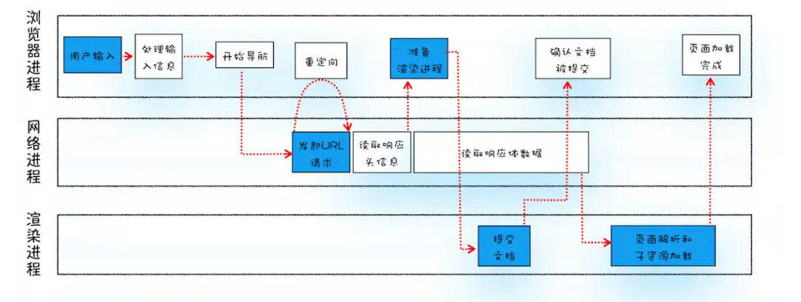
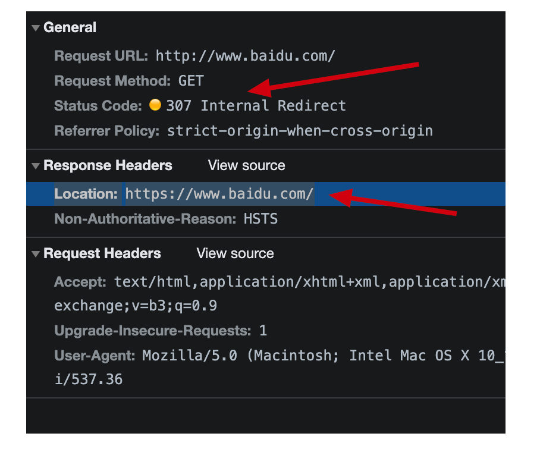
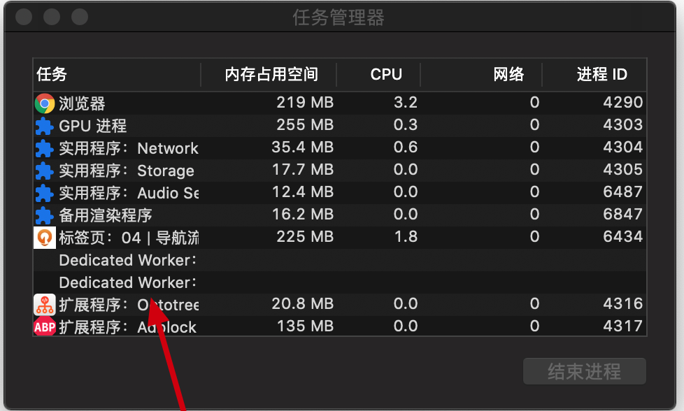

# 从输入 URL 到渲染页面

这道面试题考察的是浏览器的工作原理。

> `浏览器进程`:主要负责用户交互、子进程管理和文件储存等功能。
>
> `网络进程`:是面向渲染进程和浏览器进程等提供网络下载功能。
>
> `渲染进程`:主要职责是把从网络下载的 HTML、JavaScript、CSS、图片等资源解析为可以显示和交互的页面。因为渲染进程所有的内容都是通过网络获取的，会存在一些恶意代码利用浏览器漏洞对系统进行攻击，所以运行在渲染进程里面的代码是不被信任的。这也是为什么 Chrome 会让渲染进程运行在安全沙箱里，就是为了保证系统的安全。

**整个流程。**

### 第一步：用户输入

> 首先，浏览器进程接收到用户输入的 URL 请求，浏览器进程便将该 URL 转发给网络进程。然后，在网络进程中发起真正的 URL 请求。

##### 用户输入后详细流程

**1.当用户在地址栏中输入一个查询关键字时**，有两种情况

- 搜索内容：地址栏会使用浏览器默认的搜索引擎，来合成新的带搜索关键字的 URL。

- 请求的 URL：比如输入的是 baidu.com，那么地址栏会根据规则，把这段内容加上协议，合成为完整的 URL，如 https://www.baidu.com/，还有当输入http://www.baidu.com会变成 https://www.baidu.com/

  百度会先返回 307 Internal Redirect，然后在响应头中返回 Location: https://www.baidu.com/。告诉浏览器重新定向到那边去。

  

**2.当用户输入关键字并键入回车之后**，检测是否有 beforeunload 事件

这意味着当前页面即将要被替换成新的页面，不过在这个流程继续之前，浏览器还给了当前页面一次执行 beforeunload 事件的机会，beforeunload 事件允许页面在退出之前执行一些数据清理操作，还可以询问用户是否要离开当前页面，比如当前页面可能有未提交完成的表单等情况，因此用户可以通过 beforeunload 事件来取消导航，让浏览器不再执行任何后续工作。

从图中可以看出，当浏览器刚开始加载一个地址之后，标签页上的图标便进入了加载状态。但此时图中页面显示的依然是之前打开的页面内容，并没立即替换为百度首页的页面。因为需要等待**提交文档阶段**「后面解析」，页面内容才会被替换。

### 第二步：URL 请求过程

> 接下来，便进入了页面资源请求过程。这时，浏览器进程会通过进程间通信（IPC）把 URL 请求发送至网络进程，网络进程接收到 URL 请求后，会在这里发起真正的 URL 请求。

##### 请求过程详细流程

**1.缓存检查**
网络进程会查找本地缓存是否缓存了该资源。如果有缓存资源，那么直接返回资源给浏览器进程；如果在缓存中没有查找到资源，那么直接进入网络请求流程。**`缓存检查`是复杂的过程，可以在当前目录找到缓存相关文章**。

**2.DNS 解析**
在请求前的第一步是要进行 DNS 解析，以获取请求域名的服务器 IP 地址。然后进行 TCP 连接，如果请求协议是 HTTPS，那么还需要建立 TLS 连接。**这里涉及到了`DNS解析`、`TCP连接`、`TLS连接`可以在当前目录找到相关文章**。

**3.处理返回到的数据**

服务器接收到请求信息后，会根据请求信息生成响应数据（包括响应行、响应头和响应体等信息），并发给网络进程。等网络进程接收了响应行和响应头之后，就开始解析响应头的内容了，对于状态码 200，将解析后的数据传递给浏览器进程。
浏览器进程接收到网络进程的响应头数据之后，发送“提交导航 (CommitNavigation)”消息到渲染进程；
渲染进程接收到“提交导航”的消息之后，便开始准备接收 HTML 数据，接收数据的方式是直接和网络进程建立数据管道；
最后渲染进程会向浏览器进程“确认提交”，这是告诉浏览器进程：“已经准备好接受和解析页面数据了”。
浏览器进程接收到渲染进程“提交文档”的消息之后，便开始移除之前旧的文档，然后更新浏览器进程中的页面状态。后面就可以开始走渲染流程了。

**当我们遇到状态码是其他的呢？**

**这里设计到状态码的，可以在当前目录找到相关的文章**

比如遇到的状态码是 301/302/306/307，这些都是重定向的状态码

那么说明服务器需要浏览器重定向到其他 URL。这时网络进程会从响应头的 Location 字段里面读取重定向的地址，然后再发起新的 HTTP 或者 HTTPS 请求，一切又重头开始了，刚刚在用户输入 baidu 的时候已经讲过重定向的原理的。

**响应数据类型处理怎么处理呢？**

根据响应头去处理。

Content-Type 是 HTTP 头中一个非常重要的字段， 它告诉浏览器服务器返回的响应体数据是什么类型，然后浏览器会根据 Content-Type 的值来决定如何显示响应体的内容。

Content-Type: text/html;charset=utf-8：是一个 html 类型，那么浏览器就会交给渲染进程渲染这个 html。

Content-Type: application/octet-stream：是一个字节流类型，那么浏览器浏览器就会交给下载管理器去下载。

### 第三步：准备渲染

> 网络进程将请求到的文档传给浏览器主进程，主进程通知渲染进程，渲染进程和网络进程简历连接管道， 将网络进程请求到的 html 文档，渲染到页面上。

渲染进程准备好之后，还不能立即进入文档解析状态，因为此时的文档数据还在网络进程中，并没有提交给渲染进程，所以下一步就进入了提交文档阶段。

##### 文档提交

首先当浏览器进程接收到网络进程的响应头数据之后，便向渲染进程发起“提交文档”的消息；

渲染进程接收到“提交文档”的消息后，会和网络进程建立传输数据的“管道”；

等文档数据传输完成之后，渲染进程会返回“确认提交”的消息给浏览器进程；

浏览器进程在收到“确认提交”的消息后，会更新浏览器界面状态，包括了安全状态、地址栏的 URL、前进后退的历史状态，并更新 Web 页面。

当我们输入了地址不会马上跳转，因为资源请求，解析，数据传递的操作。

默认情况下，Chrome 会为每个页面分配一个渲染进程，也就是说，每打开一个新页面就会配套创建一个新的渲染进程。但是，也有一些例外，在某些情况下，浏览器会让多个页面直接运行在同一个渲染进程中。目前测试了掘金、简书、csdn、github、极客时间，只有极客时间是可以多个页面是渲染进程共用的。

从图中还可以看出 chrome 的架构以及不是 5 个浏览器进程了「浏览器主进程、渲染进程、网络进程、插件进程可能多个、GPU 进程」，当前版本为：92.0.4515.159。

但是图中看出 Storage 进程、Audio servie，说明了浏览器现在的架构是动态的，你使用了那些模块就会动态开启那些进程。

### **第四步：页面渲染**

> 当浏览器进程确定文档提交了，渲染进程便开始页面解析和子资源加载了，当页面加载完毕渲染进程会发送一个消息给浏览器进程，浏览器接收到消息后，会停止标签图标上的加载动画
>
> 

详情请查看本目录浏览器渲染流程

## 总结

每一步展开都是非常多内容的，尽量把每一步理解琢磨透了。
