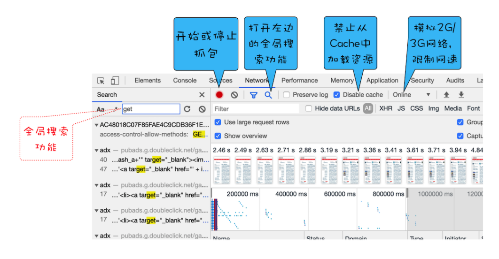
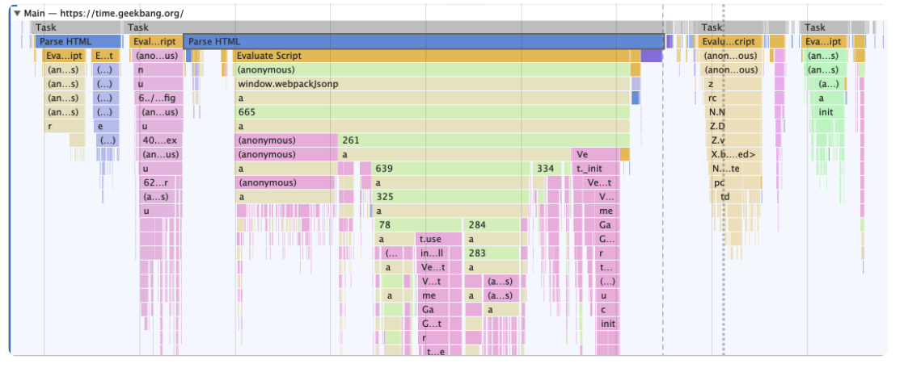

# 浏览器监控性能

我们监控性能都是基于 CRP 的

**CRP（Critical Rendering Path）关键渲染路径**

> 关键渲染路径是指浏览器从最初接收请求来的 HTML、CSS、javascript 等资源，然后解析、构建树、渲染布局、绘制，最后呈现给客户能看到的界面这整个过程。

> chrome 中的开发者工具是一个非常棒的调试工具，能合理使用真的事半功倍。

如图：


标注 1「Sources」：

- 查看 Web 应用加载的所有文件
- 编辑 CSS 和 JavaScript 文件内容
- 将打乱的 Css 文件或者 JavaScript 文件格式化
- 支持 JavaScript 的调试功能
- 设置工作区，将更改的文件保存到本地文件夹中

标注 2「Network」：页面中所有的请求，以及请求中的详细信息，时间线，以及网络请求瀑布图等信息

标注 3「Performance」：记录和查看 Web 应用生命周期内的各种事件，并用来分析过程中一些影响性能的要点

标注 4「Memory」：用来查看运行过程中的 JavaScript 占用堆内存情况，追踪是否存在内存泄漏的情况

标注 5「Application」：查看 web 应用的数据存储 PWA 的基础数据：IndexDB，Cookie 等等

标注 6「Security」：显示页面一些基础的安全信息

标注 7「Lighthouser」：对当前页面进行网络利用情况，页面性能方面的诊断，并给出一些优化建议，相比 performance 容易得到理解。

## Network

> 网络面板，主要查看页面的所有请求中的信息。根据数据做出相应优化。

网络面板网络面板由控制器、过滤器、抓图信息、时间线、详细列表和下载信息概要如下图所示


### 1. 控制器

主要有四个功能。



- 红色圆点的按钮，表示“开始 / 暂停抓包”
- 这个功能很常见“全局搜索”按钮，这个功能就非常重要了，可以在所有下载资源中搜索相关内容，还可以快速定位到某几个你想要的文件上。
- Disable cache，即“禁止从 Cache 中加载资源”的功能，它在调试 Web 应用的时候非常有用，因为开启了 Cache 会影响到网络性能测试的结果。
- Online 按钮，是“模拟 2G/3G”功能，它可以限制带宽，模拟弱网情况下页面的展现情况，然后你就可以根据实际展示情况来动态调整策略，以便让 Web 应用更加适用于这些弱网。

### 2.过滤器

网络面板中的过滤器，主要就是起过滤功能。因为有时候一个页面有太多内容在详细列表区域中展示了，而你可能只想查看 JavaScript 文件或者 CSS 文件，这时候就可以通过过滤器模块来筛选你想要的文件类型。

### 3.抓图信息

抓图信息区域，可以用来分析用户等待页面加载时间内所看到的内容，分析用户实际的体验情况。比如，如果页面加载 1 秒多之后屏幕截图还是白屏状态，这时候就需要分析是网络还是代码的问题了。（勾选面板上的“Capture screenshots”即可启用屏幕截图。）

### 4.时间线

时间线，主要用来展示 HTTP、HTTPS、WebSocket 加载的状态和时间的一个关系，用于直观感受页面的加载过程。如果是多条竖线堆叠在一起，那说明这些资源被同时被加载。至于具体到每个文件的加载信息，还需要用到下面要讲的详细列表。

### 5. 详细列表

这个区域是最重要的，它详细记录了每个资源从发起请求到完成请求这中间所有过程的状态，以及最终请求完成的数据信息。通过该列表，你就能很容易地去诊断一些网络问题。

- **列表的表头属性**

  列表的属性比较多比如 Name、Status、Type、Initiator 等等，这个不难理解。当然，你还可以通过点击右键的下拉菜单来添加其他属性，这里我就不再赘述了，你可以自己上手实操一下。另外，你也可以按照列表的属性来给列表排序，默认情况下，列表是按请求发起的时间来排序的，最早发起请求的资源在顶部。当然也可以按照返回状态码、请求类型、请求时长、内容大小等基础属性排序，只需点击相应属性即可。

  

- **详细信息**

  如果你选中详细列表中的一项，右边就会出现该项的详细信息，如下所示：

  

还有请求参数，在最下面，Query String Parameters/ Request Payload

可以在此查看请求列表中任意一项的请求行和请求头信息，还可以查看响应行、响应头和响应体。然后你可以根据这些查看的信息来判断你的业务逻辑是否正确，或者有时候也可以用来逆向推导别人网站的业务逻辑。

**Timing**

这个同样也是重点，可以查看请求的传输细节。


**Queued：**它表示当前的这个请求在这个页面加载过程中，加入到请求队列中的时间。这个数值是从 0 开始计算的，然后按照加入队列的顺序，依次累加的。
**Started：**表示加入到队列之后，实际开始处理的时间，这两次个一般是相同的，但是也有可能受其他因素的影响。

**Queuing：**也就是排队的意思，当浏览器发起一个请求的时候，会有很多原因导致该请求不能被立即执行，而是需要排队等待。导致请求处于排队状态的原因有很多。

首先，页面中的资源是有优先级的，比如 CSS、HTML、JavaScript 等都是页面中的核心文件，所以优先级最高；而图片、视频、音频这类资源就不是核心资源，优先级就比较低。通常当后者遇到前者时，就需要“让路”，进入待排队状态。

其次，我们前面也提到过，浏览器会为每个域名最多维护 6 个 TCP 连接，如果发起一个 HTTP 请求时，这 6 个 TCP 连接都处于忙碌状态，那么这个请求就会处于排队状态。

最后，网络进程在为数据分配磁盘空间时，新的 HTTP 请求也需要短暂地等待磁盘分配结束。

等待排队完成之后，就要进入发起连接的状态了。不过在发起连接之前，还有一些原因可能导致连接过程被推迟，这个推迟就表现在面板中的 **Stalled** 上，它表示停滞的意思。

这里需要额外说明的是，如果你使用了代理服务器，还会增加一个 **Proxy Negotiation** 阶段，也就是代理协商阶段，它表示代理服务器连接协商所用的时间，不过在上图中没有体现出来，因为这里我们没有使用代理服务器。

接下来，就到了 Initial connection/SSL 阶段了，也就是和服务器建立连接的阶段，这包括了建立 TCP 连接所花费的时间；不过如果你使用了 HTTPS 协议，那么还需要一个额外的 SSL 握手时间，这个过程主要是用来协商一些加密信息的。

和服务器建立好连接之后，网络进程会准备请求数据，并将其发送给网络，这就是 **Request sent** 阶段。通常这个阶段非常快，因为只需要把浏览器缓冲区的数据发送出去就结束了，并不需要判断服务器是否接收到了，所以这个时间通常不到 1 毫秒。

数据发送出去了，接下来就是等待接收服务器第一个字节的数据，这个阶段称为 Waiting (TTFB)，通常也称为“第一字节时间”。 TTFB 是反映服务端响应速度的重要指标，对服务器来说，TTFB 时间越短，就说明服务器响应越快。

接收到第一个字节之后，进入陆续接收完整数据的阶段，也就是 Content Download 阶段，这意味着从第一字节时间到接收到全部响应数据所用的时间。

### 6.下载信息概要

重点关注下 DOMContentLoaded 和 Load 两个事件，以及这两个事件的完成时间。

**DOMContentLoaded**，这个事件发生后，说明页面已经构建好 DOM 了，这意味着构建 DOM 所需要的 HTML 文件、JavaScript 文件、CSS 文件都已经下载完成了。

**Load**，说明浏览器已经加载了所有的资源（图像、样式表等）。通过下载信息概要面板，你可以查看触发这两个事件所花费的时间。

### 优化时间线上耗时项

了解了时间线面板上的各项含义之后，我们就可以根据这个请求的时间线来实现相关的优化操作了。

#### 1. 排队（Queuing）时间过久

排队时间过久，大概率是由浏览器为每个域名最多维护 6 个连接导致的。那么基于这个原因，你就可以让 1 个站点下面的资源放在多个域名下面，比如放到 3 个域名下面，这样就可以同时支持 18 个连接了，这种方案称为域名分片技术。除了域名分片技术外，我个人还建议你把站点升级到 HTTP2，因为 HTTP2 已经没有每个域名最多维护 6 个 TCP 连接的限制了。

#### 2.第一字节时间（TTFB）时间过久

TTFB： Time to First Byte，50ms 以下为好。

- 服务器生成页面数据的时间过久。对于动态网页来说，服务器收到用户打开一个页面的请求时，首先要从数据库中读取该页面需要的数据，然后把这些数据传入到模板中，模板渲染后，再返回给用户。服务器在处理这个数据的过程中，可能某个环节会出问题。解决办法是，去提高服务器的处理速度，比如通过增加各种缓存的技术。
- 网络的原因。比如使用了低带宽的服务器，或者本来用的是电信的服务器，可联通的网络用户要来访问你的服务器，这样也会拖慢网速。解决方案是，使用 CDN 来缓存一些静态文件。
- 发送请求头时带上了多余的用户信息。比如一些不必要的 Cookie 信息，服务器接收到这些 Cookie 信息之后可能需要对每一项都做处理，这样就加大了服务器的处理时长。你在发送请求时就去尽可能地减少一些不必要的 Cookie 数据信息。

#### 3.Content Download 时间过久

如果单个请求的 Content Download 花费了大量时间，有可能是字节数太多的原因导致的。这时候你就需要减少文件大小，比如压缩、去掉源码中不必要的注释等方法。

## Lighthouse

> 对当前页面进行网络利用情况，页面性能方面的诊断，并给出一些优化建议，相比 performance 容易得到理解。


使用 Lighthouse 和 Performace 都需要开启隐身模式，这样可以确保我们安装的扩展、浏览器缓存、Cookie 等数据不会影响到检测结果。不然浏览器也会提醒你。


在生成报告之前，我们需要先配置 Lighthouse，配置模块主要有两部分组成，

监测类型 (Categories)

- 监控类型 (Categories) 是指需要监控哪些内容，这里有五个对应的选项，它们的功能分别是：
- 监测并分析 Web 性能 (Performance)；
- 监测并分析 PWA(Progressive Web App) 程序的性能；
- 监测并分析 Web 应用是否采用了最佳实践策略 (Best practices)；
- 监测并分析是否实施了无障碍功能 (Accessibility)，
- 无障碍功能让一些身体有障碍的人可以方便地浏览你的 Web 应用。
- 监测并分析 Web 应用是否采实施了 SEO 搜素引擎优化 (SEO)。
- 我们只需要关注 Web 应用的加载性能，所以勾选第一个 Performance 选项就可以了。

设备 (Device)

- Moblie 选项是用来模拟移动设备环境的，

- Desktop 选项是用来模拟桌面环境的。

这里我们选择移动设备选项，因为目前大多数流量都是由移动设备产生的，所以移动设备上的 Web 性能显得更加重要。配置好选项之后，我们就可以点击最上面的生成报告 (Generate report) 按钮来生成报告了。

### 解读性能报告


#### 性能指标 (Metrics)


FCP：First Contentful Paint 标记绘制第一个文本或图像的时间。

Time to interactive：页面完全交互所需的时间。

Speed Index： 首屏加载速度。

Total Blocking Time：FCP 和 Time to Interactive 之间所有时间段的总和，当任务长度超过 50ms 时，以毫秒表示

LCP：Largest Contentful Paint 最大内容绘制标记绘制最大文本或图像的时间。

Cumulative Layout Shift ：测量视口内可见元素的移动

#### 可优化项 (Opportunities)


这里是可选优化，可以按照提示去优化我们的 web 应用程序

#### 手动诊断 (Diagnostics)


在手动诊断部分，采集了一些可能存在性能问题的指标，这些指标可能会影响到页面的加载性能，Lighthouse 把详情列出来，并让你依据实际情况，来手动排查每一项。

#### 运行时设置 (Runtime Settings)


这是运行时的一些基本数据，如果选择移动设备模式，你可以看到发送网络请求时的 User Agent 会变成设备相关信息，还有会模拟设备的网速，这个体现在网络限速上。

### 根据性能报告优化 Web 性能

> 现在有了性能报告，接下来就可以依据报告来分析如何优化 Web 应用了。最直接的方式是想办法提高性能指标的分数，而性能指标的分数是由六项指标决定的，它们分别是：

**首次绘制 (First Paint)；**

​ 如果 FP 时间过久，那么直接说明了一个问题，那就是页面的 HTML 文件可能由于网络原因导致加载时间过久，需要在 network 中寻找问题。

**首次有效绘制 (First Meaningfull Paint) 忽略；**

​ 如果 FMP 和 LCP 消耗时间过久，那么有可能是加载关键资源花的时间过久，也有可能是 JavaScript 执行过程中所花的时间过久，所以我们可以针对具体的情况来具体分析。

**首屏时间 (Speed Index)；「Lighthouse 性能指标 (Metrics)有」**

​ 它表示填满首屏页面所消耗的时间，首屏时间的值越大，那么加载速度越慢，具体的优化方式同优化第二项 FMP 是一样。

**首次 CPU 空闲时间 (First CPU Idle)；**

​ 也称为 First Interactive，它表示页面达到最小化可交互的时间，也就是说并不需要等到页面上的所有元素都可交互，只要可以对大部分用户输入做出响应即可。要缩短首次 CPU 空闲时长，我们就需要尽可能快地加载完关键资源，尽可能快地渲染出来首屏内容，因此优化方式和第二项 FMP 和第三项 LCP 是一样的。

**完全可交互时间 (Time to Interactive)；「Lighthouse 性能指标 (Metrics)有」**

​ 它表示页面中所有元素都达到了可交互的时长。简单理解就这时候页面的内容已经完全显示出来了，所有的 JavaScript 事件已经注册完成，页面能够对用户的交互做出快速响应，通常满足响应速度在 50 毫秒以内。如果要解决 TTI 时间过久的问题，我们可以推迟执行一些和生成页面无关的 JavaScript 工作。

**最大估计输入延时 (Max Potential First Input Delay)。**

这个指标是估计你的 Web 页面在加载最繁忙的阶段， 窗口中响应用户输入所需的时间，为了改善该指标，我们可以使用 WebWorker 来执行一些计算，从而释放主线程。另一个有用的措施是重构 CSS 选择器，以确保它们执行较少的计算。


观察上图的页面加载过程，我们发现，在渲染进程确认要渲染当前的请求后，渲染进程会创建一个空白页面，我们把创建空白页面的这个时间点称为 First Paint，简称 FP。

然后渲染进程继续请求关键资源，我们知道关键资源包括了 JavaScript 文件和 CSS 文件，因为关键资源会阻塞页面的渲染，所以我们需要等待关键资源加载完成后，才能执行进一步的页面绘制。上图中，bundle.js 是关键资源，因此需要完成加载之后，渲染进程才能执行该脚本，然后脚本会修改 DOM，引发重绘和重排等一系列操作，当页面中绘制了第一个像素时，我们把这个时间点称为 First Content Paint，简称 FCP。

接下来继续执行 JavaScript 脚本，当首屏内容完全绘制完成时，我们把这个时间点称为 Largest Content Paint，简称 LCP。

在 FCP 和 LCP 中间，还有一个 FMP，这个是首次有效绘制，由于 FMP 计算复杂，而且容易出错，现在不推荐使用该指标，所以这里我们也不做过多介绍了。

接下来 JavaScript 脚本执行结束，渲染进程判断该页面的 DOM 生成完毕，于是触发 DOMContentLoad 事件。

等所有资源都加载结束之后，再触发 onload 事件。好了，以上就是页面在加载过程中各个重要的时间节点，了解了这些时间节点，我们就可以来聊聊性能报告的六项指标的含义并讨论如何优化这些指标。

## Performance

> 点在运行过程中的性能数据，有了这些性能数据，我们就可以回放整个页面的执行过程，这样就方便我们来定位和诊断每个时间段内页面的运行情况，从而有效帮助我们找出页面的性能瓶颈。

使用 Performance 需要分三步走：

第一步是配置 Performance；简单说一下可以录制加载阶段也可以录制交互阶段「需要手动停止」

第二步是生成报告页；

第三步就是人工分析报告页，并找出页面的性能瓶颈。

### 生成报告页


观察上图的报告页，我们可以将它分为三个主要的部分，分别为**概览面板、性能指标面板和详情面板**。

#### 概览面板

Performance 就会将几个关键指标，诸如页面帧速 (FPS)、CPU 资源消耗、网络请求流量、V8 内存使用量 (堆内存) 等，按照时间顺序做成图表的形式展现出来，这就是概览面板。

- 如果 FPS 图表上出现了红色块，那么就表示红色块附近渲染出一帧所需时间过久，帧的渲染时间过久，就有可能导致页面卡顿。
- 如果 CPU 图形占用面积太大，表示 CPU 使用率就越高，那么就有可能因为某个 JavaScript 占用太多的主线程时间，从而影响其他任务的执行。
- 如果 V8 的内存使用量一直在增加，就有可能是某种原因导致了内存泄漏。
- 除了以上指标以外，概览面板还展示加载过程中的几个关键时间节点，如 FP、LCP、DOMContentLoaded、Onload 等事件产生的时间点。这些关键时间点体现在了几条不同颜色的竖线上。

#### 性能面板

这就需要引入性能面板了，在性能面板中，记录了非常多的性能指标项。

- Main 指标记录渲染主线程的任务执行过程
- Compositor 指标记录了合成线程的任务执行过程
- GPU 指标记录了 GPU 进程主线程的任务执行过程
- 有了这些详细的性能数据，就可以帮助我们轻松地定位到页面的性能问题。

简而言之，我们通过概览面板来定位问题的时间节点，然后再使用性能面板分析该时间节点内的性能数据。具体地讲，比如概览面板中的 FPS 图表中出现了红色块，那么我们点击该红色块，性能面板就定位到该红色块的时间节点内了，


观察上图，我们发现性能面板的最上方也有一段时间线，比如上面这个时间线所展示的是从 360 毫秒到 480 毫秒，这段时间就是我们所定位到的时间节点，下面所展示的 Network、Main 等都是该时间节点内的详细数据。

如果你想要查看事件范围更广的性能指标，你只需要将鼠标放到时间线上，滚动鼠标滚轮就可以就行缩放了。如果放大之后，要查看的内容如果超出了屏幕，那么你可以点击鼠标左键来拖动时间线，直到找到需要查看的内容，你也可以通过键盘上的“WASD”四个键来进行缩放和位置的移动。

##### Main 指标

它记录了渲染进程的主线程的任务执行记录，在 Perofrmace 录制期间，在渲染主线程上执行的所有记录都可以通过 Main 指标来查看，你可以通过点击 Main 来展开主进程的任务执行记录，具体你可以观察下图：



观察上图，一段段横条代表执行一个个任务，长度越长，花费的时间越多；竖向代表该任务的执行记录。通过前面章节的学习，我们知道主线程上跑了特别多的任务，诸如渲染流水线的大部分流程，JavaScript 执行、V8 的垃圾回收、定时器设置的回调任务等等，因此 Main 指标的内容非常多，而且非常重要，所以我们在使用 Perofrmance 的时候，大部分时间都是在分析 Main 指标。Main 指标的内容特别多。

Main 指标就记录渲染主线上所执行的全部任务，以及每个任务的详细执行过程。

你可以打开 Chrome 的开发者工具，选择 Performance 标签，然后录制加载阶段任务执行记录，然后关注 Main 指标，如下图所示：


观察上图，图上方有很多一段一段灰色横条，每个灰色横条就对应了一个任务，灰色长条的长度对应了任务的执行时长。通常，渲染主线程上的任务都是比较复杂的，如果只单纯记录任务执行的时长，那么依然很难定位问题，因此，还需要将任务执行过程中的一些关键的细节记录下来，这些细节就是任务的过程，灰线下面的横条就是一个个过程，同样这些横条的长度就代表这些过程执行的时长。

直观地理解，你可以把任务看成是一个 Task 函数，在执行 Task 函数的过程中，它会调用一系列的子函数，这些子函数就是我们所提到的过程。为了让你更好地理解，我们来分析下面这个任务的图形：


```
function A(){
    A1()
    A2()
}
function Task(){
    A()
    B()
}
Task()
```


##### Compositor 指标

通过渲染流水线，我们知道了渲染主线程在生成层树 (LayerTree) 之后，然后根据层树生成每一层的绘制列表，我们把这个过程称为绘制 (Paint)。在绘制阶段结束之后，渲染主线程会将这些绘列表制提交 (commit)给合成线程，并由合成线程合成出来漂亮的页面。因此，监控合成线程的任务执行记录也相对比较重要，所以 Chrome 又在性能面板中引入了**Compositor 指标**，也就是合成线程的任务执行记录。

##### Raster 指标和 GPU 指标

在合成线程执行任务的过程中，还需要 GPU 进程的配合来生成位图，我们把这个 GPU 生成位图的过程称为光栅化。如果合成线程直接和 GPU 进程进行通信，那么势必会阻塞后面的合成任务，因此合成线程又维护了一个光栅化线程池 (Raster)，用来让 GPU 执行光栅化的任务。因为光栅化线程池和 GPU 进程中的任务执行也会影响到页面的性能，所以性能面板也添加了这两个指标，分别是 **Raster 指标和 GPU 指标**。因为 Raster 是线程池，所以如果你点开 Raster 项，可以看到它维护了多个线程。

##### Chrome_ChildIOThread 指标

渲染进程中除了有主线程、合成线程、光栅化线程池之外，还维护了一个 IO 线程，该 IO 线程主要用来接收用户输入事件、网络事件、设备相关等事件，如果事件需要渲染主线程来处理，那么 IO 线程还会将这些事件转发给渲染主线程。在性能面板上，**Chrome_ChildIOThread 指标**对应的就是 IO 线程的任务记录。

##### Network 指标

网络记录展示了页面中的每个网络请求所消耗的时长，并以瀑布流的形式展现。这块内容和网络面板的瀑布流类似，之所以放在性能面板中是为了方便我们和其他指标对照着分析。

##### Timings 指标

用来记录一些关键的时间节点在何时产生的数据信息，关于这些关键时间点的信息我们在上一节也介绍过了，诸如 FP、FCP、LCP 等。

##### Frames 指标

也就是浏览器生成每帧的记录，我们知道页面所展现出来的画面都是由渲染进程一帧一帧渲染出来的，帧记录就是用来记录渲染进程生成所有帧信息，包括了渲染出每帧的时长、每帧的图层构造等信息，你可以点击对应的帧，然后在详细信息面板里面查看具体信息。

##### Interactions 指标

用来记录用户交互操作，比如点击鼠标、输入文字等交互信息。

#### 详情面板

对应于性能面板就是一个长条和多个竖条组成图形。通过上面的图形我们只能得到一个大致的信息，如果想要查看这些记录的详细信息，就需要引入详情面板了。


