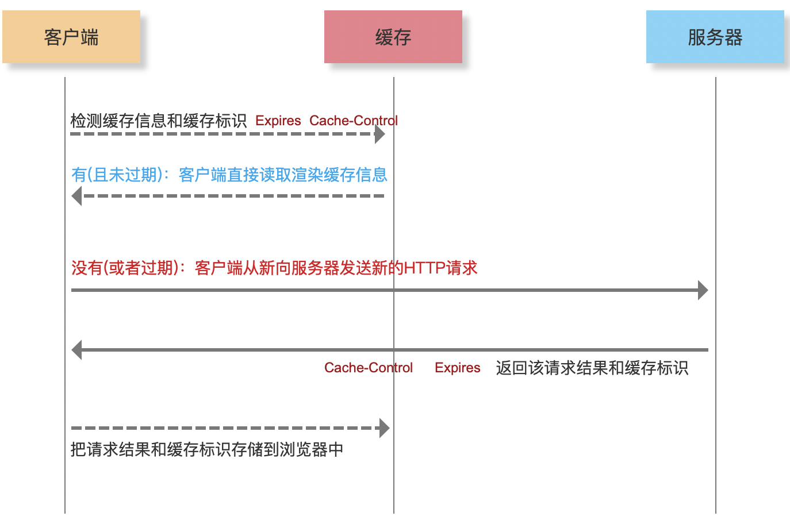

# 浏览器缓存

> 当客户端发起请求时，曾经请求过的资源会先尝试看看能不能从缓存中获取，如果在缓存策略都获取不到，那就会从服务端获取资源。
>
> 一般缓存都是指获取资源，所以Get请求居多，也有Post等等。


## 强缓存

强缓存是不需要发起请求的，只需要在本地缓存中获取即可，也是不需要我们操心的，只需要设置好响应头，浏览器会自动缓存。

在Netwrok面板中可以查看 `内存缓存：Memory Cache`、`硬盘缓存：Disk Cache` 这样字段都属于强缓存

头部有两个字段 `Expires`、` Cache-Control`

**Expires**（http1.0） ：设置响应过期时间 如 

```
Sun Sep 05 2021 15:57:22 GMT
只要超过了这个时间，资源就是过期的，需要继续往下走，协商缓存。
```

**注意：由于Expires要求客户端和服务端的时钟严格同步。HTTP1.1引入Cache-Control来克服Expires头的限制。如果max-age和Expires同时出现，则max-age有更高的优先级。**

**Cache-Control** ：通用消息头字段，客户端、服务端都可以设置。以下分为5种情况。

- 客户端、服务端都不设置Cache-Control
  - 遇见请求则请求，不会有缓存策略。
- 客户端不设置、服务端设置：**Cache-Control：max-age=30**
  - 30s秒内再次请求资源，则会走强缓存
- 客户端设置**Cache-Control：max-age=60**，服务端不设置
  - 遇见请求则请求，不会有缓存策略
- 客户端**Cache-Control：max-age=60**、服务端设置：**Cache-Control：max-age=30**
  - 30s秒内再次请求资源，则会走强缓存，超出后需要重新发起请求
- 客户端设置不缓存**Cache-Control：max-age=0**，服务端设置：**Cache-Control：max-age=30**
  - 遇见请求也不会走缓存了，每次都需要重新获取资源

小结：

1. 只有服务端才能开启缓存，默认是不会走缓存的
2. 客户端的请求头中只有设置了cache-control为：'no-store' | 'no-cache' | 'max-age=0'才会生效（也就是客户端不想走强缓存的时候生效），除非后端对这个字段做特殊处理

```css
Cache-Control 可以设置很多属性。

请求头可以设置的属性
Cache-Control: max-age=<seconds>
Cache-Control: max-stale[=<seconds>]
Cache-Control: min-fresh=<seconds>
Cache-control: no-cache
Cache-control: no-store
Cache-control: no-transform
Cache-control: only-if-cached


响应有可以设置的属性
Cache-control: must-revalidate
Cache-control: no-cache
Cache-control: no-store
Cache-control: no-transform
Cache-control: public
Cache-control: private
Cache-control: proxy-revalidate
Cache-Control: max-age=<seconds>
Cache-control: s-maxage=<seconds>

// 是否可缓存属性
public：表明响应可以被任何对象（包括：发送请求的客户端，代理服务器，等等）缓存，即使是通常不可缓存的内容。
private：表明响应只能被单个用户缓存，不能作为共享缓存（即代理服务器不能缓存它）。私有缓存可以缓存响应内容，比如：对应用户的本地浏览器。
no-cache：在发布缓存副本之前，强制要求缓存把请求提交给原始服务器进行验证(协商缓存验证)。
no-store：缓存不应存储有关客户端请求或服务器响应的任何内容，即不使用任何缓存。

// 缓存到期属性
max-age=<seconds>：设置缓存存储时间，超过这个时间缓存被认为过期(单位秒)。
s-maxage=<seconds>：覆盖max-age或者Expires头，但是仅适用于共享缓存(比如各个代理)，私有缓存会忽略它。
max-stale[=<seconds>]：表明客户端愿意接收一个已经过期的资源。可以设置一个可选的秒数，表示响应不能已经过时超过该给定的时间。
min-fresh=<seconds>：表示客户端希望获取一个能在指定的秒数内保持其最新状态的响应。

常用的应该只有这些了。
```

### 强缓存的流程

**第一步**

发起请求后，先判断`Cache-control/Expires`字段是否设置缓存，如果没有设置缓存则直接请求服务器或者资源。

**第二步**

如果设置了缓存就查找缓存，首先查找 `Memory Cache、disk cache` 中是否有匹配，如有则使用。如没有则走协商缓存，再到发送网络请求。

**注意：普通刷新 (F5)：因 TAB 页没关闭，因此 memory cache 是可用的，会被优先使用，其次才是 disk cache**
**强制刷新 (window：Ctrl + F5/mac：command+shift+R)：浏览器不使用缓存，因此发送的请求头部均带有 Cache-control: no-cache，服务器直接返回 200 和最新内容，其实是和刚刚我们举例的max-age=0是一样的**

补充一下：

200 form memory cache
不访问服务器，一般已经加载过该资源且缓存在了内存当中，直接从内存中读取缓存。浏览器关闭后，数据将不存在（资源被释放掉了），再次打开相同的页面时，不会出现from memory cache，一般脚本、字体、图片会存在内存当中。

200 from disk cache
不访问服务器，已经在之前的某个时间加载过该资源，直接从硬盘中读取缓存，关闭浏览器后，数据依然存在，此资源不会随着该页面的关闭而释放掉下次打开仍然会是from disk cache，一般非脚本会存在内存当中，如css等。




## 协商缓存

当强制缓存失效后，浏览器携带缓存标识向服务器发起请求，由服务器根据缓存标识决定当前资源在缓存获取还是重新获取新的资源。

在Netwrok面板中可以查看 304状态码

头部有四个字段 `Last-Modified/if-Modified-Since` 、` ETag/if-None-Match`

**Last-Modified/If-Modified-Since「http 1.0」**：

Last-Modified：响应头，是服务器返回文件的修改日期。

If-Modified-Since：请求头，当第一次请求的资源时候会将Last-Modified的值赋值给If-Modified-Since，下一次将值传给服务器判断当前文件是否变化，如果没有变化则返回304，有变化则返回新的资源，并将Last-Modified赋值给if-Modified-Since。

 **ETag/If-None-Match「http 1.1」**：


ETag：响应头，是服务器使用类似SHA256这样的离散函数计算出来的文件值，类似于，只要文件不变化当前的ETag就不会发现改变。

```
ETag:"737060cd8c284d8af7ad3082f209582d"`
```

If-None-Match：请求头，当第一次请求的资源时候会将 ETag的值赋值给If-None-Match，下一次将值传给服务器判断当前文件是否变化，如果没有变化则返回304，有变化则返回新的资源，并将ETag赋值给If-None-Match。

```
If-None-Match: <etag_value>
```

**注意：如果`Last-Modified/If-Modified-Since`和`ETag/If-None-Match`同时出现。浏览器会优先使用`ETag/If-None-Match`做协商缓存，因为它更加的准确判断一个文件是否被修改过。**

**由于`Last-Modified/If-Modified-Since`使用的是文件修改的日期，但是有些时候我们可能不经意的修改了文件的日期，导致服务端以为当前的文件已经被修改了，则重新返回新的资源回去，那么就协商缓存失败了，所以http1.1为了弥补http1.0的缺点就新出了`ETag/If-None-Match`。**


### 协商缓存的流程

当强制缓存失效后，走到协商缓存。

**第一步**

客户端携带着`If-None-Match/If-Modified-Since`发起请求，等待服务器响应。

**第二步**

服务器首先检查协商缓存字段`If-None-Match/If-Modified-Since`,当两个字段都存在的话，使用if-None-Match决定是否走协商缓存，如果只存在If-Modified-Since，则使用If-Modified-Since来判断是否走协商缓存，当协商缓存命中了就返回状态码304，当协商缓存失败了就会重新发起请求，响应资源到客户端，并返回状态码200。

**第三步**

客户端收到服务器的返回状态码后，如果是304则直接冲缓存中获取文件，那如果返回200则将新的资源直接渲染，然后将新的资源缓存到本地中，并且相应的请求头也需要赋值，以便于下次请求可以走协商缓存。


## 项目中如何使用缓存？

我们项目中打包出来的文件 `dist`,里面有vendor、app、各种chunk，那里面文件每次发布的时候不是全部变化的，Vue、React、moment、loadsh等等这些基本不会变。

我们需要做的是打包后文件需要隔离，将业务代码和第三方库，或者自己封装工具类，隔离开来。

好处就是没有变化的文件还可以继续走缓存，接着在Nginx配置一下dist文件的缓存，只需要配置一次，以后都不在需要了，除非发生了其他的情况。

nginx.conf 配置文件代码如下：

```nginx
worker_processes  1;
events {
  worker_connections  1024;
}
http {
  include       mime.types;
  default_type  application/octet-stream;
  sendfile        on;
  #tcp_nopush     on;
  #keepalive_timeout  0;
  keepalive_timeout  65;
  include nginx_proxy.conf;
  proxy_cache_path  /data/nuget-cache levels=1:2 keys_zone=nuget-cache:20m max_size=50g inactive=168h;
  gzip  on;
  server {
    listen       8081;
    server_name  xxx.abc.com;
    location /picture/ {
      proxy_pass http://localhost:1024;
      add_header  Cache-Control  max-age=no-cache;
    }
    location ~* \.(css|js|png|jpg|jpeg|gif|gz|svg|mp4|ogg|ogv|webm|htc|xml|woff)$ {
      access_log off;
      add_header Cache-Control "public,max-age=30*24*3600";
      proxy_pass http://localhost:1024;
    }
    error_page   500 502 503 504  /50x.html;
    location = /50x.html {
      root   html;
    }
  }
}
```


### 原理

首先浏览器按照请求访问某一个文件，比如 `chunk-1af599b5.82f5645e.js`,这些标识符其实是hash值，在我们打包的时候，webpack可以配置这个hash值的生成，当文件发生变化的时候，这个hash值也会变化，当服务器把文件返回来而且还带着响应头`Cache-Control "public,max-age=30*24*3600"`,设置该文件的缓存，下次请求的时候就会走强缓存，当max-age过期了，则强缓存失效。

大概分以下两种情况。

1. 文件路径中带有 hash 值：一年的强缓存。因为该文件的内容发生变化时，会生成一个带有新的 hash 值的 URL。前端将会发起一个新的 URL 的请求。配置响应头 `Cache-Control: public,max-age=30*24*3600,immutable`
2. 文件路径中不带有 hash 值：协商缓存。大部分为 `public` 下文件。配置响应头 `Cache-Control: no-cache` 与 `etag/last-modified`

但是当处理永久缓存时，切记不可打包为一个大的 `bundle.js`，此时一行业务代码的改变，将导致整个项目的永久缓存失效，此时需要按代码更新频率分为多个 chunk 进行打包，可细粒度控制缓存。

# 总结

发起请求的时候先走强缓存，当设置了缓存，则继续走协商缓存，如果协商缓存失败了，那么只能重新获取资源。下次在发请求的，重新试试从强缓存开始...，以此达到节约带宽和增加用户的体验，这才是缓存的目的。

