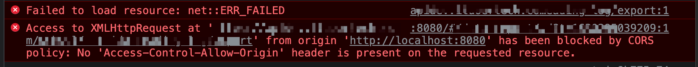

# 跨域

> 产生跨域的原因是，浏览器受同源策略的影响，禁止页面获取数据的一种安全策略


## 为什么会产生跨域？

浏览器为了使网页更加安全，不容易受到攻击，于是引用的同源策略，但是太过于严格了，影响开发者开发，然后引入了[CORS](https://developer.mozilla.org/zh-CN/docs/Web/HTTP/CORS)，为了解决 XMLHttpRequest和fetch，iframe受到同源策略的影响，浏览器可以允许服务器设置对那些客户端允许访问。当服务器没有设置允许跨域时，浏览器会提醒并且报错。如图所示。



### 浏览器是怎么做到的？

请求它其实是可以发送的，并且能得到服务器的返回，所以是浏览器限制了数据的返回，当不满足同源策略的规则时，浏览器就会报错，和上面类似。

当发送请求的时候，是在渲染进程上面发送了。为了防止黑客通过脚本触碰到系统资源，浏览器将每一个渲染进程装进了沙箱，并且为了防止 CPU 芯片一直存在的**Spectre** 和 **Meltdown**漏洞，采取了`站点隔离`的手段，给每一个不同的站点(一级域名不同)分配了沙箱，互不干扰。

在沙箱当中的渲染进程是没有办法发送网络请求的，只能通过网络进程来发送。那这样就涉及到进程间通信(IPC，Inter Process Communication)了。

渲染进程通知浏览器主进程，主进程接收到后，通知网络进程，网络进程发起请求。

**在服务端处理完数据后，将响应返回给网络进程，网络进程将数据传递给主进程，主进程检查到跨域，且没有 cors响应头，将响应体全部丢掉，并不会发送给渲染进程。这就达到了拦截数据的目的。**


## 什么是同源策略？

> **同源策略**是一个重要的安全策略，它用于限制一个origin的文档或者它加载的脚本如何能与另一个源的资源进行交互。它能帮助阻隔恶意文档，减少可能被攻击的媒介。
>
> 如果两个 URL 的protocol、port (如果有指定的话)和host都相同的话，则这两个 URL 是*同源*。
>
> 同源是指"协议+域名+端口"三者相同，即便两个不同的域名指向同一个ip地址，也非同源。


**同源策略限制内容有：**

```
Cookie、LocalStorage、IndexedDB 等存储性内容
DOM 节点
AJAX，fetch、iframe 请求发送后，请求数据是能回来，结果被浏览器拦截了。

以下标签是允许跨域：

<link href=XXX>
<script src=XXX>
<form action="xxx" method="get" class="form-example"></form> 
表单只是提交数据，并不会获取新的内容，所以可以发起跨域请求
```


## 怎么解决跨域？

### 后端解决

cors 后端设置允许请求头

```
 'Access-Control-Allow-Origin'
```


### nginx

> 实现原理类似于Node中间件代理，需要你搭建一个中转nginx服务器，用于转发请求。
>
> 使用nginx反向代理实现跨域，是最简单的跨域方式。只需要修改nginx的配置即可解决跨域问题，支持所有浏览器，支持session，不需要修改任何代码，并且不会影响服务器性能。
>
> 实现思路：通过nginx配置一个代理服务器（域名与domain1相同，端口不同）做跳板机，反向代理访问domain2接口，并且可以顺便修改cookie中domain信息，方便当前域cookie写入，实现跨域登录。
>
> [nginx](http://nginx.org/en/download.html)，然后将nginx目录下的nginx.conf修改如下:


```js
// proxy服务器
server {
    listen       81;
    server_name  www.domain1.com;
    location / {
        proxy_pass   http://www.domain2.com:8080;  #反向代理
        proxy_cookie_domain www.domain2.com www.domain1.com; #修改cookie里域名
        index  index.html index.htm;

        # 当用webpack-dev-server等中间件代理接口访问nignx时，此时无浏览器参与，故没有同源限制，下面的跨域配置可不启用
        add_header Access-Control-Allow-Origin http://www.domain1.com;  #当前端只跨域不带cookie时，可为*
        add_header Access-Control-Allow-Credentials true;
    }
}

nginx -s reload启动nginx

// index.html
var xhr = new XMLHttpRequest();
// 前端开关：浏览器是否读写cookie
xhr.withCredentials = true;
// 访问nginx中的代理服务器
xhr.open('get', 'http://www.domain1.com:81/?user=admin', true);
xhr.send();

// server.js
var http = require('http');
var server = http.createServer();
var qs = require('querystring');
server.on('request', function(req, res) {
    var params = qs.parse(req.url.substring(2));
    // 向前台写cookie
    res.writeHead(200, {
        'Set-Cookie': 'l=a123456;Path=/;Domain=www.domain2.com;HttpOnly'   // HttpOnly:脚本无法读取
    });
    res.write(JSON.stringify(params));
    res.end();
});
server.listen('8080');
console.log('Server is running at port 8080...');
```


### webpack（http-proxy）

> 前端项目服务器正向代理，通过http-serve
>
> 实现原理：**同源策略是浏览器需要遵循的标准，而如果是服务器向服务器请求就无需遵循同源策略。** 代理服务器，需要做以下几个步骤：
>
> - 接受客户端请求 。
> - 将请求 转发给服务器。
> - 拿到服务器 响应 数据。
> - 将 响应 转发给客户端。


我们先来看个例子：本地文件index.html文件，通过代理服务器`http://localhost:3000`向目标服务器`http://localhost:4000`请求数据。

```js
// index.html(http://127.0.0.1:5500)
<script src="https://cdn.bootcss.com/jquery/3.3.1/jquery.min.js"></script>
<script>
  $.ajax({
    url: 'http://localhost:3000',
    type: 'post',
    data: { name: 'xiamen', password: '123456' },
    contentType: 'application/json;charset=utf-8',
    success: function(result) {
      console.log(result) // {"title":"fontend","password":"123456"}
    },
    error: function(msg) {
      console.log(msg)
    }
  })
 </script>


// server1.js 代理服务器(http://localhost:3000)
const http = require('http')
// 第一步：接受客户端请求
const server = http.createServer((request, response) => {
  // 代理服务器，直接和浏览器直接交互，需要设置CORS 的首部字段
  response.writeHead(200, {
    'Access-Control-Allow-Origin': '*',
    'Access-Control-Allow-Methods': '*',
    'Access-Control-Allow-Headers': 'Content-Type'
  })
  // 第二步：将请求转发给服务器
  const proxyRequest = http
    .request(
      {
        host: '127.0.0.1',
        port: 4000,
        url: '/',
        method: request.method,
        headers: request.headers
      },
      serverResponse => {
        // 第三步：收到服务器的响应
        var body = ''
        serverResponse.on('data', chunk => {
          body += chunk
        })
        serverResponse.on('end', () => {
          console.log('The data is ' + body)
          // 第四步：将响应结果转发给浏览器
          response.end(body)
        })
      }
    )
    .end()
})
server.listen(3000, () => {
  console.log('The proxyServer is running at http://localhost:3000')
})

```


### websocket

> 由于api具有全双工模式，不会受浏览器限制

```
高级api 不兼容老版本 需要使用socket.io做兼容

let socket = new WebSocket('ws:xxx')
socket.open = function(){
	socket.send("发送内容")
}
```


### JSONP

> 只能发送get请求，不支持其他方式 
>
> 不安全 xss攻击，比如jsonp返回再次创建script标签的脚本

```js
利用浏览器script脚本的特性，也可以利用其他的标签，style也可以
通过拉取数据然后执行回调函数获取数据，即可。
function jsonp({ url, params, cb }) {
  return new Promise((resolve, reject) => {
    let srcipt = document.createElement('script')
    window[cb] = function(data) {
      resolve(data)
      document.body.removeChild(srcipt)
    }
    params = { ...params, cb }
    let arrs = []
    for (let key in params) {
      arrs.push(`${key}=${params[key]}`)
    }
    srcipt.src = `${url}?${arrs.join('&')}`
    document.body.appendChild(srcipt)
  })
}

jsonp({
  url: 'https://sp0.baidu.com/5a1Fazu8AA54nxGko9WTAnF6hhy/su',
  params: { wd: 'b' },
  cb: 'show'
}).then(data => {
  console.log(data, 'data')
})
```

### postMessage 、window.name、location.hash、document.domain

> 可以通过html页面的嵌套可以实现跨域处理

```
postMessage 
postMessage是HTML5 XMLHttpRequest Level 2中的API，且是为数不多可以跨域操作的window属性之一，它可用于解决以下方面的问题：

页面和其打开的新窗口的数据传递
多窗口之间消息传递
页面与嵌套的iframe消息传递
上面三个场景的跨域数据传递

postMessage()方法允许来自不同源的脚本采用异步方式进行有限的通信，可以实现跨文本档、多窗口、跨域消息传递。

a页面
<iframe src="xx" id="iframe" onload="load()"></iframe>
function load(){
	let frame = doucument.getElementByid('#iframe')
	frame.contentWindow.postMessage('发送的内容',url)
	window.onmessage = function(e){
		console.log(e.data) // 接收到的参数
	}
}

b页面
window.onmessage = function(e){
	console.log(e.data) // 接收到的参数
	e.source.postMessage('发送的内容')
}


window.name属性的独特之处：name值在不同的页面（甚至不同域名）加载后依旧存在，并且可以支持非常长的 name 值（2MB）。
window.name 通过给name赋值。但是流程比较麻烦。


location.hash 通过把值放在hash上面，然后监听hanshchange事件

前提是数据互通是两个文件处在一级域名和二级域名的关系
document.domain 通过设置 document.domain = "一级域名"
实现原理：两个页面都通过js强制设置document.domain为基础主域，就实现了同域。
```

