# 浏览器渲染流程

### 渲染详细过程

##### **1.构建 DOM 树**

由于浏览器无法理解html，所以需要转换为dom树，dom树其实和html结构是非常相似的，但是dom树是存储在内存中，可以通过JavaScript访问的到。

##### **2.样式计算**

​	2.1.转换样式

​		同样无法理解css，所以需要转换为styleSheets。document.styleSheets 可查看

​	2.2.转换样式表中的属性值，使其标准化

```css
body { font-size: 2em }
p {color:blue;}
span {display: none}
div {font-weight: bold}
div p {color:green;}
div {color:red; }

标准化的过程是
body { font-size: 32px }
p {color:rgb(0,0,255);}
span {display: none}
div {font-weight: 700}
div p {color:rgb(0,128,0);}
div {color:rgb(255,0,0); }
```

​	2.3计算dom节点的具体某个节点的样式

​		样式计算阶段的目的是为了计算出 DOM 节点中每个元素的具体样式，在计算过程中需要遵守 CSS 的继承和层叠两个规则。这个阶段最终输出的内容是每个 DOM 节点的样式，并被保存在 ComputedStyle 的结构内

DOM 元素最终的计算样式，可以打开 Chrome 的“开发者工具”，选择第一个“element”标签，然后再选择“Computed”子标签中可以查看

UserAgent 样式，它是浏览器提供的一组默认样式，如果你不提供任何样式，默认使用的就是 UserAgent 样式。

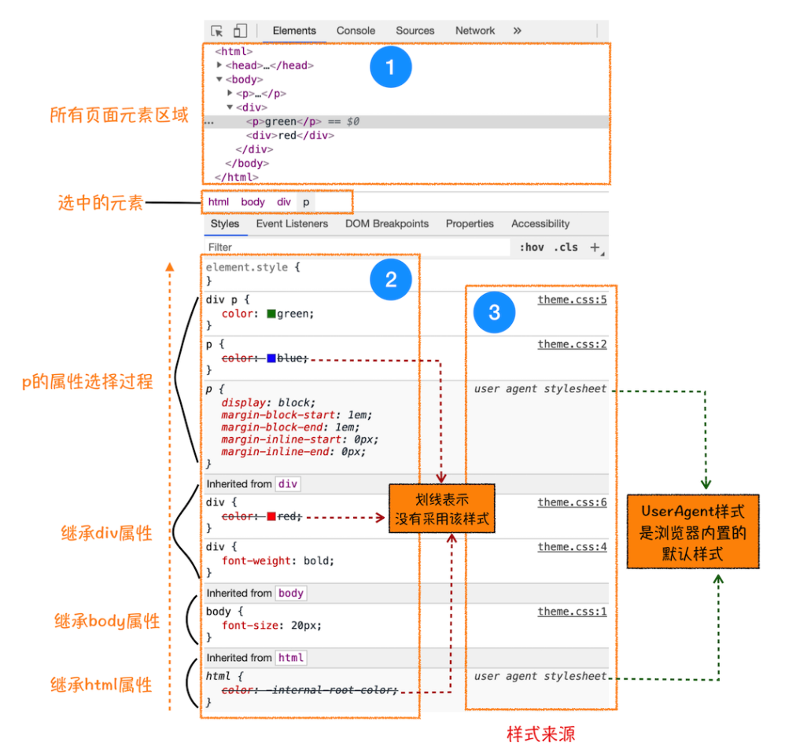


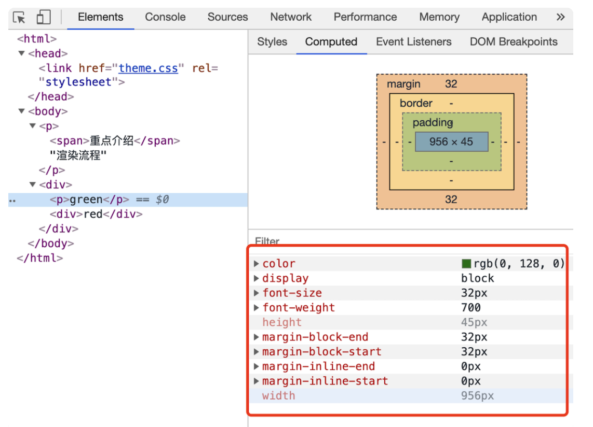


##### **3.布局阶段**

现在，我们有 DOM 树和 DOM 树中元素的样式，但这还不足以显示页面，因为我们还不知道 DOM 元素的几何位置信息。**那么接下来就需要计算出 DOM 树中可见元素的几何位置，我们把这个计算过程叫做布局**。

3.1创建布局树

你可能注意到了 DOM 树还含有很多不可见的元素，比如 head 标签，还有使用了 display:none 属性的元素。所以在显示之前，**我们还要额外地构建一棵只包含可见元素布局树。**

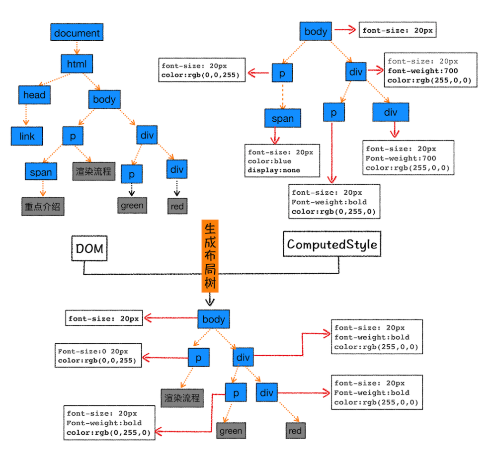

为了构建布局树，浏览器大体上完成了下面这些工作：

遍历 DOM 树中的所有可见节点，并把这些节点加到布局树中；

而不可见的节点会被布局树忽略掉，如 head 标签下面的全部内容，再比如 body.p.span 这个元素，因为它的属性包含 dispaly:none，所以这个元素也没有被包进布局树。

3.2布局计算

现在我们有了一棵完整的布局树。那么接下来，就要计算布局树节点的坐标位置了。布局的计算过程非常复杂。

在执行布局操作的时候，会把布局运算的结果重新写回布局树中，所以布局树既是输入内容也是输出内容，这是布局阶段一个不合理的地方，因为在布局阶段并没有清晰地将输入内容和输出内容区分开来。针对这个问题，Chrome 团队正在重构布局代码，下一代布局系统叫 LayoutNG，试图更清晰地分离输入和输出，从而让新设计的布局算法更加简单。

##### **4.分层**

目前阶段还不能绘制，因为页面中有很多复杂的效果，如一些复杂的 3D 变换、页面滚动，或者使用 z-index做 z 轴排序等，为了更加方便地实现这些效果，渲染引擎还需要为特定的节点生成专用的图层，并生成一棵对应的图层树（LayerTree），正是这些图层叠加在一起构成了最终的页面图像。

在chrome查看图层 https://www.cnblogs.com/HenrysBlogs/p/13419843.html

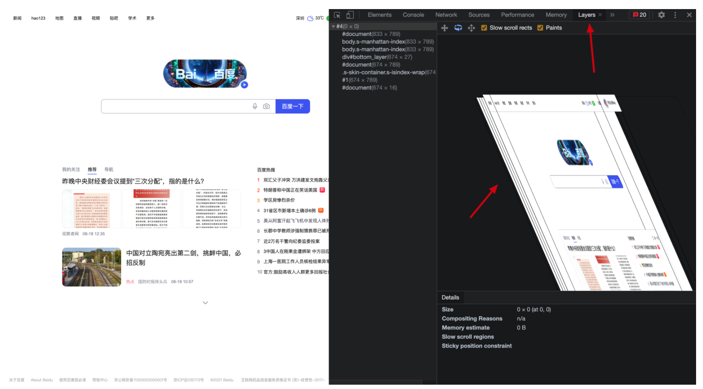

可以看到的是右边的图是拥有很多的图层的，它合成后是左边的图。

创建新的图层的条件

4.1 第一点，拥有层叠上下文属性的元素会被提升为单独的一层

页面是个二维平面，但是层叠上下文能够让 HTML 元素具有三维概念，这些 HTML 元素按照自身属性的优先级分布在垂直于这个二维平面的 z 轴上。你可以结合下图来直观感受下：

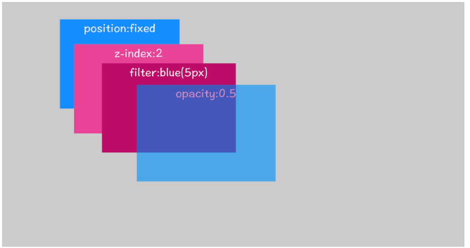


4.2需要剪裁（clip）的地方也会被创建为图层。

```html
  <style>
    div {
      width: 200px;
      height: 200px;
      overflow: auto;
      background: gray;
    }
  </style>
  <body>
    <div>
      <p>所以元素有了层叠上下文的属性或者需要被剪裁，那么就会被提升成为单独一层，你可以参看下图：</p>
      <p>从上图我们可以看到，document层上有A和B层，而B层之上又有两个图层。这些图层组织在一起也是一颗树状结构。</p>
      <p>
        图层树是基于布局树来创建的，为了找出哪些元素需要在哪些层中，渲染引擎会遍历布局树来创建层树（Update LayerTree）。
      </p>
    </div>
  </body>
```


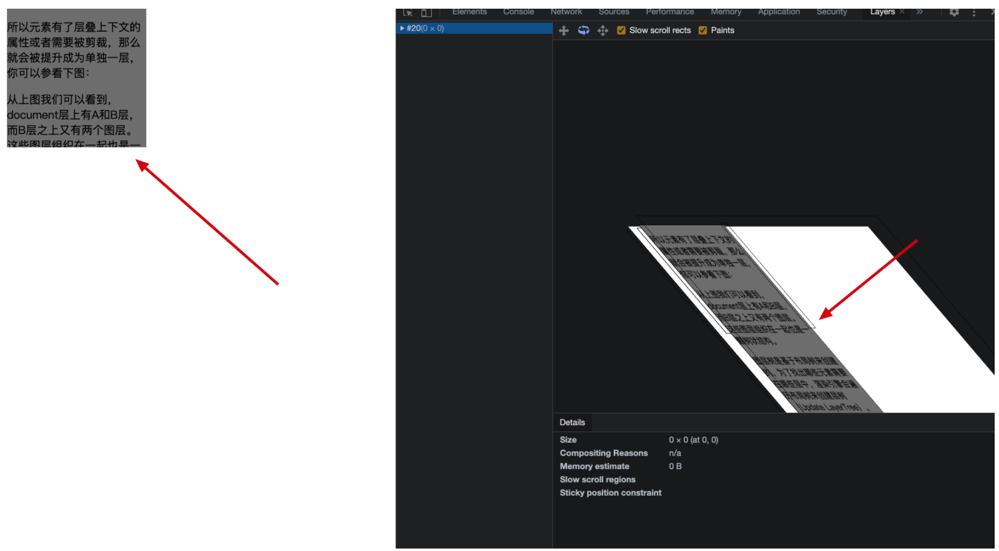


##### **5.绘制**

在完成图层树的构建之后，渲染引擎会对图层树中的每个图层进行绘制

从图中可以看出，绘制列表中的指令其实非常简单，就是让其执行一个简单的绘制操作，比如绘制粉色矩形或者黑色的线等。而绘制一个元素通常需要好几条绘制指令，因为每个元素的背景、前景、边框都需要单独的指令去绘制。所以在图层绘制阶段，输出的内容就是这些待绘制列表。

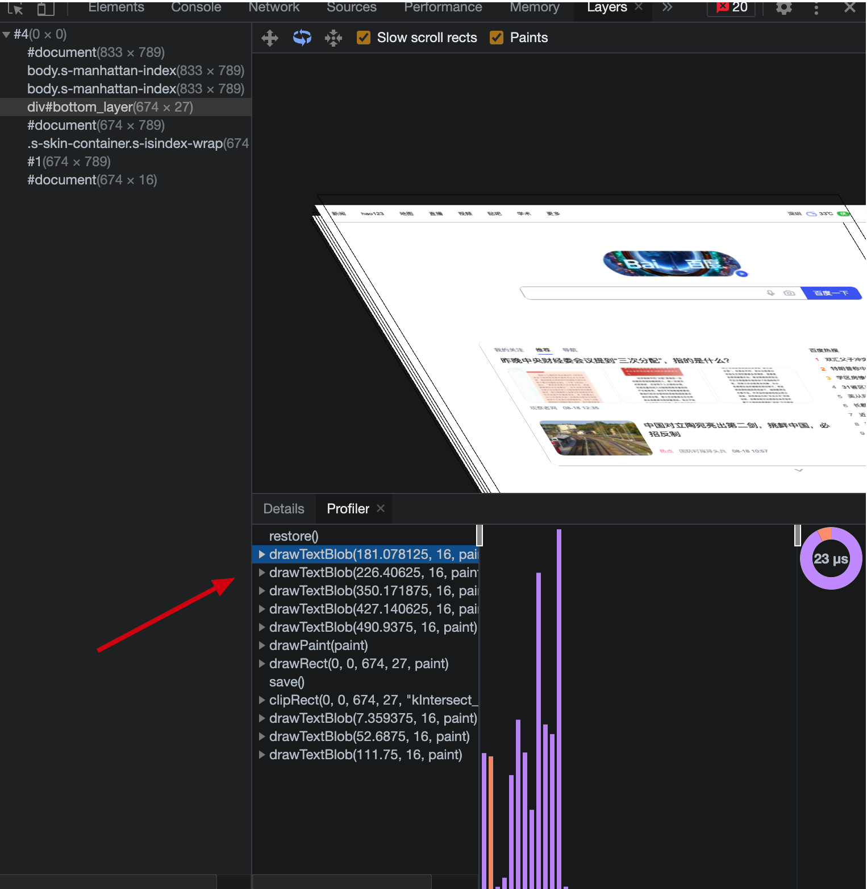


##### **6.光栅化和合成**

绘制列表只是用来记录绘制顺序和绘制指令的列表，而实际上绘制操作是由渲染引擎中的合成线程来完成的。你可以结合下图来看下渲染主线程和合成线程之间的关系

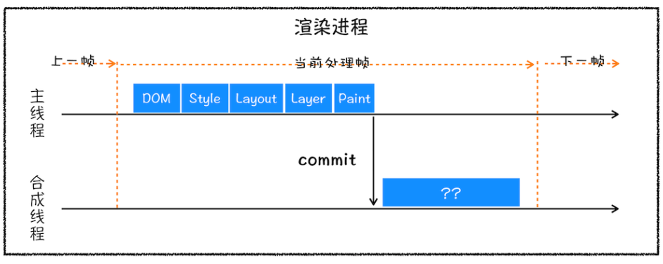

如上图所示，当图层的绘制列表准备好之后，主线程会把该绘制列表提交（commit）给合成线程，那么接下来合成线程是怎么工作的呢？

通常一个页面可能很大，但是用户只能看到其中的一部分，我们把用户可以看到的这个部分叫做视口（viewport）。在有些情况下，有的图层可以很大，比如有的页面你使用滚动条要滚动好久才能滚动到底部，但是通过视口，用户只能看到页面的很小一部分，所以在这种情况下，要绘制出所有图层内容的话，就会产生太大的开销，而且也没有必要。基于这个原因，合成线程会将图层划分为图块（tile），这些图块的大小通常是 256x256 或者 512x512，如下图所示：

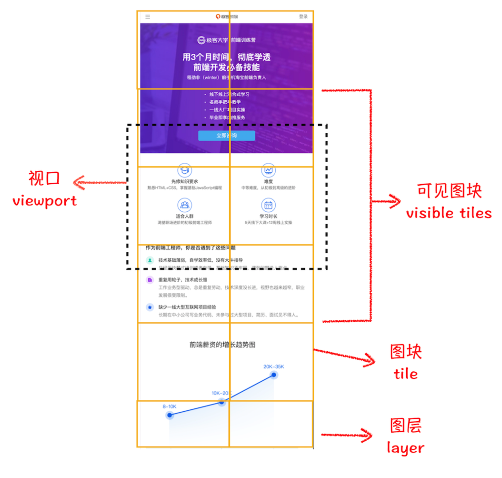

然后合成线程会按照视口附近的图块来优先生成位图，实际生成位图的操作是由栅格化来执行的。所谓栅格化，是指将图块转换为位图。而图块是栅格化执行的最小单位。渲染进程维护了一个栅格化的线程池，所有的图块栅格化都是在线程池内执行的，运行方式如下图所示：

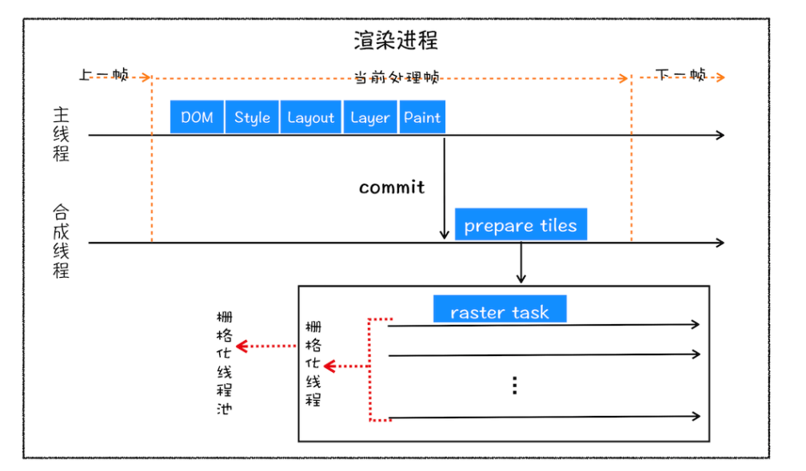

通常，栅格化过程都会使用 GPU 来加速生成，使用 GPU 生成位图的过程叫快速栅格化，或者 GPU 栅格化，生成的位图被保存在 GPU 内存中。相信你还记得，GPU 操作是运行在 GPU 进程中，如果栅格化操作使用了 GPU，那么最终生成位图的操作是在 GPU 中完成的，这就涉及到了跨进程操作。具体形式你可以参考下图：

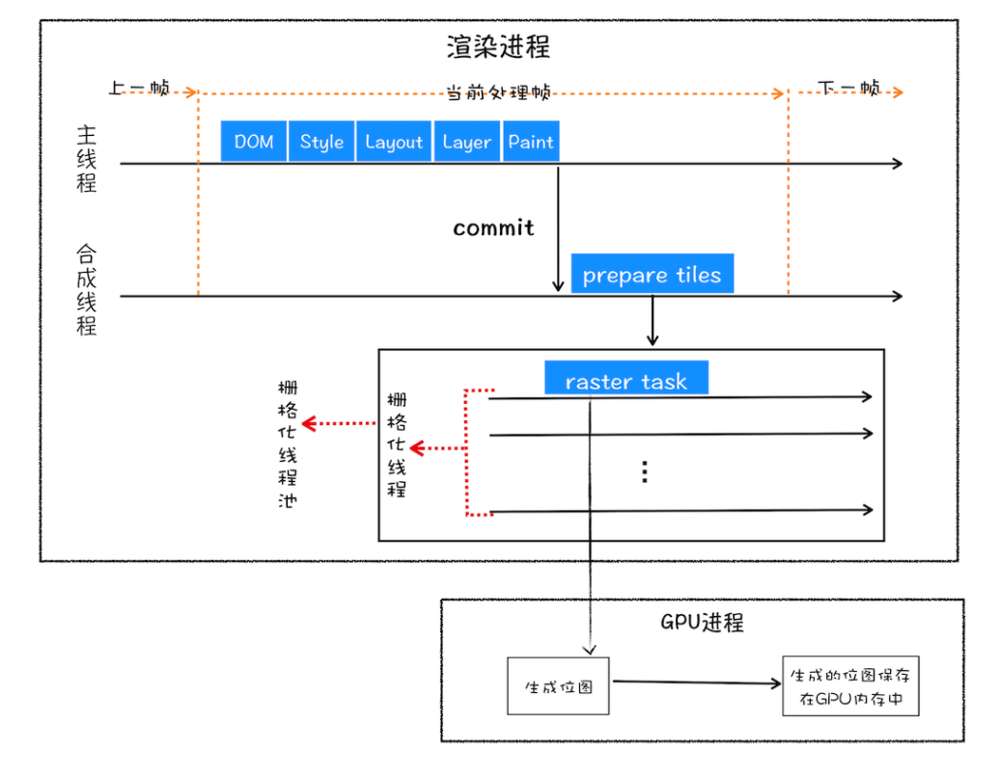

从图中可以看出，渲染进程把生成图块的指令发送给 GPU，然后在 GPU 中执行生成图块的位图，并保存在 GPU 的内存中。


##### **7.合成和显示**

一旦所有图块都被光栅化，合成线程就会生成一个绘制图块的命令——“DrawQuad”，然后将该命令提交给浏览器进程。

浏览器进程里面有一个叫 viz 的组件，用来接收合成线程发过来的 DrawQuad 命令，然后根据 DrawQuad 命令，将其页面内容绘制到内存中，最后再将内存显示在屏幕上。

到这里，经过这一系列的阶段，编写好的 HTML、CSS、JavaScript 等文件，经过浏览器就会显示出漂亮的页面了


**总结**

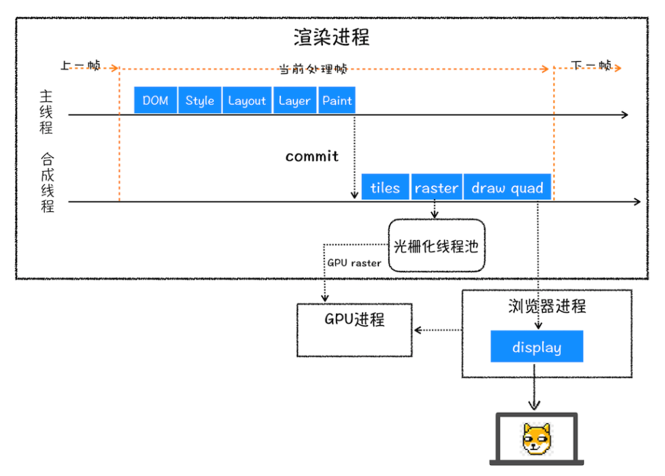


1.渲染进程将 HTML 内容转换为能够读懂的 DOM 树结构。

2.渲染引擎将 CSS 样式表转化为浏览器可以理解的 styleSheets，计算出 DOM 节点的样式。

3.创建布局树，并计算元素的布局信息。

4.对布局树进行分层，并生成分层树。

5.为每个图层生成绘制列表，并将其提交到合成线程。

6.合成线程将图层分成图块，并在光栅化线程池中将图块转换成位图。

7.合成线程发送绘制图块命令 DrawQuad 给浏览器进程。浏览器进程根据 DrawQuad 消息生成页面，并显示到显示器上。


### reflow、repaint、合成

有了上面介绍渲染流水线的基础，我们再来看看三个和渲染流水线相关的概念——“重排”“重绘”和“合成”。理解了这三个概念对于你后续 Web 的性能优化会有很大帮助。

1. 更新了元素的几何属性（重排）你可先参考下图：

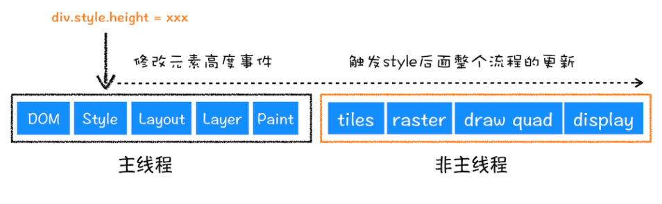

从上图可以看出，如果你通过 JavaScript 或者 CSS 修改元素的几何位置属性，例如改变元素的宽度、高度等，那么浏览器会触发重新布局，解析之后的一系列子阶段，这个过程就叫重排。无疑，重排需要更新完整的渲染流水线，所以开销也是最大的。


2. 更新元素的绘制属性（重绘）

   接下来，我们再来看看重绘，比如通过 JavaScript 更改某些元素的背景颜色，渲染流水线会怎样调整呢？你可以参考下图：

   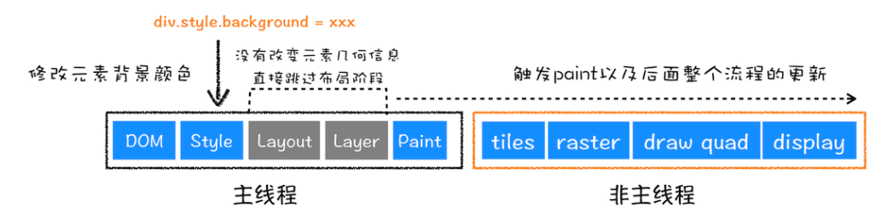

从图中可以看出，如果修改了元素的背景颜色，那么布局阶段将不会被执行，因为并没有引起几何位置的变换，所以就直接进入了绘制阶段，然后执行之后的一系列子阶段，这个过程就叫重绘。相较于重排操作，重绘省去了布局和分层阶段，所以执行效率会比重排操作要高一些。

3. 直接合成阶段

   那如果你更改一个既不要布局也不要绘制的属性，会发生什么变化呢？渲染引擎将跳过布局和绘制，只执行后续的合成操作，我们把这个过程叫做合成。具体流程参考下图：

   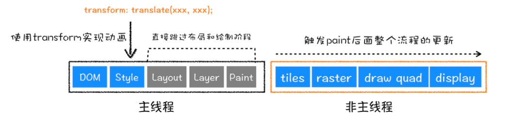

在上图中，我们使用了 CSS 的 transform 来实现动画效果，这可以避开重排和重绘阶段，直接在非主线程上执行合成动画操作。这样的效率是最高的，因为是在非主线程上合成，并没有占用主线程的资源，另外也避开了布局和绘制两个子阶段，所以相对于重绘和重排，合成能大大提升绘制效率。


### 下载CSS/JS 会影响DOM解析吗？

```html
1.当从服务器接收HTML页面的第一批数据时，DOM解析器就开始工作了，在解析过程中，如果遇到了JS脚本，如下所示：
<html>
    <body>
        hello world
        <script>
        document.write("--foo")
        </script>
    </body>
</html>
那么DOM解析器会先执行JavaScript脚本，执行完成之后，再继续往下解析。

2.引用js文件，如下所示：
<html>
    <body>
        hello world
        <script type="text/javascript" src="foo.js"></script>
    </body>
</html>
这种情况下，当解析到JavaScript的时候，会先暂停DOM解析，并下载foo.js文件，下载完成之后执行该段JS文件，然后再继续往下解析DOM。这就是JavaScript文件为什么会阻塞DOM渲染。
这种情况又可以有三种处理方案
2.1 比如js是需要在某个位置操作dom的，默认加载。
2.2 当引用js不依赖于当前的dom和js的时候，计时器，广告，可以使用async，它的作用是解析到到它的时候会交给网络进程下载，下载完成就会执行，执行的时候可能会影响到dom的解析，因为dom可能解析完毕了，也可能还在解析。
2.3 想等待dom解析完成才执行js，可以使用 defer，它的作用是解析到它的时候会交给网络进程下载，下载完成后，也需要等待dom解析完成后才执行，是在DOMContentLoaded 事件之前执行。


3.内联js和引入css文件 如下所示：
<html>
    <head>
        <style type="text/css" src = "theme.css" />
    </head>
    <body>
        <p>hello world</p>
        <script>
            let e = document.getElementsByTagName('p')[0]
            e.style.color = 'blue'
        </script>
    </body>
</html>
不过在执行 JavaScript 脚本之前，如果页面中包含了外部 CSS 文件的引用，或者通过 style 标签内置了 CSS 内容，那么渲染引擎还需要将这些内容转换为 CSSOM，因为 JavaScript 有修改 CSSOM 的能力，所以在执行 JavaScript 之前，还需要依赖 CSSOM。那么这时候就需要等待这个样式被下载完成或者解析才能继续往下执行，所以在这种情况下，CSS也会阻塞DOM的解析。也就是说 CSS 在部分情况下也会阻塞 DOM 的生成。


所以JS和CSS都有可能会阻塞DOM解析。


浏览器其实在接收到 HTML 数据之后的预解析过程中，HTML 预解析器识别出来了有 CSS 文件和 JavaScript 文件需要下载，会同时交给网络进程下载，下载时间按照最长的来算，最后html解析到等待css下载完成的位置，这时候如果还在下载，那么就会堵塞。
```

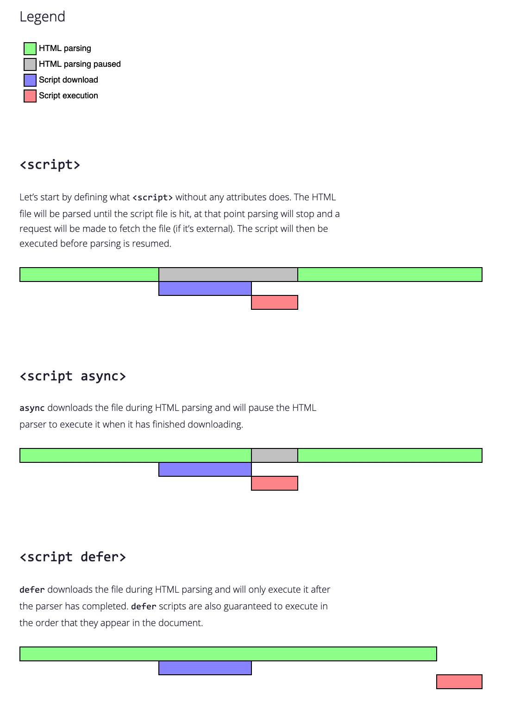

### 白屏是怎么回事？

当网络进程返回html页面的时候，渲染进程会创建一个空白的页面，这时候浏览器会从上一个页面跳转过来，这时候浏览器的关键文件 html css js 还在下载和解析，这个过程叫做白屏。当渲染浏览流程走完后就会显示出真实页面的样子。

#### 如何减少白屏时间？

考虑的方向是：下载 CSS 文件、下载 JS 文件和执行JS、下载其他的必须资源如图片等等。

1.通过内联 JavaScript、内联 CSS 来移除这两种类型的文件下载，这样获取到 HTML 文件之后就可以直接开始渲染流程了。

2.但并不是所有的场合都适合内联，那么还可以尽量减少文件大小，比如通过 webpack 等工具移除一些不必要的注释，并压缩 JavaScript 文件。

3.还可以将一些不需要在解析 HTML 阶段使用的 JavaScript 标记上 async 或者 defer。

4.对于大的 CSS 文件，可以通过媒体查询属性，将其拆分为多个不同用途的 CSS 文件，这样只有在特定的场景下才会加载特定的 CSS 文件。

