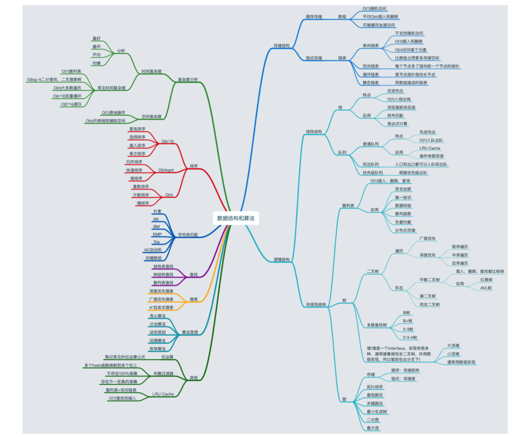

# 算法指南

**解题思路**

```
If-else, switch（branch）

for，while loop（Iteration）

递归 Recursion（Divide, Backtrace）

搜索 Search：深度优先搜索（Depth first search）、广度优先搜索（Breadth first search）、A* 等

动态规划（Dynamic Programming）

二分查找（Binary Search）

贪心算法（Greedy）

数学（Math）& 位运算等
```

