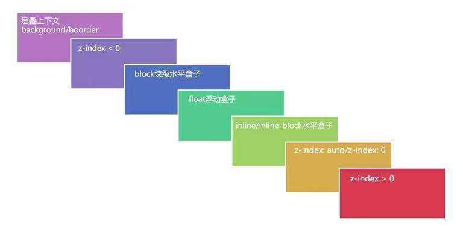

# CSS常见问题

#### 层叠上下文

[层叠上下文](https://juejin.cn/post/6844903667175260174)

> z-index 不是只有定位才有的，任何元素都可以使用，而且可以是一个 Infinite Value、auto。
>
> 层叠上下文分为:
>
> ​	1、` 根层叠上下文` 就是普通的 
>
> ​	2、`层叠上下文` 定位产生的或者其他方式产生的
>
> 层叠等级： 是同一层级元素和元素的层级比较 注意子元素无论层级多高都不能超过层叠等级高的元素
>
> ​		比如A的层级为1，a-1的子元素层级也为1， B 的层级是2，b-1的子元素层级为-2，A和B在同级。那么a-1层级虽然是1，b-1的层级为-2，假如它们的位置出现重叠b-1一定会把a-1盖住，因为B的层级高于A层级。
>
> 层叠顺序： 是一个规则，如下
>
> ​	background/border  <  (z-index<0)  <  block 块级水平盒子 < float浮动盒子 < inline/inline-block水平盒子 <  z-index:atuo < (z-index > 0)
>
> 关于这个float浮动盒子的位置我是不理解的，有理解的同学指教一下我吗？
>
> 

```
CSS2中 position 会将根层叠上下文变成层叠上下文
CSS3中出现了很多新属性，其中一些属性对层叠上下文也产生了很大的影响。如下：
	父元素的display属性值为flex|inline-flex，子元素z-index属性值不为auto的时候，子元素为层叠上下文元素；
	元素的opacity属性值不是1；
	元素的transform属性值不是none；
	元素mix-blend-mode属性值不是normal`；
	元素的filter属性值不是none；
	元素的isolation属性值是isolate；
	will-change指定的属性值为上面任意一个；
	元素的-webkit-overflow-scrolling属性值设置为touch。
```




#### 移动端1px问题

> 问题的来源？
>
> ​	当我们在移动端中在一些dpr大于1的手机设备，会出现1px比较粗的问题，我们常见的就是iphone看起来怎么这么粗，随着现在手机的设备分辨率高，dpr===2、dpr===3，已经特别常见。

| 方案                     | 优点                  | 缺点                                     |
| ------------------------ | --------------------- | ---------------------------------------- |
| 使用0.5px实现            | 代码简单，使用css即可 | IOS及Android老设备不支持                 |
| 使用border-image实现     | 兼容目前所有机型      | 修改颜色不方便                           |
| 通过 viewport + rem 实现 | 一套代码，所有页面    | 和0.5px一样，机型不兼容                  |
| 使用伪类 + transform实现 | 兼容所有机型          | 不支持圆角                               |
| box-shadow模拟边框实现   | 兼容所有机型          | box-shadow不在盒子模型，需要注意预留位置 |

****

```
1、使用0.5px实现
	border: 0.5px solid red; 
2、使用border-image实现
	.border-image-div{
	  width: 100px;
	  height: 100px;
	  margin-top: 20px;
	  border-bottom: 1px solid transparent;
	  border-image: linear-gradient(to bottom, transparent 50%, red 50%) 0 0 100%/1px 0;
	}
3、通过 viewport + rem 实现
	其实我已经在我另一篇文章讲过的。
	rem利用Flexile手淘的兼容方案 https://github.com/amfe/article/issues/17
	vh 这是基于vh的兼容方案
4、使用伪类 + transform实现
		// 左边框，如果需要修改边框位置，可以修改元素top，left，right，bottom的值即可
		&::before {
		    position: absolute;
		    top: 0;
		    left: 0;
		    content: '\0020';
		    width: 100%;
		    height: 1px;
		    border-top: 1px solid #E9E9E9;
		    transform-origin: 0 0;
		    overflow: hidden;
		}
		
		@media (-webkit-min-device-pixel-ratio: 1.5) and (-webkit-max-device-pixel-ratio: 2.49) {
		    &::before {
		      transform: scaleY(0.5);
		    }
		}

		@media (-webkit-min-device-pixel-ratio: 2.5) {
		    &::before {
		      transform: scaleY(0.33333);
		    }
		}
5、box-shadow模拟边框实现	
	// 下边框
	box-shadow: 0 1px #E9E9E9;
	// 全边框
	box-shadow: 0 -1px #D9D9D9, 1px 0 #D9D9D9, 0 1px #D9D9D9, -1px 0 #D9D9D9;
```

#### **为什么字体不能用`rem` ?**

> 我们不希望文本在Retina屏幕下变小，另外，我们希望在大屏手机上看到更多文本，以及，现在绝大多数的字体文件都自带一些点阵尺寸，通常是16px和24px，所以我们不希望出现13px和15px这样的奇葩尺寸。

换句话说，如果使用`rem`,那么字体的单行数量显示，在不同的尺寸和像素比的屏幕上都是一样的。但真的不能用吗？未必呀( ⊙ o ⊙ )！！设计稿可能会有这样的需求：我这一行字必须就是这几个（其实就是**标题**）,这时候，你总不能说，噢~介个iphone6 plusd的像素比这么高，像素这么多，就让它多显示几个字的标题吧吧吧吧吧...

所以，有时候并不是不能用，而是要选择合适的时候使用合适的单位吧。

> 如此一来，就决定了在制作H5的页面中，rem并不适合用到段落文本上。所以在Flexible整个适配方案中，考虑文本还是使用px作为单位。只不过使用[data-dpr]属性来区分不同dpr下的文本字号大小
>
> 当然这只是针对于描述性的文本，比如说段落文本。但有的时候文本的字号也需要分场景的，比如在项目中有一个slogan,业务方希望这个slogan能根据不同的终端适配。针对这样的场景，完全可以使用rem给slogan做计量单位。
>
> 这个回答来着  https://github.com/jincdream 


#### Reflow & Repaint

https://juejin.cn/post/6844903779700047885

https://juejin.cn/post/6844903569087266823

介绍一下重绘和回流

> 会引起元素位置变化的就会reflow 窗口大小改变、字体大小改变、以及元素位置改变，都会引起周围的元素改变他们以前的位置；不会引起位置变化的，只是在以前的位置进行改变背景颜色等，只会repaint；

如何避免重绘和回流

> 只要按照上面的规则尽量避免就可以了，下面进行一些补充。
>
> 1、修改样式的时候通过 css 类名修改或通过 cssText 修改。
>
> 2、DOM 元素离线修改—>隐藏元素，应用修改，重新显示
>
> 3、使用绝对定位让复杂动画脱离文档流减少父元素以及后续元素频繁的回流
>
> 4、避免触发同步布局事件，如获取 offsetWidth 等属性值，因为会强制浏览器刷新队列。
>
> 5、使用css3硬件加速，可以让 transform、opacity、filters、will-change 这些动画不会引起回流重绘 （会提高内存占用）。

